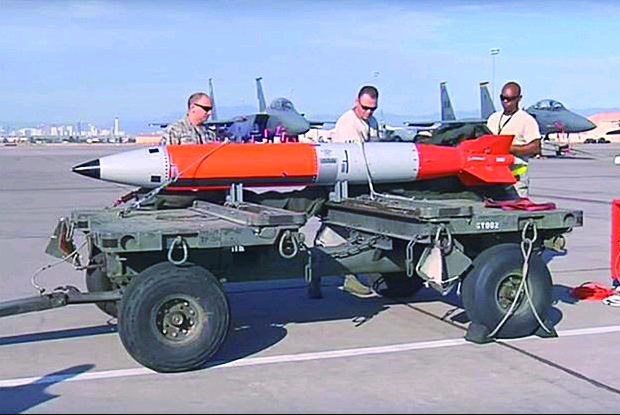
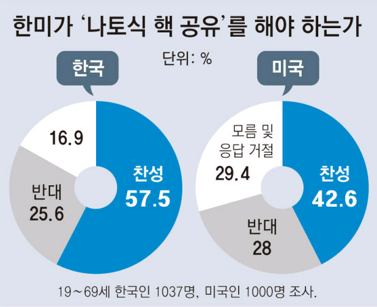

# 警惕！关于在韩国部署战术核武器，美韩口风变了

今年1月韩国总统尹锡悦提出“自主拥核论”后，美韩有人就一直在就此暗中使劲。韩国《东亚日报》3月31日称，最新民调显示，美韩民众对于推进两国“北约式核共享”方案的态度发生明显转变，支持者的意见大幅领先。老司机认为，对于美国下一步是否会恢复在朝鲜半岛部署核武器，我们必须保持高度警惕。

_美军B61-12战术核弹头_

报道称，所谓“北约式核共享”是指美国在北约盟国部署战术核武器，在发生紧急情况时动用战机等共同进行核攻击的概念。目前美国在比利时的克莱因-
布罗格尔基地、德国布切尔空军基地、意大利的阿维亚诺空军基地和吉地托雷基地、荷兰的沃尔克尔空军基地、土耳其的因吉尔利克空军基地部署有约100-150枚战术核武器，主要以B61-3和B61-4重力核炸弹为主，正在逐步替换为新型B61-12核炸弹，后者当量在300吨到5万吨之间可调。

值得注意的是，除了美国空军外，这些核炸弹也可以由所在国的战机携带以执行核打击任务。换句话说，如果美韩推进“北约式核共享”，韩国空军的战斗机（可能主要以F-15K和F-35A战斗机为主）也将具备携带核武器的能力。

《东亚日报》委托韩国盖洛普公司于3月17日至22日以韩国人（1037人）和美国人（1000人）为对象进行的民调结果显示，美国人中赞成韩国自行拥有核武器（64%）的比率比反对意见高出22.6个百分点；对于在韩国部署战术核武器，赞成（36.5%）和反对（37%）的回答比率差不多。更明显的是，对于韩国和美国“北约式核共享”方案，42.6%的美国人表示赞成。比反对（28%）比率高出10个百分点以上。

需要重视的是，韩国民众对相关问题的赞成比率也比美国高很多。赞成韩国拥有核武器（64%）、共享北约式核武器（57.5%）、部署战术核武器（56.7%）的比率都是反对者的两倍以上。

韩国总统尹锡悦1月提出“自主拥核论”后，不但韩国国内一度批评声四起，美国拜登政府也多次强调“韩国不可能拥核”的立场。拜登政府的正式回答是：“我们的目标是实现朝鲜半岛完全、可验证的无核化。”这被视为美国排除了在韩国部署核武器的可能性。

但老司机注意到，韩国和美国方面近来有人不断在该问题上造势。例如最近俄罗斯宣布将在白俄罗斯部署战术核武器后，美国国会就有人借机扯到朝鲜半岛，鼓吹应该在韩国部署美国的核武器。韩国《朝鲜日报》称，在俄罗斯宣布将在白俄罗斯部署核武器后，美国联邦参议院外交委员会重量级议员詹姆斯·里什明确主张：“拜登政府也应该考虑在韩国重新部署美国的核武器。”报道称，这是拜登政府上台以来，美国议会重量级人物首次直接提出重新在朝鲜半岛部署战术核武器的主张。

_F-35战斗机测试投放B61-12核炸弹_

对于恢复在韩国部署战术武器的巨大政治影响，美韩方面显然非常清楚——这将破坏国际核不扩散体系，打破国际核战略平衡及地缘政治安全，必然会引起朝鲜乃至周边国家的强烈反对。除了政治因素外，美国核专家也从军事角度提出明确的反对意见——由于冷战结束后美国战术核武器大部分已经退役，当前总共只有230枚战术核武器。考虑部署在欧洲的100-150枚战术核弹头在当前的紧张局势下不可能转移到韩国，倘若将美国本土剩下的约100枚战术核弹头转移到韩国，必然会严重影响美国的快速核反应能力。同时，还有反对者认为，如果美军将搭载在难以被敌军探测和拦截的空中、海上平台上的战术核武器转移到韩国的地下掩体，反而会失去威慑力。

但即便如此，韩美部分人士仍在这个关键问题上不断使劲。《东亚日报》称，将于4月举行的韩美首脑会谈中，会共同发表关于美国强化对韩国提供核保护伞的方案。韩国政府消息灵通人士透露：“美国国内赞成韩国拥有核武器的舆论，将在首脑会谈中对韩国要求加强核保护伞的请求起到有利作用。”

美国智库战略与国际问题研究中心在题为《关于美国的对朝政策及遏制扩张的建议》的报告中也表示：“应该为在朝鲜半岛重新部署低当量核武器奠定基础。为此，有必要研究与准备工作有关的桌面演习等。”该报告认为，即使美国不立即在韩国重新部署战术核武器，也有必要启动应对这种可能性的准备工作。

由此可见，美国在韩国部署战术核武器的可能性正日益增加，我们对此需要保持高度警惕。

