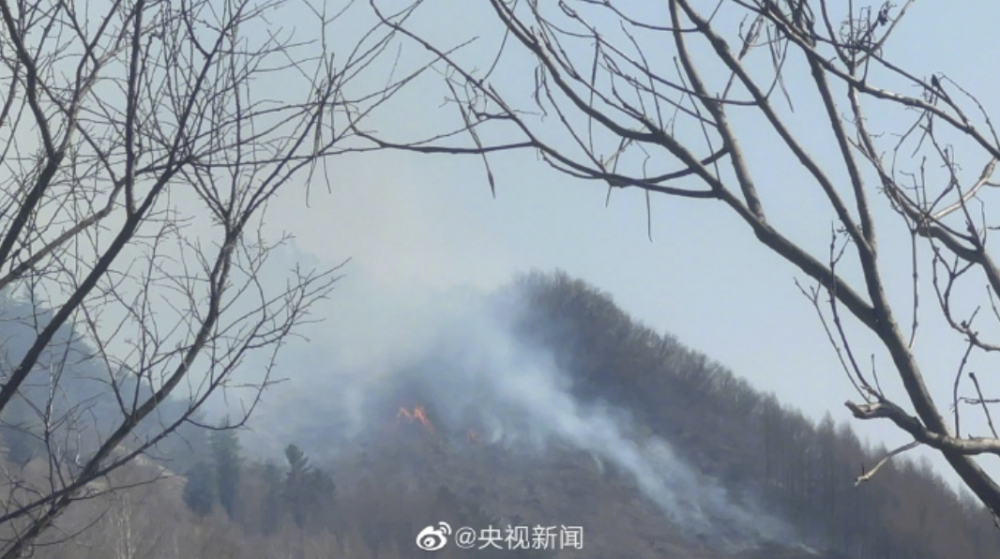
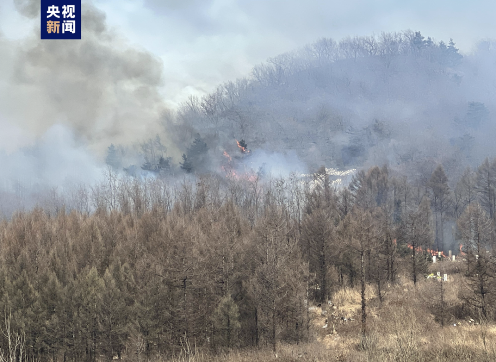
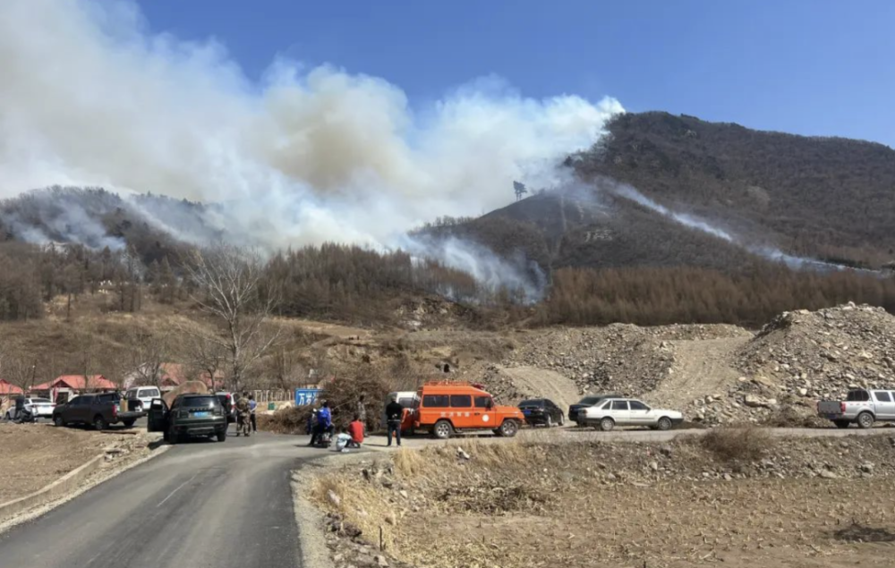
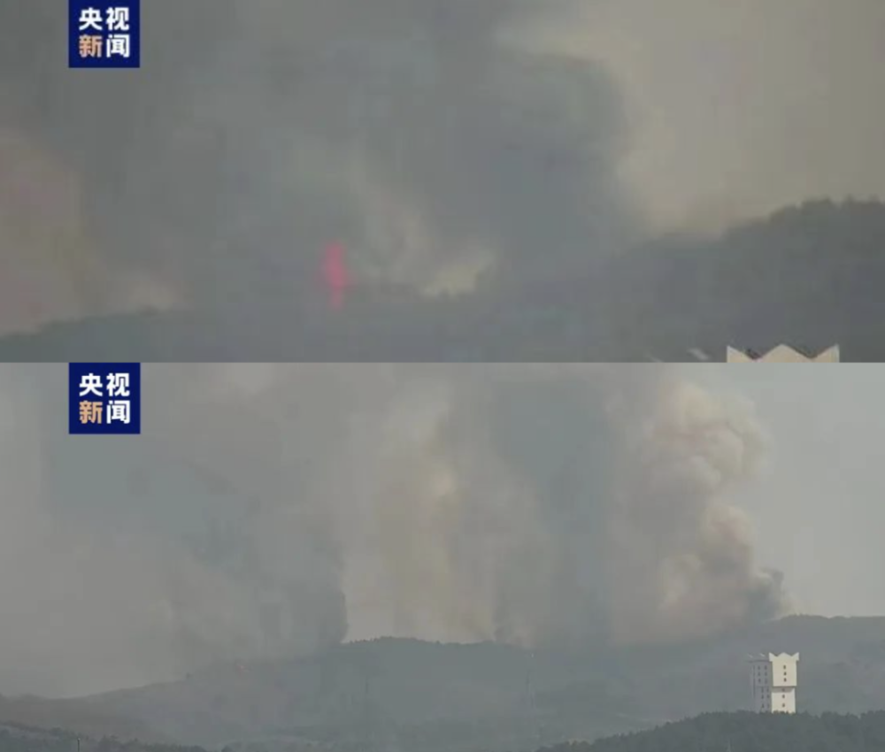
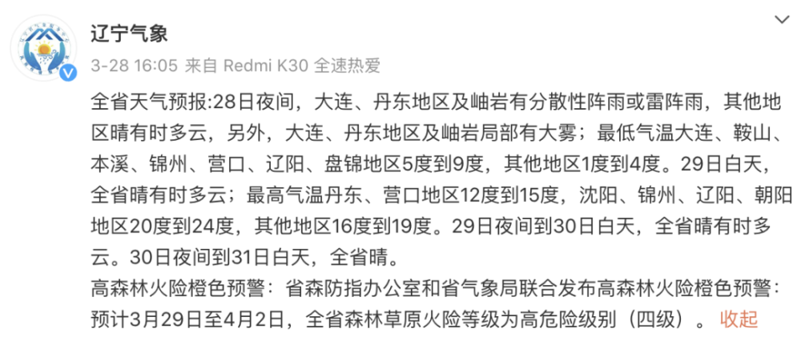

# 辽宁两地突发山火，正在扑救！此前连续6天发布橙警

今天中午，辽宁省本溪市本溪满族自治县发生山火。下午，由于风力较大，山火持续发展，目前已蔓延至临近的山城子村碱厂沟。此外，村子后山也发生火情，有部分村民开始转移。目前，当地仍在增加救援力量。

此外，今天中午，辽宁省抚顺市石文镇发生森林火灾，大火产生的浓烟和火苗远在10余公里外清晰可见，当地已经调派大批救援队伍赶往现场。

3月29日，全国森林草原防灭火工作电视电话会议指出，当前已进入森林草原火灾春防紧要期，必须保持高度警醒。会议强调要坚持关口前移、源头治理，广泛开展宣传教育，强化基层群防群控，严格野外火源管理，严查违法违规用火，切实提高风险隐患排查整改质量，积极主动开展事前防范。

北京日报注意到，3月28日起至今，辽宁省持续6天发布高森林火险橙色预警：省森防指办公室和省气象局联合发布高森林火险橙色预警：预计3月29日至4月2日，全省森林草原火险等级为高危险级别（四级）。

辽宁省森林草原防灭火指挥部要求下发通知要求：各地要加强备耕和临近清明期间的野外用火管控，加大巡护频次，做好林缘、山坡地200米范围内秸秆离田工作。

辽宁省气象部门此前预测，3月28日至4月2日白天，受高压脊控制，各地气温持续回升；受南高北低气压场影响，低压前部气压梯度和变压梯度大，各地偏南风较大；28日夜间，受低空切变线影响，辽宁省东部地区有分散性阵雨，其他时段无明显降水。

来源：北京日报综合@央视新闻、@辽宁气象、中国应急管理微信公众号

