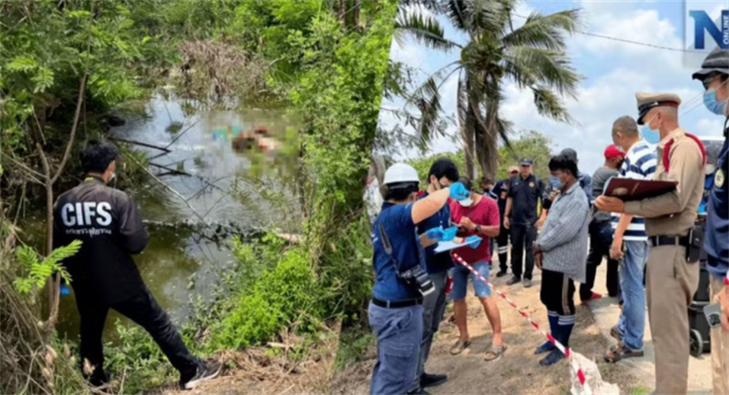

# 22岁中国女留学生在泰国遭中国籍嫌犯绑架杀害，我国警方有管辖权吗

4月2日，据多家泰媒报道，泰国暖武里府Bang Mae Nang警局接到报案，称当地Ton Chuek
Salaya寺附近莲花池水沟中发现一塑料袋，里面有一具女尸。经泰国警方初步调查，死者为日前失踪的22岁中国留学生金某，嫌疑人为3名中国籍男子，已逃回中国。那么，我国警方对此案有管辖权吗？嫌疑人会在我国接受审判吗？现代快报记者采访了法律界人士。

**女留学生尸体在水沟被发现，绑匪曾索要50万人民币**

据媒体报道，一名目击者在水沟处看到一具浮尸，便立即报了警。死者身穿一件T恤和棕色裤子，手脚疑似被捆绑，身上有多处伤。3月31日下午，曼谷一所大学负责中国留学生事务的老师曾前往警局报案，称该校音乐系大三学生金某失踪，年龄为22岁。当地警方、移民局等相关部门立即展开调查，寻找金某下落。

_△尸体在一处水沟中被发现_

根据金某父亲提供的信息，3月29日，一名神秘男子用其女儿的微信向他发送了金某被绑架的照片，并要求其向一个中国账户汇入50万人民币的赎金。由于不确定女儿的具体情况，他没有在第一时间将钱转给歹徒，自此他便和女儿失去了联系。

报道称，警方怀疑金某是在别处被杀，随后被抛尸于水沟。

**警方称3名嫌疑人已离开泰国**

据泰国警方透露，金某大一至大二期间均为网上授课，于今年3月8日入境泰国，以继续完成学业。监控录像显示，金某曾于3月28日打车前往暖武里府Bang
Yai区的一家百货公司，随后失踪。金某曾于3月28日晚至3月29日凌晨乘坐一辆红色马自达轿车。调查发现，可疑车辆是从车辆租赁公司租借的，已于3月30日归还。

_△3月28日，金某曾打车前往暖武里府BangYai区的一家百货公司。_

泰国警方发现，3名嫌疑人曾居住在BangYai地区一出租屋内，已于3月29日搬出。据悉，3名嫌疑人为预谋作案，他们在BangYai地区租了住所和车辆，经常徘徊在该地区。

经泰国警方调查，3名嫌疑人已于3月30日离开泰国。目前，泰国警方正进一步搜集整理相关证据，并移交给中国警方以便进一步调查。

**中国警方有权介入管辖**

根据现有信息，嫌疑人、被害人均是中国籍，但案件发生在泰国境内，那么中国警方能否介入管辖此案呢？

对此，北京市（高朋）律师事务所陈凯律师告诉现代快报记者，此案的犯罪行为发生地、犯罪结果发生地均在泰国，应由泰国司法部门管辖。不过，我国法律有属地管辖、属人管辖的相关规定，报道称被害人、嫌疑人均是中国籍，那就是中国公民，中国警方是有权管辖的。从此案的具体情况看，中、泰两国警方应进行司法合作，将凶手绳之以法，使其接受法律制裁。

另外，陈凯表示，此案中如果3名嫌疑人最终受到泰国法律的制裁，我国司法部门仍有权追究其刑事责任。不过，如果嫌疑人被泰方判处并执行死刑，根据规定，我国司法部门便不再追究其刑责。

现代快报+记者 顾元森 综合南都、四川观察

