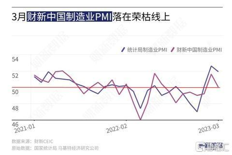
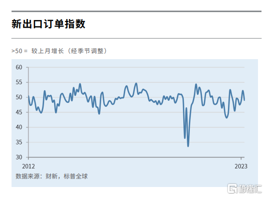

# 3月财新中国制造业PMI录得50.0，回暖势头放缓

本文整合自：财新网

4月3日公布的3月财新中国制造业采购经理指数（PMI）录得50.0，较2月下降1.6个百分点，落在荣枯线上，显示制造业经济活动总体与上月持平，回暖势头放缓。

这一走势与国家统计局制造业PMI一致。统计局近日公布的3月制造业PMI回落0.7个百分点至51.9，连续三个月位于扩张区间。

分项数据显示， **制造业供需修复速度减慢，**
3月制造业生产指数、新订单指数在扩张区间回落，仅略高于荣枯线。部分受访企业反映受益于疫情防控放开，客户需求和数量均有改善，但也有企业表示销售相对疲弱，尤其是海外订单。分品类来看，消费品销售增长，中间品和投资品销售下降。此外，主要受外需不振拖累，新出口订单指数重回收缩区间。

就业情况仍未得到根本性改善，3月制造业就业指数再度降至临界点以下。据调查，用工量下降主要是因为人员自愿离职后岗位空缺没有得到填补，以及企业削减成本。同时，积压工作量指数在扩张区间小幅下行，产能压力相对温和。

3月原材料购进价格指数落在临界点上，意味着在连续五个月上涨后，当月制造业成本环比维持不变。需求不振限制企业定价能力，当月出厂价格指数小幅降至收缩区间，其中消费品价格降幅大于中间品和投资品价格涨幅。

制造业供应链延续了2月的修复趋势，3月供应商供货时间指数继续位于扩张区间，但较上月略有回落。

制造业企业主仍对未来生产经营充满信心，3月信心指数较2月的近两年高点有所回落，但仍高于长期均值。企业普遍预计，未来一年将恢复更正常的运营状态。市场需求改善、客户数量增加、新产品开发等因素，支撑了业界的增长预测。

产量和新订单增速减弱

新订单总量增速减弱，月内仅略有增长。虽然不少厂商反映最近疫情防控放开，客户需求和数量皆有改善，但也有企业表示销售相对疲弱，尤其是海外订单。新接出口业务量在
3 月份重陷收缩，惟收缩率整体仍算温和。

制造业用工在2月份曾出现增长，3月则轻微收缩。据调查样本企业反映，用工量下降，普遍是因为人员自愿离职后没有填补空缺，以及企业致力削减成本。另一方面，整个行业产能压力仍然相对温和，积压工作量增速轻微，低于上月。

3月份，制造商采购活动连续两月小幅扩张，企业表示原因是新业务量持续增长，以及产量上升。不过，由于采购成本高，一定程度上导致企业增加动用原有库存，生产资料库存量因此进一步下降。月内成品库存也有轻微下降。

3月份，随着新冠防范措施的放开，供应商产能和库存改善，支撑 **供应链表现进一步好转。** 当月供货速度改善率虽然轻微，但已是 2018
年后仅有的第三次改善记录。

投入成本在3月份保持稳定不变，终止了此前持续5个月的上扬趋势。据调查样本企业反映，部分原料成本下降 (普遍是因为供应增加)
，有助抵消其他费用的上涨。另一方面，制造业平均销售价格轻微下降，许多厂商提到为保竞争力而使整体定价力受限。

对于未来一年的产量预期，中国制造商保持高度乐观，认为会比当前水平有提高。市场需求改善，客户数量增加，新产品开发等预期因素支撑了业界的增长预测。

王喆：制造业修复速度放缓，就业再度收缩

财新智库高级经济学家王喆表示，3月财新中国制造业PMI相关数据显示经济快速复苏势头有减弱迹象，反映出疫情期间积压需求短期释放后经济恢复基础不牢固的现实。展望未来，经济增长仍依赖内需的提振，特别是居民消费水平的提升。唯有千方百计夯实就业基础、提高居民收入、改善市场预期，方能落实中央提出的恢复和扩大消费的既定目标。

随着疫情防控较快平稳转段、节后复工稳步推进和前期稳增长政策逐渐显效，2023年前两个月，中国主要经济增长数据较2022年末明显改善，三驾马车的表现均好于预期。不过，拆解复苏动能可以发现，复苏更多由前期积压需求释放和政策驱动，内生增长动能仍然偏弱。

3月通常是春节后的开工旺季，PMI往往季节性回升，但2023年两个制造业PMI均有回落，显示随着疫情期间积压的需求逐渐消耗，制造业修复速度放缓，内生动能仍待夯实。市场普遍认为，虽然低基数将推高二季度经济数据同比表现，但经济环比修复最快的阶段或已过去。鉴于两个新出口订单指数回落幅度均大于新订单指数，且绝对值更低，未来制造业将更多由国内需求主导。

2023年政府工作报告将国内生产总值增长的目标设定为5%左右，这一目标相对谨慎，显示2023年更多是恢复性增长而非刺激性增长。新一任政府履职后，提高企业研发费用加计扣除比例、减征小微企业所得税、降低失业和工伤保险费率等优化完善税费支持政策陆续出台，并多次向市场传递出支持民营经济发展、“吃改革饭、走开放路”的信号。未来经济复苏的节奏将取决于企业和居民部门信心的修复进程。

