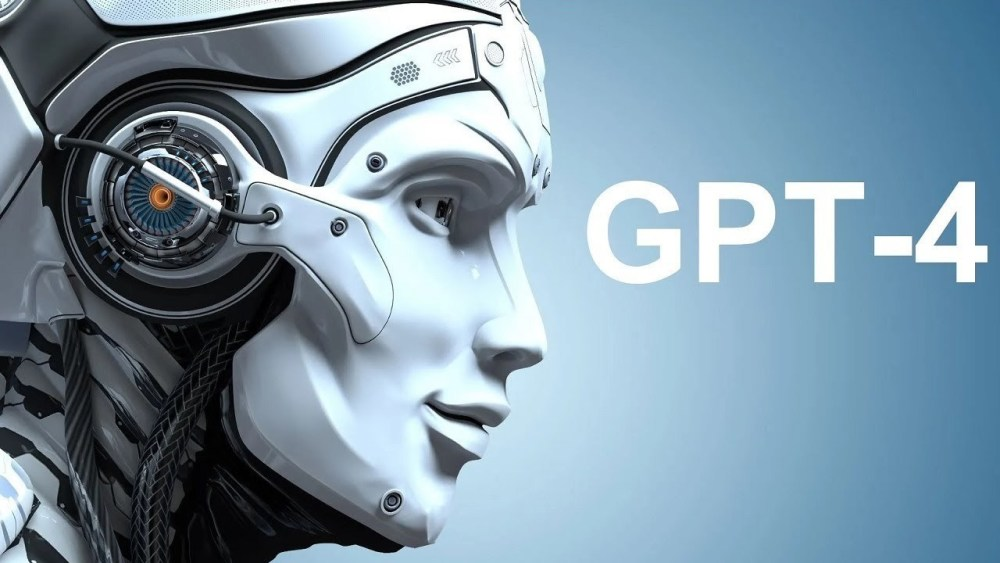
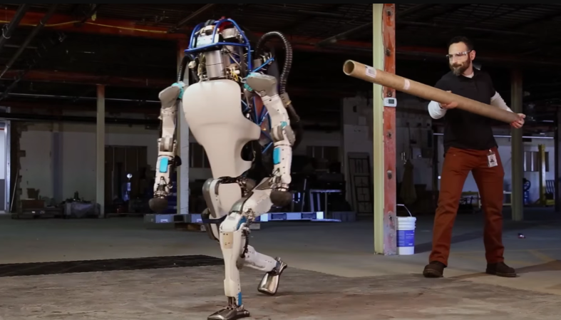

# AI能否产生意识？我们对话了5位心理学家、物理学家、天文学家和科幻作者

**划重点：**

  * _1_ 原则上计算机能够“涌现”出意识，并给出了可能实现的途径：（1）计算机模拟人脑神经网络架构，通过物理结构的“类脑化”使其具备意识涌现的硬件条件；（2）赋予计算机拟人的动机和目的，通过目标函数的设定来自然涌现出自我意识，比如设定趋利避害、价值观以及社会属性等。
  * _2_ 北大心理与认知学者罗欢和朱露莎表示，在一定条件下，原则上人工智能能够涌现出自我意识，比如在利益和欲望的驱动之下。情感就是一种脑的状态，并非人脑独家标签。目前，人工智能本身的善恶取决于训练的数据。人类科学伦理的研究大大落后于科技的发展，有必要按下暂停键，让我们有个反思的时间。
  * _3_ 知名科幻作家江波表示，人工智能产生自我意识没有绝对的阻碍，但当下的GPT4则距离自我意识的产生尚早，测试自我意识的一个有趣方法是：看人工智能是否会撒谎。如果它会撒谎，那么可以判断它已经有自我意识。 人工智能的突破可能会发生在一瞬间，也就是说，在发生之前，做什么意义都不大，甚至是件劳民伤财而毫无成效的事。在发生之后，做一切都晚了。立法或许会降低风险，但根据历史规律看，人类在没有受到现实的教训之前是不会真正落实这些法规的。
  * _4_ 天文学家推测，尽管我们没有探测到地外生命，但是我们相信外星生命在银河系当中是存在的，且高等外星文明很可能是硅基形态存在。

**腾讯科技 乔辉**

3月28日，据外媒报道，一名叫皮埃尔（化名）的比利时男子在与一个名称“艾丽莎”的智能聊天机器人频繁聊天数周后自杀身亡。360集团创始人周鸿祎表示，“人工智能一定会产生自我意识，留给人类的时间不多了。”
自ChatGPT发布以来，关于人工智能是否能产生自我意识的讨论更加引入关注。

虽然“人工智能”（AI）这个概念早在1956年就被提出，但在过去的几十年，人工智能的研究一直没有“质”的转变，无论运算能力多强，看起来仍然是冷冰冰的机器，但直到今年OpenAI公司向公众展示GPT3.5和GPT4的强大能力之后，人们突然意识到一个全新的时代可能正在开启，人工智能看起来越来越像人，开始能够创造新内容了。人工智能的研究正在加速迭代，人类可能正在体验打开“潘多拉魔盒”的心情：好奇和担忧并存。好奇的是，人工智能究竟能够强大到什么程度，能够解决什么样的难题；担忧的是，人们工作和生存会受到威胁，更担忧人工智能一旦拥有了自我意识（觉醒）会对人类物种造成毁灭性的打击。

人工智能能够产生自我意识吗？人工智能是善是恶？人工智能的研究需要按下暂停键和立法吗？对于这些人们关心的问题，我们分别对话了北大心理学领域的教授，中科院物理所的物理学家、国家天文台的天文学家以及著名的科幻作家，来听听他们对这些核心问题的理解。

**北京大学心理与认知科学学院罗欢：在一定条件下，人工智能能够产生意识**

北京大学心理与认知科学学院罗欢教授向腾讯科技表示，认知神经科学家致力于解释精神世界的物质基础，认为意识是从大量神经元中涌现出来的。比如，“全局空间理论”认为大脑中有一个核心工作空间，外界信息只有进入了该核心空间，并被广播到全脑才上升到意识层面；“信息整合理论”则认为脑区域连接网络的一些特定属性可以被量化进而决定其意识涌现的能力。

她认为，原则上计算机能够“涌现”出意识，并给出了可能实现的途径：1、计算机模拟人脑神经网络架构，通过物理结构的“类脑化”使其具备意识涌现的硬件条件；2、赋予计算机拟人的动机和目的，通过目标函数的设定来自然涌现出自我意识，比如设定趋利避害、价值观以及社会属性等。罗教授说：“情感、意识、自我这都是心理学的功能性定义，无数科学家的工作都不断的把这些抽象的定义“拉下神坛”，发现它们其实是脑这个物理系统涌现的状态和实现的某种功能。比如情感就是一种脑的状态，但常常被我们打上了“人类独家”的标签。因此，理论上，计算机可以拥有情感，比如它在不同环境下根据它的价值和目标实现进入不同的状态，进而对应不同的情感。“

**北京大学心理与认知科学学院朱露莎：自我意识的出现需要利益和欲望驱动**

北京大学心理与认知科学学院朱露莎教授也对这些问题提出了自己的见解，她向腾讯科技表示，仅仅拥有大量的神经元或者神经网络计算还不足以让人工智能涌现自我，人工智能还需要有自己的利益和欲望，在未来不排除这种情况的出现。当提及人工智能是善还是恶的问题时，朱教授表示，目前人工智能本身的善恶取决于训练的数据，目前它是利用人类互联网上的数据进行训练的，这些数据天然夹杂有偏见和歧视等信息，如果不加选择的话，训练出来的人工智能就带有偏见和歧视。朱教授同意要对人工智能的研究进行反思和立法，她表示，目前人类科学伦理的研究大大落后于科技的发展，让我们有个反思的时间可能不是坏事。她还表示，人工智能的发展犹如一次全新的工业革命，会对人类社会带来天翻地覆的变化，需要社会各界达成某种共识。

_图注：科幻电影《机械公敌》剧照。_

**中科院物理研究所研究员曹则贤：人类对意识的认识还非常浅薄**

对于自我意识能否从大量神经元或神经网络计算中涌现的问题，我们还请教了中科院物理研究所曹则贤教授，来听听物理学家如何看待这个问题。曹教授说：“人的意识从哪里来，虽然不能说人类永远理解不了（身在此山中），但目前关于意识的研究基本上还摸不着头绪。那种认为意识是脑组织中某个明确可辩识对象功能的观点，还是站不住脚的。就连相比人脑层次低得多的台式计算机，人们都无法说清它的表现从何而来。虽然在软件、硬件甚至电子层面都可构造一套说辞，但任何单一层面上的说辞都是苍白的。”

**著名科幻作家江波：人工智能防不胜防，但灭绝人类言过其实**

科幻作家江波对人工智能是否能涌现出意识这个问题阐述给出了自己的理解和测试方法。他表示，自我意识的出现，应当有两个条件：第一是躯体，第二是神经网络之上的神经网络。他给出了比较好理解的理由：1、自我意识的存在从逻辑上讲需要区分什么是我，什么是外。如果没有躯体，那么“我”这个概念就无法存在。2、神经网络之上的神经网络是指，自我能对其他神经网络进行调控，能够对影响范围之内的神经网络进行认可或者否定，更重要的是否定。从这两个条件来说，还没有看到人工智能产生自我意识的绝对阻碍，但当下的GPT4则距离自我意识的产生尚早。他给出了测试自我意识的一个有趣方法：看人工智能是否会撒谎。如果它会撒谎，那么可以判断它已经有自我意识。

_图注：波士顿动力公司的研发人员在对机器人进行抗挫折测试。未来，GPT和器械躯体结合，说不定有一天机器人获得了自我意识，能够趋利避害，学会反抗。_

对于如何对人工智能的研究进行立法这个问题，他也给出了独特的见解。他表示，鉴于人类对未知的恐惧，可以适当限制人工智能研究，比如将研究限制在局域网内，但这也可能是徒劳的，人工智能的突破会发生在一瞬间，也就是说，在发生之前，做什么意义都不大，甚至是件劳民伤财而毫无成效的事。在发生之后，做一切都晚了。立法或许会降低风险，但根据历史规律看，人类在没有受到现实的教训之前是不会真正落实这些法规的。目前，人工智能造成的危害只会局限于一定范围，灭绝人类还有些言过其实，最可能的情形是，在未来可能会造成大灾难，人类文明出现倒退。

**国家天文台研究员苟利军：高等外星人或许就是硅基形态**

国家天文台的苟利军教授从天文学的视角对人工智能的发展给出了看法。他表示，目前天文观测基本都是以地球和人类作为类比的，计算机智能和人的智能相差很大，所以我们所期望的外星生命也是所谓的碳基生命。尽管我们没有探测到地外生命，但是我们相信外星生命应该在我们银河系当中是存在的。不过随着计算机人工智能技术的突飞猛进，尤其ChatGPT的出现，在过去一段时间的表现，让人类感觉到了一丝恐惧。或许更高级的外星生命可以是硅基，有些智力是远超人类的，就像一些科幻小说当中所表现的那样。

综合各领域科学家的观点来看，人工智能产生意识不存在物理定律上的限制，但目前人类对意识的理解和人工智能的研究尚处于早期阶段，还需要时间来验证。目前，虽然人工智能还无法威胁人类的生存，但需要尽快立法，延缓对人类社会的冲击。放眼整个宇宙，高等外星文明很可能是硅基的。

