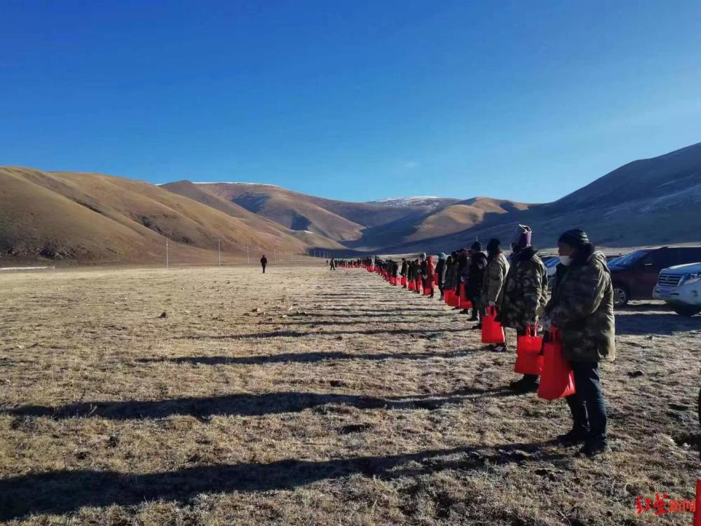
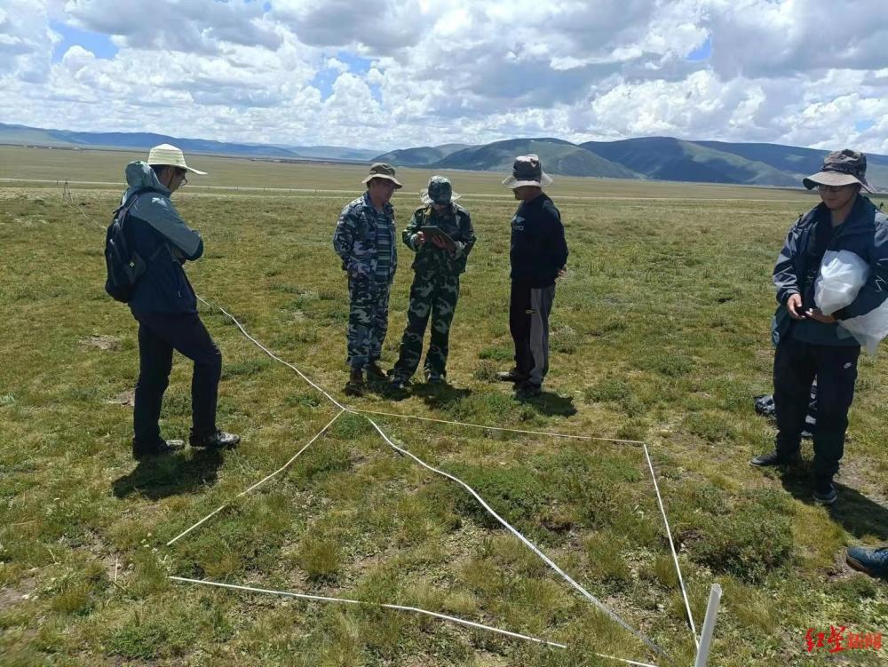

# “人鼠大战40年”！青藏高原上，一个县的治鼠拉锯战

初春三月，四川甘孜石渠县，扎溪卡大草原依旧冰封，冷风吹面犹寒。但在冻土之下，许多动植物都在蠢蠢欲动，为开春破土而出积蓄力量，其中就包括高原鼠。

**青藏高原高寒草地是世界上海拔最高、面积最大、类型最为独特的草地生态系统。**
适宜的鼠类种群，可维持青藏高原的生物多样性，但过度的鼠类取食牧草、啃食草根、破坏植被、打洞造丘导致草地沙化，传播疾病，严重影响当地畜牧业发展。而青藏高原草地退化，会给周边地区和长江中下游地区的生态及发展带来严重影响。

石渠县，位于青藏高原东南缘，隶属四川省甘孜州，地处川青藏三省（区）结合部。该县面积达25191平方公里，平均海拔4526米。作为四川面积最大的县，
**石渠县也是四川草原鼠害面积最大的县。**
2021年的数据显示，石渠县有天然草原3100余万亩，鼠害面积2076万亩，重度鼠害面积1600余万亩，超过四川全省60%以上。资料显示，川西北草原鼠害爆发于上世纪80年代初，到上世纪90年代初，四川省3亿多亩草原，被划定为严重程度的鼠害面积达4000多万亩，集中在甘孜、阿坝高海拔地带。其中，甘孜石渠县达2000多万亩，占全川一半以上。

石渠的鼠害治理，始于上世纪80年代初。该县治鼠在“鼠进人退”和“人进鼠退”之间的平衡之间前行，至今已40年。在经历漫长的“拉锯战”后，治鼠成效在最近十年得以体现，鼠害蔓延之势得到控制，严重鼠荒地面积逐年减少。数据显示，石渠县2021年重度鼠害面积为1615.10万亩，相较1992年的数据，减少700万亩左右。成效得益于综合治理的全面落实，包括灭鼠、种草、禁牧等各方面发力。这不仅是鼠害的治理，而是整个草原生态的修复。

四川省林业科学院副院长周俗表示，了解草原退化与鼠害的关系是综合治理的关键。治鼠不仅仅是治鼠，而是一个综合、系统的工程。
**连日来，红星新闻记者走访多位参与这场持续40年“人鼠拉锯战”的相关人员，探讨高原之上“人鼠冲突”间的生态平衡点…**

_四川甘孜
众人在进行鼠害防控_

**“鼠害记忆”：**

**锐减的牦牛和被迫搬离的村庄……**

赶在扎溪卡大草原“醒”来前，是又一轮大范围的鼠害防控。

“选在冬季灭鼠，能有效降低其种群的繁殖基数。”甘孜州石渠县林草部门负责此项活动的相关工作人员告诉红星新闻记者，冬季可供鼠类食用的植物大量减少，投放控鼠饵料也更易被鼠采食。刚刚过去的这个冬天，石渠县完成了200万亩草地的鼠害防控，有效率在80%。200万亩有多大？一个标准的足球场约为10.7亩，差不多相当于19万个足球场。

石渠县幅员面积25191平方公里，平均海拔4526米，是长江黄河的分水岭，也是重要水源涵养地、补给地和国家重要湿地生态功能区，素有“中华水塔”之称。

作为四川面积最大的县，石渠县也是草原鼠害面积最大的县。2021年的数据显示，全县有天然草原3100余万亩，鼠害面积2076万亩，重度鼠害面积1600余万亩，占到全省60%以上。

_四川甘孜
众人在进行鼠害防控_

为什么石渠草原鼠害这么严重？

根据四川省草原研究所主办的《草原与畜牧》杂志（原《四川草原》）1995年第3期刊发的《论石渠县鼠害失控及对策》一文显示，“1986年全国五省区交叉检查团到我县（石渠县）检查工作时指出，石渠县的鼠害居全国之冠，其危害程度之烈，实属罕见。”

此文中详述了石渠草原鼠害的失控之势。1982年全县鼠害发生面积300万亩，10年后的1992年，鼠害发生面积已达2700余万亩，其中重度鼠害面积2200余万亩，鼠荒地260余万亩。1982年，石渠全县基本上还没有鼠荒地，但到了1992年，鼠荒地面积已经占全县可利用草地的9%以上。上世纪五六十年代，石渠草原还是“马过草场草扫肚”“席地而坐不见人”，但随着草原的荒漠化，变成了“跑只老鼠都看得见。”

历史上，畜牧业就是石渠县的单一的支柱产业。鼠害的爆发，形成大面积寸草不生的鼠荒地，导致畜牧业生产力持续下降。1980年，全县牦牛存栏105万头，到了1993年仅有77万头。

“一些牧民已经无牧可放。”上述工作人员告诉红星新闻记者，在石渠县蒙宜乡蒙格村，由于鼠害猖獗等原因，周围草地退化，高寒草甸的土壤裸露，变成寸草不生的黑土滩，30多户村民不得不因此搬离原来的居住点。直到10多年后，当地草地得以恢复，人们才又逐渐搬迁回来。

_高原鼠_

**“控鼠”**

**治理、反复、再治理**

**一场持久的拉锯战**

“灭鼠要赶在春天土壤解冻、草长起来以前完成。”从2022年11月到今年1月底，石渠县林草局草原站带着数百人在草原上灭鼠，灭鼠队分成多组，整齐地站成一排，然后按口令沿着草地走过去，发现鼠洞便投下拌有生物药剂的饵料。这一轮结束后，3月至4月底还将进行一轮投饵。

**该草原站相关负责人表示，鼠控下来后，马上要开始人工种草，或给天然草地施肥。** 经过灭鼠、种草的鼠荒地会在今年夏天得以复苏。

但这片区域的治理还远未完成。目前以披碱草为主的人工草地，因种子不能成熟，四五年后会自然退化，鼠害便会重新发生。“我们不是要把鼠全部灭掉，也完全做不到。”上述负责人表示，投饵的目的只是把鼠的数量控制下来，任何一片草地，从技术到方法上，都只能达到降低种群密度的效果。

按照防控指标，一亩地在2只鼠以下，就不需要防控。但这个数据是不稳定的，有可能第二年就出现爆发式增长，因此必须做好全面监测。过去40年来，石渠县的鼠害治理，就如同一场持久的“拉锯战”。很多区域，都经历着治理、反复、再治理的过程。

_四川甘孜 众人在进行鼠害防控_

石渠县林草局提供的数据显示，2021年重度鼠害面积为1615.10万亩，相较于1992年的数据，减少了700万亩左右。成效主要取决于最近10年的综合防控举措得以全面落实。

上世纪80年代，石渠县主要在草地上投放化学药剂，但药物残留和生态影响难以评估。到上世纪90年代，已全部采用生物药剂，并辅以气体爆破、陷阱等物理手段。同时，招引鼠类天敌也进行了广泛尝试，在草原上架设T型架，方便老鹰栖息，引进狐狸等。

这些控鼠方法均被证实颇有效果，但跟踪监测发现，鼠的“反弹规律”依然存在。治理后的草地只要还存在裸斑，周边的鼠很快又会迁徙而来，而在集中治理后，鼠的繁殖力也会出现“报复式”增长。

2023年2月下旬，四川省林业科学院副院长周俗刚刚跑了一趟阿坝州，调研若尔盖草原鼠害防控情况。他说，草原鼠害治理确实存在着“反复”情况，除了上述原因，过度放牧，气候变化等造成的草地退化，也会诱发鼠害重新爆发。

“给人的印象是，年年治鼠年年鼠害。”周俗表示，过去几十年来，川西北草原鼠害发生面积总体变化不大，但严重区域有所降低，特别是鼠荒地得到了明显恢复。

_四川甘孜
众人在进行鼠害防控_

**不仅是控鼠**

**这是综合系统工程**

**“不能头痛医头脚痛医脚”**

是草先退化，还是鼠害先发生？

在鼠害治理过程中，这个问题也被人提了出来。鼠啃食牧草，到处打洞，形成鼠荒地。但人们同时发现，那些长势丰茂的草原上并没有鼠害，反而是盖度低、草低矮的区域，鼠害更容易发生。

周俗，1988年参加工作，对草原鼠害进行了长达30多年的研究。“低矮、有裸斑的草地，更适宜鼠类生存。”他说，好比苍蝇不叮无缝的蛋，是草原有了“缝”，然后有了鼠害。
**鼠害的成灾机制早有定论——过度放牧等原因造成草原退化，草原退化引发鼠害，鼠害进一步加剧草原退化。“所以，你不能头痛医头，脚痛医脚。”他说，了解草原退化与鼠害的关系，是综合治理的关键。治鼠不仅仅是治鼠，这是一个综合、系统的工程，有很多复杂的因素和问题要去解决。**

周俗介绍，四川有天然草地3亿多亩，鼠害主要集中在川西北海拔3000米以上的高寒地带。害鼠种类包括高原鼠兔、藏鼠兔、高原鼢鼠、旱獭、青海田鼠等10余种，危害最大的是高原鼠兔和鼢鼠。

“按照鼠害的成灾机制，我们要做的不仅仅是控鼠。”周俗说，早些年鼠害治理效果不明显，主要原因便是缺乏综合性的举措，“头痛医头，脚痛医脚，显然是治标不治本。”

在周俗看来，综合防治是对影响鼠害的各个因素进行研判，从草原生态系统出发，去落实相应的治理举措。

分析近年来的石渠县鼠害治理成效，更重要在于禁牧、轮牧制度的落实。鼠的种群密度控制下来，人工种草恢复植被，然后再禁牧让草地休养生息。草保持良好长势，便剔除了鼠害爆发的外在环境。

“受制于高海拔、资金欠缺、科技支撑不足等诸多困难。”他告诉红星新闻记者，这些工作需要多个职能部门共同发力，也需要更多的政策、资金等方面的支持。比如2003年出台的“退牧还草”政策，以及一系列草原生态保护补助奖励机制，对草原鼠害治理起到了决定性作用。

数据可以佐证，上世纪80年代初期，石渠县有超过100万头牦牛。如今，该县牦牛稳定在40多万头，这个数量符合当地林草部门计算的草原承载力。

而石渠县林草局每年都会对草场的承载力进行计算，并形成报告，交给农牧农村局指导牲畜产业发展。

石渠县林草局草原站相关负责人表示，石渠县着力发展牦牛集群产业，也有助于草地恢复，鼠害治理。更多的牦牛被圈养起来，种出来的草有计划地收割，可以确保草地休养生息。同时，严格实行轮牧制度，确保草场不出现过度放牧。

在治理技术上，石渠县也在不断创新，近年来与四川大学团队合作，根据鼠类生活习性，在草原上安置矮墙陷阱，能持续有效地起到控鼠作用。针对外地草种生长周期的缺陷，石渠县林草局跟四川农业大学也展开合作，培育优质牧草草种，从去年开始已试种成功。

“只有一环扣一环，才能正确草地得到有效保护和利用。”该负责人表示，就石渠县来说，综合治理的方法和技术依然还在摸索中，但目前已经取得明显发展，并且成效显现。

_四川甘孜
众人在进行鼠害防控_

**治鼠亟待确立生态指标**

**“我们的目的是找到生态系统平衡点”**

“害”，是从人类的角度去判断的。周俗说，上世纪80年代，牧区大力增加牲畜养殖，草成为紧缺的生产资料。当人们发现鼠在和牲畜争夺牧草的时候，鼠就变成了危害。

“因此，最初的鼠害治理是从经济指标出发的。”周俗告诉红星新闻记者，根据经济阈值进行评价，在一片鼠害草地上，危害的经济损失大于治理成本，那就选择治理，反之着不需要治理。

为了简化这种评价标准，国家曾专门出台指导意见，以单位面积鼠的数量作为判断标准，具体到一公顷草地面积超过300个有效鼠洞，便被划定为鼠害严重区域。在国家生态建设要求下，前些年又把这个判断标准调整为一公顷草地面积超过360个有效鼠洞。

周俗表示，在过去的鼠害治理过程中，这个指标的确具有清晰的指导意义。但从生态系统来说，这个指标又过于简单化了，鼠害治理会给土壤、生态链带来哪些影响，目前并没有一个清晰而准确的评价。

_四川甘孜
众人在进行鼠害防控_

2023年3月12日，全国绿化委员会办公室发布2022年中国国土绿化状况公报显示，我国森林面积2.31亿公顷，森林覆盖率达24.02%，草地面积2.65亿公顷，草原综合植被盖度达50.32%。

据全国草原监测报告统计，2007—2021年间我国草原鼠害年平均发生面积为3644.69万公顷，2018年开始出现“逆势增长”，2021年达到最高，达到5000万多公顷。

周俗说，鼠在斑驳化的草地里出现种群爆发，是因为鼠类在这种环境里适宜生存，它有开阔的视野，便于躲避天敌，有喜欢的草种，能够提供更丰富的营养。研究表明，如果植被盖度达到90%以上，草的高度在50～70公分以上，鼠的数量就很难爆发式增长。

_四川的高原鼠_

石渠县林草局草原站也在鼠害治理经验中发现，一亩草地里，有2只以下的鼠，对草地是有益处的，它的道洞可以松土，也能维系生态链的稳定。但在该草原站负责人看来，草原鼠害治理还有诸多困难，存在着外界认识不到位，生态恢复困难，资金和科技支撑不够等问题。

“鼠，作为草原生态链中的重要一环，治鼠就必然会关系到整个生态链。”周俗告诉红星新闻记者，高原鼠兔、高原鼢鼠等鼠类本来是青藏高原特有物种，它们比人类还要早来到这片草原，保持着生态的平衡，系统的稳定。

作为草原鼠害治理专家，周俗不赞同极端观点，“有些说不用治理，有些说就要把鼠灭干净。”他说这种观点之争从草原鼠害发生以来就有，但“我们不能不作为，但也不能干预过度，我们的目的是要找到整个生态系统的平衡点。”

“这个平衡点，就是当下亟待确立的生态指标。”周俗表示，在这个平衡点上，要有草，有人，有牛，有鹰，有狐狸……也必须要有鼠的和谐共存。

红星新闻记者 蒋麟 杨灵 图据受访者

责编 邓旆光 编辑 王禾

