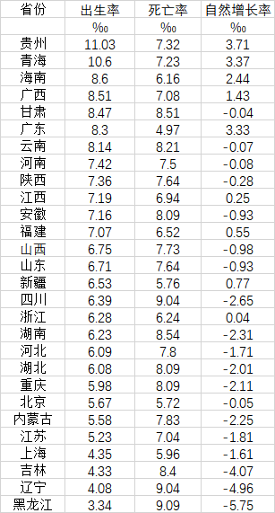

# 东北三省去年常住人口共减少86.08万人，出生人口跌破40万

近期，各省份正陆续发布2022年的人口数据。

吉林省统计局网站近日发布的《吉林省2022年国民经济和社会发展统计公报》显示，年末全省总人口为2347.69万人，其中城镇常住人口1496.18万人，占总人口比重（常住人口城镇化率）为63.73%，比上年末提高0.37个百分点。户籍人口城镇化率为49.08%。全年出生人口10.23万人，出生率为4.33‰；死亡人口19.84万人，死亡率为8.40‰；自然增长率为-4.07‰。人口性别比为99.83（以女性为100）。

2021年末吉林全省总人口为2375.37万人。也就是说，2022年，吉林常住人口减少了27.68万人。

目前，东北三省2022年人口数据已全部出炉，三省常住人口减少数量均超过了20万人。数据显示，2022年年末黑龙江常住总人口3099万人，比上年减少26万人。辽宁2022年年末常住人口4197万人，比上一年减少32.4万人。加上吉林，东北三省去年常住人口共减少86.08万人。

东北三省常住人口减少较多，主要跟低出生率有关。数据显示，去年黑龙江人口出生率为3.34%，辽宁为4.08‰，吉林为4.33‰。三省出生率位列全国倒数后三位。人口自然增长率方面，黑龙江为-5.75‰，辽宁为-4.96‰，吉林为-4.07‰，同样位居倒数后三位。

吉林大学东北亚研究院教授衣保中分析，近年来东北经济下行压力大，就业机会少，部分年轻人口外流，影响了出生率。另一方面，尤其是东北城镇化和工业化早，很多就业人员在国企、行政计划单位，体制内的人员占比较大，过去计划生育执行得比较严格，东北的独生子女比例在全国是比较高的。目前，这批独生子女进入婚育阶段，因此出生率也比较低。

数据显示，去年吉林出生人口为10.23万人，黑龙江出生人口10.39万人，辽宁出生人口17.2万人，三省出生人口合计跌破了40万，仅为37.74万人，占全国比重仅为3.95%。常住人口合计超9600万的东北三省，去年出生人口不及西南的云南一省多。

第一财经记者梳理发现，目前已有29个省份公布2022年人口数据，其中28个省份公布了出生人口相关数据，目前人口大省的出生人口数据均已揭晓。数据显示，去年广东、河南、山东三个人口大省的出生人口稳居前三。其中，广东连续三年成为唯一一个出生人口超100万的省份，广东已经连续五年成为第一生育大省。

从出生率来看，27个省份中，有12个省份人口出生率超过7‰，这12个省份也超过了6.77‰的全国平均水平。12个省份中，有9个省份来自中西部，只有海南、广东和福建来自东部沿海。人口出生率低的省份主要来自东北、华东和华北，主要是城镇化和工业化较早的地方。

28省份2022年人口出生率、死亡率和自然增长率（数据来源：第一财经记者根据各地统计数据整理）

