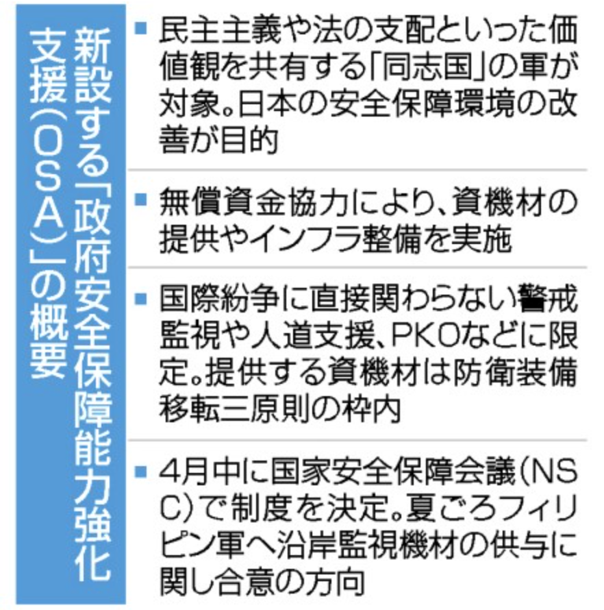

# 动作越来越大！日本政府将推出无偿支援伙伴国家军队的合作机制

去年12月，日本内阁会议上通过的《国家安全保障战略》等三份安保文件规定了对“志同道合”国家军队提供援助。时隔近四个月，这项新机制落地了。

据日本共同社报道，4月1日，日本政府多名有关人士透露，日本政府将以“改善日本的安全保障环境”为由，推出一项无偿支援伙伴国家军队的合作机制。

该机制致力于协助东南亚国家提升海空监视能力，以遏制中国在区域内的军事活动，并计划今年内向菲律宾及印太地区国家提供监视及通信器材。

_新成立的政府安全保障能力强化支援（OSA）概述。图源：共同社_

据悉，新设的无偿资金合作机制名为“政府安全保障能力强化支援”（OSA），不同于仅限非军事领域的政府开发援助（ODA）的机制，新机制致力于向拥有“民主与法治等共同价值观的志同道合国家”的军队提供装备和物资器材。

报道声称，考虑到“中国在东海和南海加强军事活动”，日本此举意在直接支援东南亚国家的军队，以提升对华“遏制力”。

提供的器材限定为规定防卫装备品出口规则的“防卫装备转移三原则”范围内，并允许用于完善与军事活动有关的基础设施。

比如监视海岸所需雷达和分析数据的设备，提高受援国领海和领空警戒监视能力，用于反恐的防弹车等装备品也在设想之列。

新机制的合作对象限定为“不直接参与国际纷争”的领域，例如：提高警戒监视领海及领空、反恐和海盗对策等确保安全的能力，出于应对灾害及搜救等人道主义目的，强化联合国维和行动的能力。

日本政府将在4月的国家安全保障会议上正式落实新机制，计划今年夏季前后向菲律宾军方提供可增强海洋状况把握能力的雷达，年内再向印太地区内的数个国家提供通信装置等。

但报道称，考虑到域内众多国家与中国的关系深厚，日本的做法能否达到预期目的，仍是未知数。

ODA政策是日本战后恢复经济的外交手段之一，最初是为了扩大商品和原材料市场。1992年，日本首次制定《政府开发援助大纲》，2015年改名为“开发合作大纲”。

2015年的大纲首次允许日本对他国军队提供政府开发援助，以支持这些军队的非作战行动。八年后的今天，日本新设OSA机制，致力于向伙伴国军队提供用于军事目的装备，日本进一步谋求军力松绑的行动按部就班，野心昭然若揭。

长安街知事（微信ID：Capitalnews）注意到，日本已经成为美国在亚洲的桥头堡，近来打着“中国威胁论”的幌子，积极拉拢菲律宾的动作幅度越来越大，不仅砸6000亿日元拉拢菲律宾，还主动牵线搭桥，敦促菲律宾与日美共同建立反华安全框架。

据共同社3月28日报道，知情人士表示，日本提议，日、美、菲共同设立一个三方安全对话机制，以应对所谓的“中国在印太地区军事上越来越强硬”。

菲律宾国家安全顾问阿诺称，考虑最快4月举行该机制的首次会议，时间和地点正在协调。美国国家安全顾问沙利文和日本国家安全保障局长秋叶刚男预计将成为参加该会议的另外两名代表。

另一位美国政府消息人士称，这次三边会议很可能在美国和菲律宾4月11日于华盛顿举行的外长、防长“2+2”会谈后举行。日美官员希望在不久的将来，将该框架从对话扩大到三边防务合作和演习。

_岸田文雄与拜登资料图。图源：AP_

客观上制造了包围中国的局面，却反咬一口“中国威胁”，日本在背离和平宪法、助力美国打造“亚洲版北约”的邪路上走得太远了。

好战穷兵，未有不亡者也。4月2日，国务委员兼外长秦刚在北京同日本外相林芳正举行会谈时直言不讳地表示，日本不应为虎作伥。

