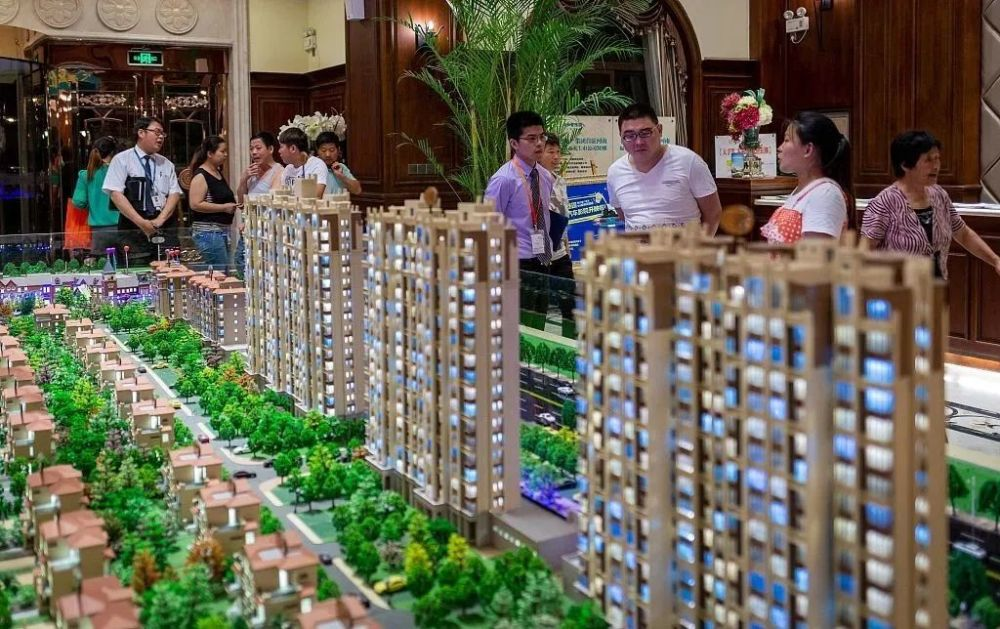

# 十余家房企亏损均超百亿，“买到地盖出房子就能赚钱的局面一去不返”

_来源：视觉中国_

作者 | 郭一非

编辑 | 杨布丁

出品 | 棱镜·腾讯小满工作室

“2022年整个房地产行业可以说极其严峻。两大现象，一是债务大量违约，二是大量企业亏损。”美的置业主席郝恒乐的这番话，基本代表了地产行业去年的处境。

不过，美的置业一没暴雷，二没亏损。虽然跌出千亿房企阵营，但销售排名甚至还前进了4位。这在民企房企集体大倒退的浪潮中极为罕见，一个重要原因在于背靠身后的家电巨头美的集团。

行业大洗牌在2022年来得更为明显。以TOP10房企为例，招保万金（招商、保利、万科、金地）首次重新回归，同样入局的中海、绿城、建发、华润也均为国央企背景；唯二的民企，仅剩碧桂园、龙湖两家，十强常客恒大、融创则双双落榜。

背靠大树的优势，有力帮助了房企们免于债务违约的暴雷风险，但在远超外界预期的市场恶化形势面前，仍旧显得力不从心。

“现在暴雷的企业集中在民企，难道我们的国企都是好好的吗？虽然今天他们没有出现债务危机，但是他们的资产质量、经营水平，大家怎么就不关心呢？”原阳光城总裁朱荣斌曾在去年公开质疑称。

如今，当2022年财报账本一一摊开，展现在公众面前时，外界发现，招商、保利、华润、金茂等一众国央企归母净利润也大幅下滑，远洋、华侨城两家国央企甚至巨损超过百亿元。当然，民企日子更不好过，免于暴雷风险的碧桂园遭遇了上市16年来第一次亏损，融创、蓝光、荣盛、富力、雅居乐、正荣、佳兆业、禹洲等暴雷民营房企，亏损均超过百亿元。

拿当年意气风发、收购万达酒店资产的富力来看，其2022年归母净利润亏损164.7亿元，两年巨亏超过320亿元，“出售酒店资产成为公司流动资金来源”。

销售低迷、项目降价致结算收入减少、毛利较低，再加上资产大幅减值计提，成为房企净利下滑的核心原因。

乐观来看，灰暗的日子或许已经过去，进入2023年，暴雷房企名单虽然还在增加，但市场也迎来了久违的小阳春行情，带来了珍贵的销售现金流。但这场楼市回暖的热度能持续多久，仍待时间的检验，这也将直接决定房企们能否迎来真正的触底反弹。

**“没有‘狂飙’，也没有‘倒春寒’”？**

2021年，当万科归母净利润近13年来首次下滑时，57岁的董事长郁亮第一次向股东当众致歉，并将2022年目标定为“止跌企稳”。

到了来年，在同行们业绩大幅下滑的衬托下，万科扬眉吐气了一把，营收与净利润双双守住了正向增长。

作为观测行业的风向标，万科在致股东的信中写道，2022
年，行业形势的严峻性远远超出了我们在年初的预计，“全年商品房市场出现了有统计数据以来最大幅度的下跌，百强房企销售额同比下降42%。行业融资能力大幅萎缩，海外债务市场失去功能。大量房企资金链断裂，并冲击上下游。市场预期降至冰点，信心危机导致的恶性循环开始向所有企业蔓延”。

首当其冲的就是销售额的下滑。中指研究院的统计称，央国企业销售额降幅一般在20%以内，受到市场调整冲击较小，经营稳健的民企降幅在30%左右，发生债务违约的企业降幅基本在70%以上。

疫情结束，积压需求释放的小阳春行情下，中指统计称，2023年1-3月，TOP100房企销售额为17589.5亿元，同比增长8.2%，这是2022年以来首次实现增长。

尽管如此，开发商们对于行业回暖的判断依旧谨慎。

比如，郁亮认为，“市场既没有‘狂飙’，也没有‘倒春寒’”，仍处于温和恢复的阶段。

与其类似，绿城副总裁李骏则认为，市场整体已现回暖迹象，但热度及可持续性仍需时间的检验，若宏观经济持续向好，居民购房信心恢复，2023年房地产市场复苏是大概率事件。

城市之间的分化更为明显。华润置地总裁张大为表示，房地产回暖主要表现在一二线热点城市，其他的二线还处于止跌的阶段，目前大部分三四线反弹不明显。

金茂总裁李从瑞则相对悲观：“行业形势依然未见好转，我们不能寄希望于市场上涨。”

**华侨城首亏百亿背后**

紧随销售额大幅下滑之后，地产行业的利润也开始遭遇挑战。

经济观察报不完全统计，截至3月30日，已经发布业绩报或业绩预报的144家房企中，有105家净利润出现下滑，其中76家处于亏损状态，亏损额预计或已经超过百亿的大约有13家。144家房企整体亏损至少约2839亿元，如果加上还没有公布业绩报的100多家房企，全行业亏损规模将更大。这也是房地产行业近十年利润降幅最为严重的一年。

以央企华侨城为例，其上市25年来首次亏损，2022年的归母净利润巨损109.5亿元，同比下滑387.05%。

对于亏损原因，文旅+地产双轮驱动的华侨城有5条解释，比如市场下行导致销售额下滑、为了快速去化项目降价、存货资产进行计提减值、转让股权的投资收益减少、部分合作开发项目利润减少。

即便如民营房企龙头碧桂园，也遭遇了上市首次净利润下滑，其归结的原因也颇为类似，即市场下行，低毛利项目结转导致毛利率下降；对物业项目计提减值增加；外汇波动的汇兑净损失所致。

“去年的环境下，活下来的企业都会牺牲掉一些利润来保现金流，这个是不争的事实。”碧桂园首席财务官伍碧君解释称，大家一方面在去杠杆，另一方面经济收缩状况下，为了尽社会责任保交付，各种支付都是照常进行。

值得注意的是，国内商品房预售制下，房企拿地后，先向购房者收取卖房款，等房屋竣工交付后，预收款才能结转为营收与利润。这意味着，销售周期与收入确认周期不匹配。过去两三年前的高价地块，纷纷遭遇了去化不畅、房价下降以及交付进度缓慢等不利因素，从而导致结算毛利率普遍下滑。

与此同时，基于对未来市场预期的悲观判断，选择计提资产减值，也是房企利润大幅下滑的重要原因。不过，市场也多有声音认为，这一招数既清算了历史旧账，也间接甩掉了包袱，或许能为未来利润增长提前做好财务安排。

比如，华侨城2022年前三季度还有1.26亿元的净利润，全年却亏损109亿元。这一度引来了深交所的关注函。

对此，公司总会计师冯文红解释称，预计房地产市场短期调整压力仍然较大，对公司存量项目进行存货跌价测试，导致预计未来现金流量的现值低于账面价值的存货，计提了存货跌价准备115亿元，以及应对长期股权、投资固定资产等减值准备12亿元。

不过，行业也有例外。比如龙湖首席财务官赵轶直接表示，我们整体不存在计提减值，因为整体的土地成本相对可控，我们处理的空间比较大。

**碧桂园也要回归一二线了**

只卖房不囤地的极致生存法则，在2022年愈演愈烈，即使进入2023年仍未有太多改善。

海通证券统计称，2022全年土地出让收入为66854 亿元，同比下降23%。土地成交量价齐跌，长期需求或不足。

从拿地方来看，克而瑞地产统计称，22个重点城市集中供地中，地方国资拿地金额占比达到42.0%，超过了央国企的37.4%，民企仅为15.8%、混合所有制企业占比为4.8%。

城市分化也更为明显。热度较高的城市为北京、上海、深圳、杭州、厦门和合肥，而反观长春、沈阳等城市，至今尚未能推出第三批次集中供地，全年宅地供地计划完成率不足三成。

“消费者更加理性，买到地盖出房子就能赚钱的局面已经一去不返。”万科在致股东的信中判断。

这其中，三四线成为房企集体遗忘的地方，房企们为了争夺一二线核心地块，更是被迫“烧香拜佛”，祈求中签拿地。

克而瑞研报统计称，经过上一轮棚改带来的市场高温后，百强房企开始回归一二线。2020-2022年，三四线城市成交金额分别占比53%、50%、48%。在拿地建面上，2022年更是仅占31%，同比下降20个百分点。

“高能级城市将是房企争夺的主战场。长三角、大湾区的三四线，受到城市群辐射的利好，可以看高一线。”上述研报认为，大多数人口流出、产业无支撑的三四线城市，土地或将出现无人问津的现象。

以“三四线之王”碧桂园为例，其在宣布重启拿地的同时，也将投资重心将转向一二线城市。公司总裁莫斌展望称，计划在3-5年内，将一二线的土储货值占比提高至50%。

尽管在小阳春行情刺激下，碧桂园、金地、新城等房企开始重启拿地，但土地冷清局面依旧在延续。

中指研究院统计，2023年一季度，全国300城土地出让金同比下降12.8%，成交面积同比下降26.7%，流拍撤牌率为15.3%，同比好转了23.6个百分点。投资拿地方仍以央国企老面孔为主——22城集中供地中，央国企占比37%，地方国资占比42%，民企占比仅16%。

中指判断称，短期来看，政府或继续加大核心区优质地块供应力度，“土拍市场能否继续回温仍有赖于销售端恢复程度，土拍分化仍将延续”。

“房地产政策进入全面宽松周期，但仍难刺激居民加杠杆购房。”佳兆业董事会主席郭英成在年报中略显悲观地表示，2022年11月出台融资“三支箭”，监管层对于房企融资态度发生根本性转变，逐步变为保（企业）主体，但只惠及少数优质民企，多数民企融资难的基本面没有改变。

**腾讯新闻出品内容，未经授权，不得复制和转载，否则将追究法律责任。**

