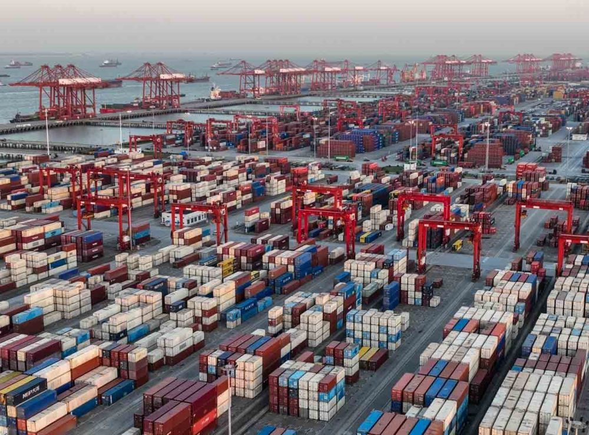
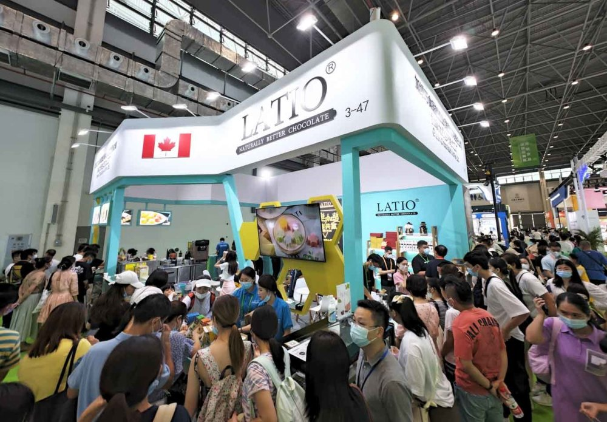
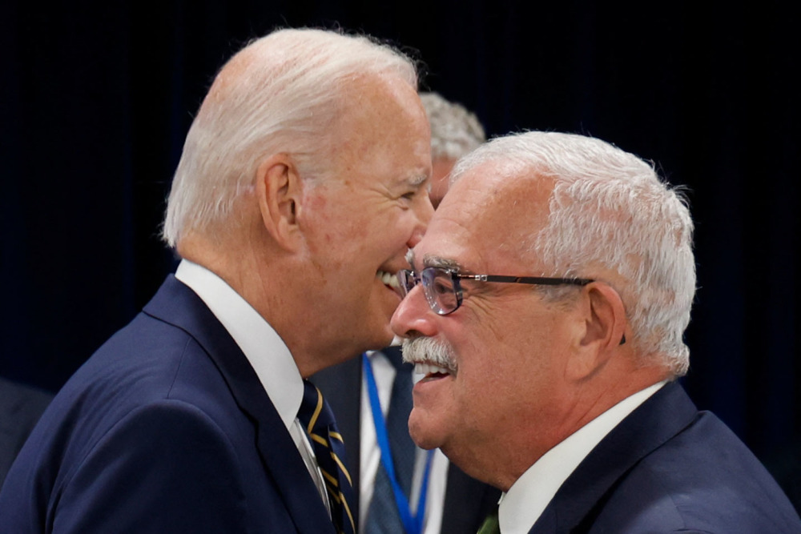
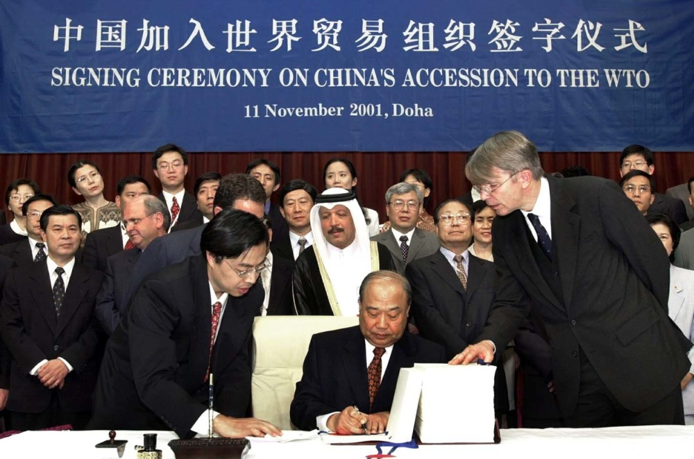
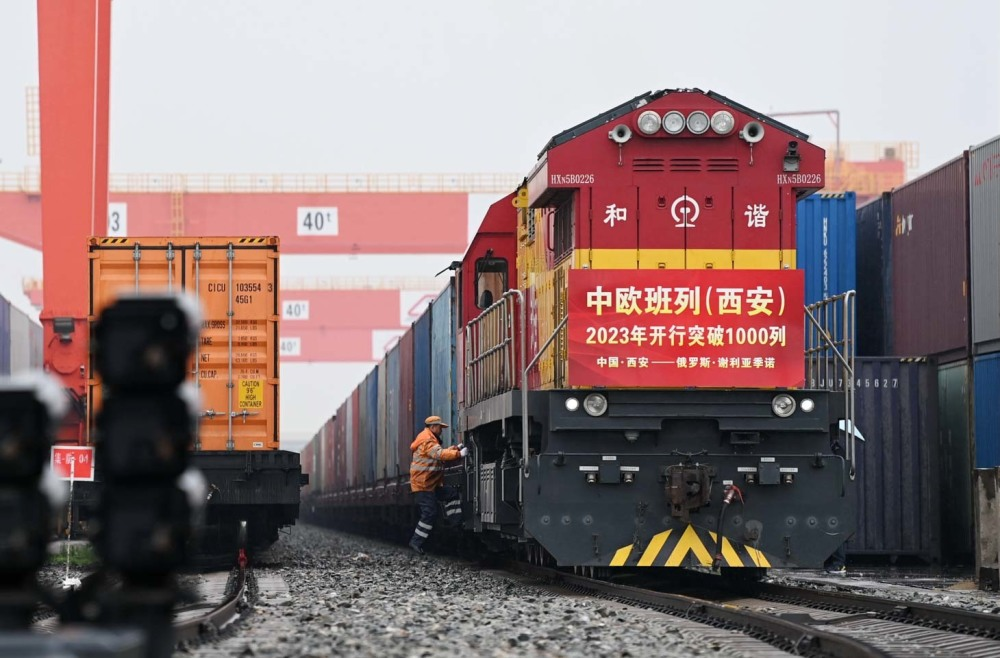
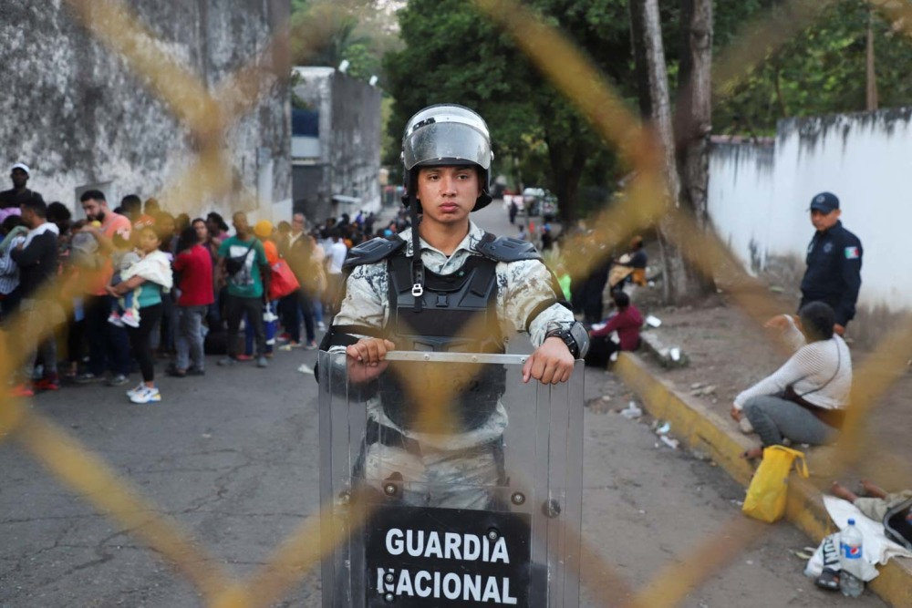
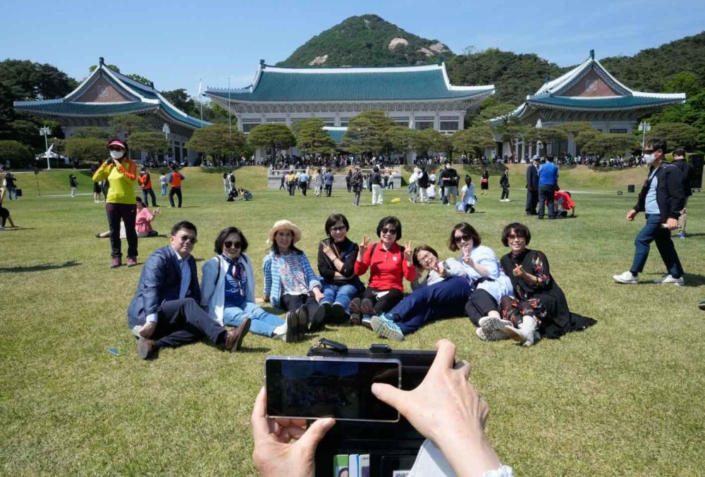

# 发达国家还是发展中国家，到底谁说了算？

2023年3月13日，江苏太仓港码头。海关总署发布的数据显示，以美元计，2023年2月中国进出口额超过4112亿美元，同比增长1.3%

2023年3月27日，美国国会众议院以415票赞成、0票反对的表决结果，通过了《中华人民共和国不是发展中国家法》，
要求美国国务院对国际组织施加影响，“把中国重新归类为高收入、中高收入或者发达国家，而不再视其为发展中国家”，从而确保“中国不会因发展中国家地位而获得优惠待遇及援助”。

这部法案由加利福尼州共和党众议员金映玉（Young Kim）与康涅狄格州民主党众议员杰里·康纳利（Gerry
Connolly）联合提出，他们认为中国已经是世界第二大经济体，占全球经济的18.6%，经济规模仅次于美国，美国被视为发达国家，中国也应如此。

未来，该法案还需要参议院通过并得到美国总统拜登的签字，才能正式生效。而在不久之前，犹他州共和党参议员米特·罗姆尼（Mitt
Romney）和马里兰州民主党参议员克里斯·范·霍伦（Chris Van
Hollen）已经提出了一项类似的法案，称之为“终止中国的发展中国家地位法案”，宣称要禁止中国以发展中国家身份参与有美国加入的国际组织。

_2023年3月29日，博鳌亚洲论坛2023年年会举行“中国式现代化”分论坛（新华社/图）_

再往前追溯，拜登的前任特朗普就曾经多次在公开场合声称，中国作为一个经济大国，披着“发展中国家”的身份，比美国获得了更多的资源和政策优待，美国吃大亏了。

2022年9月，美国参议院曾经以69票赞成、27票反对批准了一项气候条约修正案，即《〈关于消耗臭氧层物质的蒙特利尔议定书〉基加利修正案》，该修正案承诺美国将减少导致气候变化的氢氟碳化物的生产和使用；同时，这项修正案还附加了一项针对中国的条款，建议取消中国发展中国家的身份。

显然，不承认中国是发展中国家，强行把中国推入发达国家的行列，是美国近年来遏制中国的新举措，那么，美国此举会带来哪些后果？而中国离发达国家到底又有多远？

_2022年7月30日，海南海口，观众在第二届中国国际消费品博览会现场参观。中国国家统计局数据显示，2023年1-2月份，社会消费品零售总额77067亿元人民币，同比增长3.5%（新华社/图）_

什么是发达国家？

事实上，到底什么是发达国家，全球范围目前并没有统一的标准，主要国际组织各有各的定义。

目前，全球有26个国家既是OECD成员国、联合国贸发会议B组工业国、国际货币基金组织定义下的发达经济体，也是联合国开发署的高人类发展指数国家、世界银行高收入国家。这26个国家，是确定无疑的发达国家。

发达国家的概念，最早来自于1961年成立的经济合作与发展组织OECD，它在成立宣言中提出了发达国家的概念。OECD的前身为欧洲经济发展组织，成立之初有包括欧美老牌资本主义国家在内的20个创始成员国，此后陆续有日本等国家加入。到目前为止，OECD共有38个成员国，被看作是发达国家俱乐部，不过其中的土耳其、墨西哥、波兰，被普遍认为还算不上发达国家。

1964年12月成立的贸发会议是联合国的常设机构，主要职能是处理有关贸易和经济发展问题，目前拥有195个成员国。自1991年以来，贸发会议成员被分为四组：A组主要包括非洲和亚太集团的国家，B组由西欧和美国、日本等发达国家组成，C组由拉丁美洲和加勒比集团国家组成，D组则由东欧集团国家组成。其中的B组基本都被视为发达国家。

_美国总统拜登（左）与众议员杰里·康纳利（视觉中国/图）_

2021年6月22日，韩国在联合国贸发会议上正式提出本国的地位变更案，该申请在7月2日得到了所有195个成员国的一致赞成。这样，韩国从亚非发展中国家的A组进入了发达国家俱乐部的B组，成为B组的第32个国家。这也是贸发会议成立以来第一个地位变更的国家。中国目前仍然是A组的成员。

国际货币基金组织（IMF）则将全球196个经济体分为两类：发达经济体、新兴市场和发展中经济体，其中发达经济体有40个，中国则被归为“新兴市场和发展中经济体”。IMF也明确指出，上述划分依据按购买力平价计算的GDP、货物及服务出口总额和人口等指标，不是基于经济或其他方面的严格标准，且会随着时间而演变。

联合国开发署按照自己编制的“人类发展指数（HDI）”，把全世界191个国家和地区分为三类：极高（66个），高（49个）、中等（44个）、低（32个），中国目前排在第79位，属于第二档的“高人类发展指数国家”。

世界银行则按照人均国民总收入（GNI）把世界各国分为低收入、中等偏下收入、中等偏上收入和高收入四个组别。按照2023年公布的最新划分结果，低收入经济体是指人均国民收入在1085美元或以下的28个经济体；中低收入经济体是指人均国民收入在1086美元至4255美元之间的54个经济体；中等偏上收入经济体是指人均国民收入在4256美元至13205美元之间的54个经济体；高收入经济体是指人均国民收入在13205美元以上的81个国家和地区。按这个标准，中国被归于中等偏上收入经济体。

_2001年11月11日，卡塔尔首都多哈，中国对外贸易经济合作部部长石广生在中国加入世界贸易组织的签字仪式上签署文件（视觉中国/图）_

发达国家的义务

从以上各种标准可以看出，无论依据哪个主要国际组织的划分标准，中国都算不上是一个发达国家。所以美国国会认定中国是发达国家，明显不符合实际情况，其中有着明确的政治企图。

美国之所以积极地想要把中国变成发达国家，是因为如果中国一直是发展中国家，那么在很多国际贸易和金融领域，就会受到相应的照顾，比如WTO规定发展中国家可以有高于发达国家的进口税率、长于发达国家的过渡期，以及更多的贸易优惠等等。而一旦成为发达国家，不仅这些优惠不能享受了，还要承担更多的义务，比如发达国家有义务向发展中国家提供资金支持、在节能减排方面承担更多的义务、国内市场按照要求得高度开放，等等，这些对尚处于发展中国家水平的中国来说，无疑会增加额外的负担。

而强行把其他国家归为发达国家，美国不仅对中国这么干，对一些和它走得很近的国家，也同样不放过。2020年2月10日，美国贸易代表办公室（USTR）更新了欠发达和发展中国家名单，将25个经济体排除在优惠清单之外，只保留了44个欠发达国家和36个发展中国家。

USTR认为只要符合以下三项中任何一项的国家，都不应被列入优惠清单：第一，人均国民收入超过世界银行的高收入国家线（当时为12375美元）；第二，一国贸易占世界贸易的比例超过0.5%；第三，其他因素，包括属于欧盟成员国、OECD成员国或申请国、G20成员国、非市场经济国家等。

这样一来，一些大国尽管人均国民收入还比较低，也不被允许继续享受贸易优惠，比如中国、印度；一些中小富国，即便是盟友，也同样不被允许继续享有发展中国家待遇，比如韩国。

_2023年3月23日，在西安国际港站，X8489次中欧班列准备驶往俄罗斯谢利亚季诺（新华社/图）_

此类举动，是近年来在国内政治压力之下，美国贸易保护主义情绪上升、不断对其他国家挥舞贸易战大棒的必然产物。

由于中国已经在2020年被美国移出欠发达和发展中国家名单，所以美国此次的举动，对当下的中美贸易并没有太大的影响。但这很可能意味着美国接下来会变本加厉，拿取消中国的最惠国待遇说事。

2023年1月30日，美国国会参众两院提出了2023年版本的《中国贸易关系法案》(China Trade Relations Act of
2023)，要求撤销中方在2000年9月获得的与美国永久正常贸易关系地位，让美中贸易关系重回2001年以前的模式。如果该法案通过，美国总统需要每年定期在国会批准下，更新对中国贸易地位的定义。

2023年1月10日，墨西哥国民警卫队在位于恰帕斯州塔帕丘拉的墨西哥难民援助委员会外站岗，试图北上前往美国的移民排起长队（新华社/图）

1990年代，中美曾经围绕着美国是否给予中国最惠国待遇问题激烈交锋。1999年，中美两国就中国加入世界贸易组织达成一系列的双边协议。根据协议规定，在中国正式加入世界贸易组织后，美国需要给予中国永久正常贸易关系地位。2000年9月，美国国会正式通过了给予中国永久正常贸易关系的相关法案。自此以后，历届美国总统无需每年定期对中国的贸易地位进行重新评估，中美贸易往来也因此更上一层楼，走上了高速发展的快车道。

如果未来中国的最惠国待遇被取消，对于中国来说，大量的出口型企业原本享有的关税优惠政策就没有了，出口到美国的商品就必将以更高的价格进行售卖，会降低其市场竞争力。当然，这并不意味着美国就可以独善其身，其自身也会受损。到那时，即便每年中国的最惠国待遇得以延续，但年度审议的过程，其中唇枪舌剑的博弈过程，也必然会给中美关系带来惊涛骇浪，让两国关系充满了不确定性。

当然，在国际范围，中国是不是发达国家并不是由美国说了算，联合国、世界银行、国际货币基金组织等机构各有各的标准，它们未必听美国的。特朗普时期就曾经向WTO提交一份建议，要求将经合组织、G20成员或在全球贸易比重中占比超过0.5%的经济体剔除出发展中国家行列，但遭到WTO方面拒绝。

而且，国际组织要认定一个国家是发达国家，这个国家自身的意愿很重要，很多时候要自己先提出申请，比如联合国贸发会议认定韩国是发达国家，就是在韩国主动申请后完成的。还有个别国家，各方面条件都达到了发达国家标准，但一直不承认自己是发达国家，很多时候仍然以发展中国家自居，其他国家也无可奈何，比如新加坡。

_2022年5月10日，韩国首尔，民众参观青瓦台时留影（新华社/图）_

但在贸易领域，关系是双向的，一个国家宣称自己是发展中国家，并不意味着它就一定能享有某些发达国家给予的单方面优惠，还要看对方是否接受。在多边贸易中，其他成员也可以对某一成员国利用发展中国家条款的决定提出挑战。尽管新加坡自称是发展中国家，但美国同样不承认，并在贸易中把新加坡当作发达国家对待。

而且中国不是新加坡，作为世界第二大经济体，中国如今得到了越来越多的关注，影响力也越来越大，伴随着中国经济的发展和海外投资的增多，对中国发展中国家地位的质疑，也会随之增加。

事实上，早在2021年，已经有包括欧盟、英国、加拿大在内的32个国家宣布取消中国贸易普惠制待遇，原因就是今天的中国已经成为全球第二大经济体，拥有全球最完整的工业体系，人均国民收入水平也在不断提升，继续“普惠”不合时宜。从积极的角度看，这意味着中国的发展水平得到了认可；但从另一方面看，这也意味着已经有许多国家对中国的发展水平感到忌惮，认为中国不再适用“发展中国家”这一身份。

按照国家统计局的数据，2022年，中国的人均GDP
是85698元人民币，折合成美元接近13000元，暂时还没有达到世界银行13205美元的高收入国家门槛，但也仅有一步之遥，近两年大概率会达到，到那时，围绕着中国是否还是一个发展中国家的国际争论，可能会变得更加激烈。

南方人物周刊特约撰稿 赵灵敏

