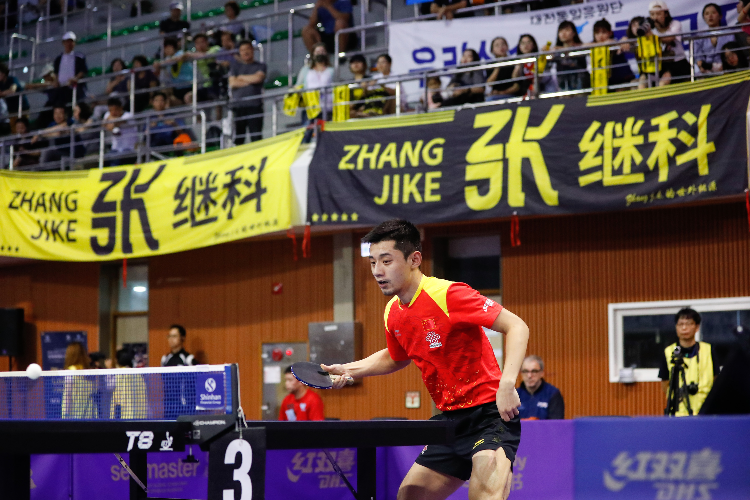

# 女明星遭人用隐私视频勒索，张继科为何是“证人”而不是“被告人”？

**南都讯 记者汪雅云**
近日，“有关前乒乓球国手张继科借钱欠债及传播前女友隐私视频”的传闻持续发酵，针对此风波中涉及的法律问题，南都记者也专访了盈科粤港澳大湾区刑事专业委员会的主任，盈科（广州）律师事务所股权高级合伙人丁一元，他对此事件里的几个热点争议话题做了专业法律解析。

**南都：张继科被记者李微敖曝涉赌，并通过传播前女友的私密视频来借钱还赌债，如果此事属实，他在其中需要负哪些法律责任？**

**丁一元**
：首先，针对其涉赌行为方面。若需要承担赌博罪的责任，需要从主、客观两个方面来综合判断。主观上行为人必须出于直接故意，并具有获取钱财的目的，且数额较大。参赌者并不以赌博所得为其生活或者挥霍的主要来源的。对此可视情节给予治安处罚等行政处理，但不宜认定为犯罪。

其次，传播他人私密信息要钱方面。问题的关键是：隐私视频的内容。《民法典》第1032条第二款规定，隐私是自然人的私人生活安宁和不愿为他人知晓的私密空间、私密活动、私密信息。但要区分一般隐私视频和含有淫秽信息的隐私视频。

在正常男女朋友关系中，
如果未经得同意，而是采用偷拍的方式，一方面如果是一般隐私视频，比如说他人正常的生活状态，不涉及《刑法》所调整的范围，在未经同意的情况下向他人发送他就是一般的侵权行为；另一方面，还可能触犯我国《治安管理处罚法》。

但如果是有拍摄并散布他人私密部位的隐私视频，有可能触犯传播淫秽物品罪、侵犯公民个人信息罪。

综上，如张继科向他人发送（或提供视频）属实，则构成民事上侵权行为；如主观上想让他人拿前女友私密视频去威胁、要挟前女友要钱（代偿赌债），涉嫌共同敲诈勒索。

具体法律依据为：《民法典》第1032条、第1033条；《治安管理处罚法》第68条；《刑法》第274条敲诈勒索罪、第364条传播淫秽物品罪。

**南都：以记者目前曝光的“借条”，以及他对一位当事人采访内容来看，这些材料是否可以作为法律证据来使用？**

**丁一元：** 所涉“借条”是否能够作为法律证据使用，要通过对证据的三性，即合法性、真实性、关联性来审查欠条/借条，综合判断是否能够作为证据使用。

就行为人500万元《借款合同》而言，若出借人明知借款人将所借款项用于赌博（违法犯罪活动），仍将资金出借给行为人。根据法律规定，该民间借贷合同无效。无效的合同因为不受法律的保护，即使借条是张继科亲笔书写的，债主也不能获得胜诉判决。

具体法律依据为：《民法典》第157条。

**南都：张继科那边发布律师声明说会起诉一些言论对他造成的名誉权侵权，这个名誉权侵权和诽谤罪有什么区别？为什么不直接告诽谤罪？**

**丁一元**
：名誉权侵权包括诽谤，但不等于诽谤罪。（依据《刑法》第264条：以暴力或者其他方法公然侮辱他人或者捏造事实诽谤他人，情节严重的，处三年以下有期徒刑、拘役、管制或者剥夺政治权利）。两者具体区别如下：

首先，名誉权侵权属于民事纠纷，而诽谤罪属于刑事犯罪，且多为自诉案件。法律在这规定了一种例外情形，只有在侮辱、诽谤行为“严重危害社会秩序和国家利益”时，才属于公诉。所以，在网络上以报警方式自证清白、回应网络舆论的艺人，根本证明不了什么。

其次，名誉权侵权与诽谤罪之间不是对立关系，而是侵害程度大小的位阶关系。侵犯名誉权的行为包括诽谤，两者差异关键在于是否“情节严重”（依据《最高人民法院最高人民检察院关于办理利用信息网络实施诽谤等刑事案件适用法律若干问题的解释》第二条：利用信息网络诽谤他人，具有下列情形之一的，应当认定为刑法第二百四十六条第一款规定的“情节严重”：（一）同一诽谤信息实际被点击、浏览次数达到五千次以上，或者被转发次数达到五百次以上的；（二）造成被害人或者其近亲属精神失常、自残、自杀等严重后果的；（三）二年内曾因诽谤受过行政处罚，又诽谤他人的；（四）其他情节严重的情形）。

所以具体到这件事上，记者报道等未达到刑法第246条规定情形之一（甚至侵权也构不上），所以无法控告诽谤罪，律师声明只能以名誉侵权来起诉，主要起到警告作用。

**南都：我们也注意到记者李微敖公布的采访内容里，提到一位S先生在2020年一审被判犯有敲诈勒索罪，判了有期徒刑7年，并罚款5万，张继科在其中是以证人身份出现在此案中的，那么当时为什么他是不负有法律责任的呢？**

**丁一元** ：首先，个人认为张和前女友是恋人关系，且都属于名人，可能当时前女友报案只控告了S先生。

其次，S的口供中可能并没有说是张继科指使他这样去做，同时也不排除张继科被境内外赌博团伙人员（债主）逼迫，无奈之下提供隐私视频等可能性。

而如果张继科将视频发给s先生时，二者已经预谋再通过该视频向前女友敲诈勒索或行为人明知s先生要敲诈勒索对方，仍将视频传播，或实施敲诈时提供了对方手机号码等帮助行为。那么张构成敲诈勒索罪的共同犯罪；否则敲诈勒索罪部分的刑事责任则应由S先生及幕后指使人承担，张便为证人身份。

**南都：也有舆论认为记者的爆料直接把前女友的隐私推到公众面前，似乎不妥，您觉得这位记者的行为是否也存在违法争议？**

**丁一元** ：在网络时代，记者曝光公众人物的隐私，需要注意把握分寸，若该公众人物存在违法犯罪、损害公共利益的行为，则可以通过网络曝光的方式进行举报，
否则可能侵犯公众人物的隐私权、违反个人信息保护的规定。

另外，若爆料内容存在断章取义，爆料人存在恶意诋毁他人声誉的行为，记者未核实甄别就报道出街，则可能侵犯该公众人物的名誉权，需承担相应的民事责任。

**南都：如果普通公众遇到类似事件，例如私密视频和照片被外泄，甚至有人以此威胁勒索，应该如何处理？**

**丁一元** ：首先，洁身自好，不要轻信他人，增强自我保护意识，及时报警。

其次，采用拖延战术。一旦确认对方手中有自己的隐私，先做一些不明确的承诺，例如表示自己正在努力筹钱等，然后及时与身边专业的法律人士沟通处理解决方案。

