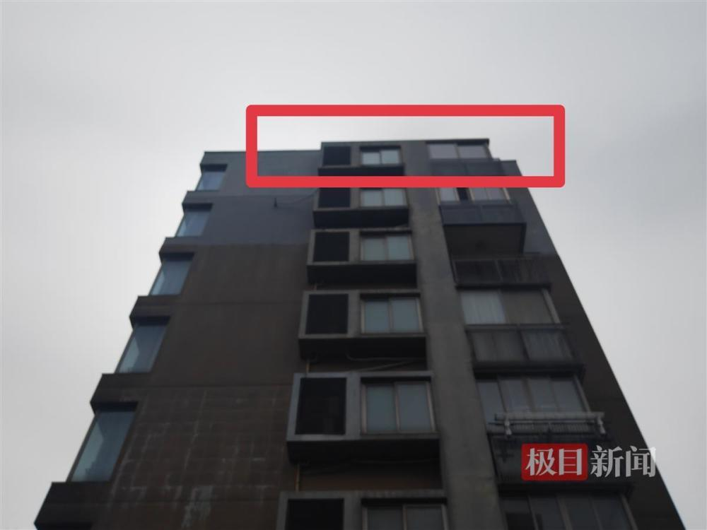
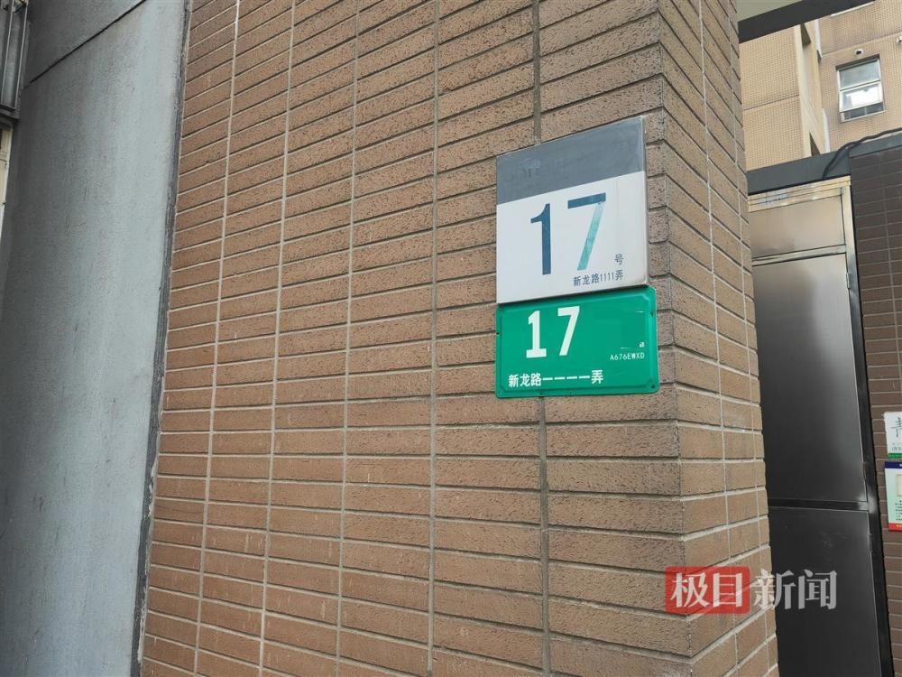
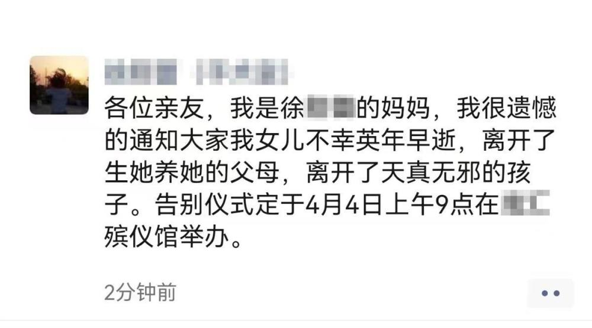

# 实探上海医生杀妻案发小区：事发时家里还有老人和孩子

极目新闻记者 丁鹏

4月3日，上海市公安局闵行分局官方发布了一则警情通报：2023年4月1日10时50分，新龙路某小区内发生一起刑事案件，民警迅速到场将犯罪嫌疑人周某某（男，37岁）控制。经查，周某某因家庭矛盾与妻子徐某某发生冲突后，将徐某某杀害。目前，周某某已被依法刑事拘留，案件正在进一步侦办中。

_红色框位置为事发业主家_

另据新京报消息，犯罪嫌疑人周某某是上海某医院医生，遇害者徐某某是一名护士。

4月3日中午，极目新闻记者来到位于上海市闵行区新龙路的事发小区，一名附近房产中介的工作人员告诉记者，1日事发当天，特警和救护车到小区时，他们并不知道发生了什么事。3日，他们才听说一名男子在家中将其妻子杀害。

_事发楼栋入口_

事发小区一名物业工作人员向极目新闻记者介绍，事发业主家里平时住了4口人，除夫妻俩和他们的女儿外，还有女方的母亲。被害女子是上海本地人，男子不清楚是哪里的，户主是两个人的名字。上述工作人员表示，事发时老人和孩子也在家，疑似是老人报的警。“老人带着孩子今天上午已经搬走了，她说再也不会回来了。”

_疑是当事人微信朋友圈截图_

_死者朋友圈截图（网络截图）_

极目新闻记者在事发单元的楼梯间看到，这是一栋一梯两户的单元楼，事发业主门口还放着一辆儿童单车。一名住户向记者介绍，事发业主家里已经没有人了，房子是夫妻双方共同出资买的，肯定要两边家里协商如何处理。“有中介打电话来问我这件事。”该业主说。

（来源：极目新闻）

