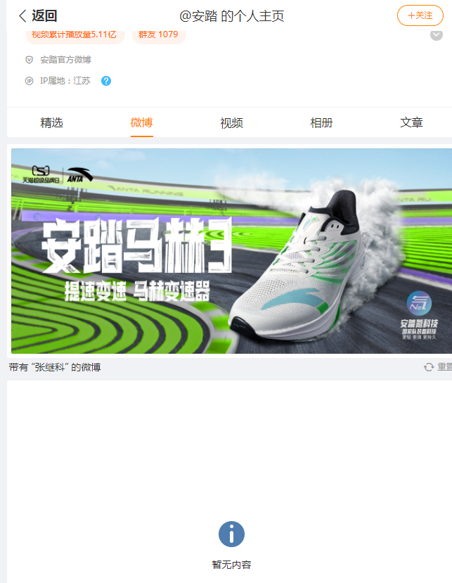
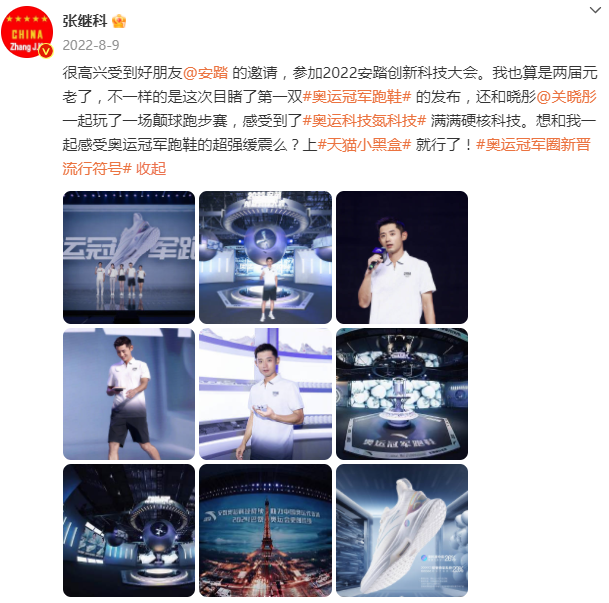

# 张继科事态升级：安踏删除张继科动态，下架全部宣传物料

近日，“有关张继科借钱欠债及传播女演员隐私视频”的传闻持续发酵。昨晚，媒体人李微敖回应“张继科事件”，曝光相关证据，并称自己遭到网暴。

今日，有网友发现，安踏的官方微博已无法搜索到与张继科有关的内容，其官方旗舰店也已下架张继科宣传物料。

安踏回应：已终止和张继科所有合作

翻看张继科的个人微博账号，他多次发布与安踏的合作动态，并称其为好朋友。

据不完全统计，张继科曾先后代言了美津浓体育品牌、华润怡宝矿泉水、可口可乐、蒙牛纯牛奶、平安车险、燕京啤酒、东风悦达起亚、安踏、舒肤佳等多个品牌，并频繁在多档综艺节目中现身。

2017年5月22日，《体坛周报》公布了2016年中国体坛财富榜。张继科2016年以6000万元收入排在第二。

编辑 苏静

