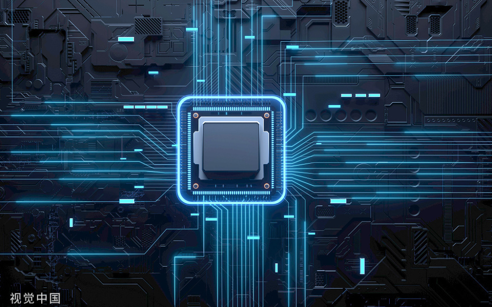

# 拟限制23种半导体制造设备出口，日本各界盘算“禁令”后果

【环球时报综合报道】在刚过去的这个周末，日本各界议论纷纷，争论政府将出台的半导体“禁令”到底意味着什么。3月31日，东京宣布计划限制23种半导体制造设备出口。日本政府做出此举，正值全球市场上半导体需求大跌，各公司都在努力争取扩大市场之际。与此同时，美国加大对中国芯片进口的打压，破坏整个半导体行业。

**日本半导体巨头表态谨慎**

《日本经济新闻》4月2日的报道称，日本对华半导体制造设备出口额几乎是美国对华出口额的两倍。熟悉出口情况的日本律师上野一英认为，未来日本相关企业和政府之间需进行坦诚意见交换，以确保避免出现不可预见的商业市场萎缩或摩擦。2022年日本向中国大陆出口的半导体制造设备金额超过8200亿日元（约合424.21亿元人民币），中国大陆是日企在该领域的第一大出口目的地，约占出口总额的30%。

《读卖新闻》认为，有很多日本半导体制造设备主要是向中国出口，所以十分担心政策对今后业绩的影响。路透社3月31日援引日本丸红中国经济研究所主管铃木贵元的分析称，鉴于日本国内芯片市场需求不够强劲，政府的措施将对日本设备制造商造成打击，损害日本企业的市场发展，在监管层面上也必然会降低日本企业的竞争力。

日本明星大学教授细川昌彦3月31日在接受日本广播协会（NHK）电视台采访时表示：“日本政府此次宣布的措施有两点值得关注：一是没有直接点名表示限制中国，现在中国对这样的措施非常敏感；二是日本努力表现在此事上‘并非完全按照美国的意思进行’。”

“日经亚洲评论”网站4月2日称，作为日本最大的芯片制造设备供应商，东京电子的产品可能面临出口限制。“作为一家公司，我们无权评论地缘政治事务和法规，”东京电子的一名代表这样表示，并称该公司将做出适当回应。制造半导体清洁设备的Screen
Holdings公司发言人称，该公司将审查出口公告相关内容，并遵循指导。上述措施也可能打击到尼康，该公司生产用于制造高级芯片的光刻设备，预计其扫描仪产品将受到出口管制。尼康发言人表示，公司仍在研究影响，并将“按照决定的规则行事”。

**全球半导体市场，日本到底是什么角色？**

在半导体领域，日企在很多关键产业链上扮演着非常重要的角色，尤其是半导体原材料，以及生产设备的零部件方面。NHK网站报道称，在半导体制造设备方面，日本厂商占据全球约30%的市场份额，拥有一定的竞争力。

加拿大研究公司Tech
Insights的数据显示，根据2021年的全球市场销售排名，日企在半导体制造设备制造商前15强中占据半壁江山。全球排名第三的东京电子专营半导体制造前道工序所用的设备，排在第六位的爱德万在半导体的检查设备方面具有优势，第七位的Screen
Holdings在去除晶圆杂质的清洁设备方面具有较强竞争力。佳能在这份榜单上排在第十四位，负责生产特殊曝光设备。另据日本半导体制造设备协会的数据，2021年日本制造商半导体制造设备总销售额3.4万亿日元左右，较此前一年增长超过三倍。

英国《金融时报》称，限制设备出口对企业的影响范围将超出预期。此前的预估表明主要受到影响的是东京电子和尼康，但知情人士认为真正受到影响的公司至少有10家，包括Screen
Holdings和爱德万。

**只是日本的第一步？**

尽管日本一再“放低调门”，但日本企业（中国）研究院执行院长陈言对《环球时报》记者分析称，此次的出口限制只是日本走出的第一步，今后日本会在更多的相关产业上有所动作。在一定程度上，日本在多个技术领域已经被中国赶超，在半导体等方面还保持着对中国的高技术优势。

几年前，日本对韩国进行半导体原材料出口限制，对韩半导体产业带来一定冲击。“韩国全产业链能力不够强，因此日本限制供应造成很大的影响。”信息消费联盟理事长项立刚对《环球时报》记者表示，中国情况不太一样，“我们有大量的设备，自己也开始制造，所以日本无法达到对韩国那样的效果。”在3月31日的华为2022年年度报告会上，华为轮值董事长徐直军表示，中国芯片产业将在制裁下自力更生。

