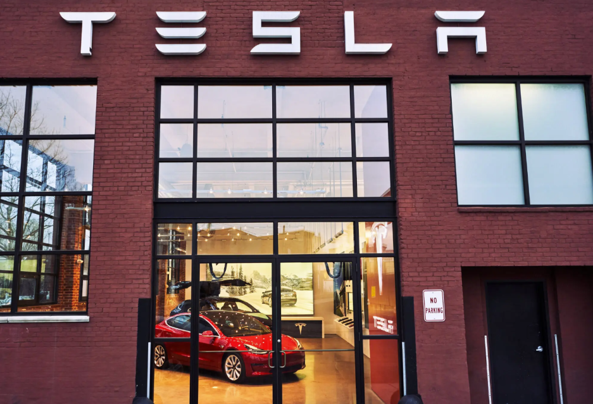

# 特斯拉降价策略奏效 第一季度交付量增长36％创下历史新高

腾讯科技讯 4月3日消息，在下调电动汽车价格后，特斯拉今年前三个月的销量增长了5%，这有助于弥补经济增长放缓和利率上升的影响。

特斯拉于美国当地时间周日表示，从1月到3月，该公司共交付了近42.3万辆汽车，与去年同期的31万辆汽车相比增长了36%，也高于2022年第四季度的40.5万辆，创下历史新高，略低于华尔街此前预期的43.2万辆。

Battle Road
Research的总裁本·罗斯说：“这表明电动汽车的需求仍然强劲，特斯拉是电动汽车买家的安全选择。虽然最近的降价和税收抵免的确切影响难以确定，但这两个因素都对该公司起到了积极推动作用。”

当前，所有汽车制造商都在努力应对利率上升带来的负面影响，因为利率上升增加了每月汽车还款的成本。但特斯拉的销售数据可能会让许多投资者失望，他们预计该公司当季销量将超过43万辆。

不过，特斯拉依然在美国电动汽车市场占据主导地位，而且已经重新获得了部分在2022年感到失望的投资者信任。去年，特斯拉首席执行官埃隆·马斯克因收购推特而分心。今年到目前为止，特斯拉股价已经累计上涨了90%，尽管其市值仍是2021年11月高峰时期的一半左右。

在美国，电动汽车买家可享受的联邦税收抵免政策发生了变化，特斯拉成为主要受益者之一。去年，美国政府取消了对个别汽车制造商符合7500美元税收抵免条件的汽车数量限制，当时特斯拉的配额已经用完。但今年1月，购买其两款最受欢迎的汽车，可以重新获得7500美元的税收抵免资格。

不过从4月16日起，税收抵免规则将变得更加严格，要求企业从美国或其盟国购买电池组件和电池原料。特斯拉告诉买家，其最便宜的Model
3轿车(使用中国制造电池)将无法再获得全额退税。但在满足其他车型的要求方面，特斯拉可能领先于福特汽车等竞争对手。

特斯拉还在得克萨斯州奥斯汀附近和柏林郊外的新工厂提高了产量，减少了客户等待提车的时间。特斯拉今年3月表示，柏林工厂的产能已提高至每周5000辆。

投资者仍对特斯拉在中国的销量感到担忧，该公司在中国面临比亚迪等本土对手的激烈竞争。特斯拉在周日的新闻发布会上没有提供中国或其他地区的具体销售数据。

同时，特斯拉主导美国市场的能力今年也将受到考验，因为老牌汽车制造商将推出新的电动车型。通用汽车计划在2023年开始销售三款新电动汽车，其中包括售价约为3万美元的SUV和一款起价约为4万美元的电动皮卡，这两款车都比特斯拉最实惠的汽车（起价约为4.3万美元）便宜。

马斯克曾承诺，该公司推迟已久电动皮卡Cybertruck将在年底前上市销售。但这款未来感十足的皮卡要到2024年才能开始量产。在那之前，特斯拉将不会在美国最受欢迎的皮卡市场推出任何产品。（金鹿）

