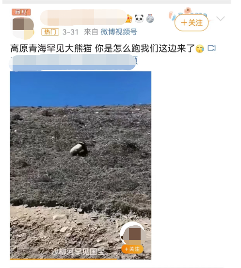
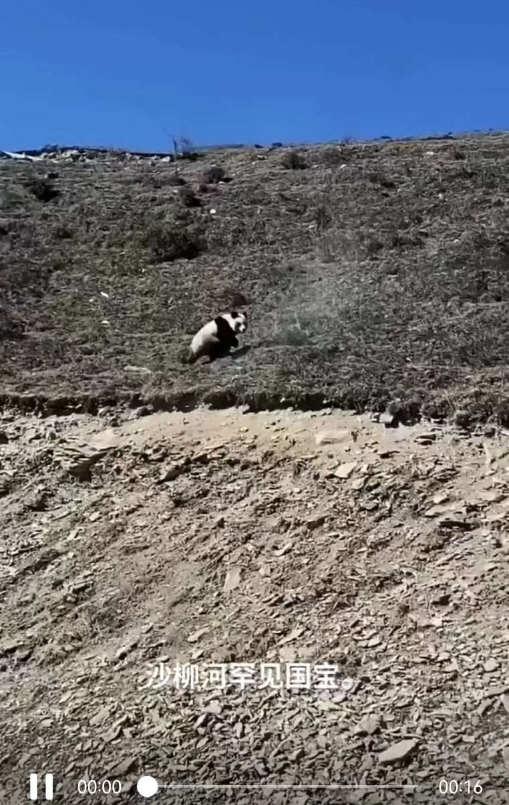

# 网传青海发现野生大熊猫 专家回应：不可能

央广网西宁4月3日消息（记者贾海元）近日，一段“青海发现野生大熊猫”的视频在多个社交平台流传。视频中，一只大熊猫在山坡上向上爬行。发布者也在文字和视频中标注了发现地点青海沙柳河。

_社交平台视频截图_

此视频发布后，部分网友对视频中大熊猫的生存状况发生了担忧，也有网友对视频内容存在质疑。“视频里这种生境100%不会有大熊猫，要么是视频造假，要么是位置造假，总之是假新闻，没有意外。青海只有西藏棕熊，没有野生大熊猫，绝对！”微博认证为知名科学科普博主的“圆掌”跟帖回复说。

在青海境内，名为沙柳河的区域共有三处，分别位于青海省海北藏族自治州刚察县、海西蒙古族藏族自治州都兰县和乌兰县。其中平均海拔最高的是乌兰县，4000米左右。其次是刚察县，3300米左右。平均海拔最低的是都兰县，3180米左右。三地气候均以高原干旱大陆性气候为主，植被主要是高山草甸。

针对此事，青海省林业和草原局相关工作人员在接受央广网记者采访时表示，大熊猫在国内的原始分布地主要在四川、陕西和甘肃的白水江一带。大熊猫主要以食用箭竹等竹子为生，青海是不生长竹子的，因此可以判断视频中的地理位置不是在青海。

“青海没有任何的野生大熊猫记录，并且已知的野生大熊猫分布记录的位点都离青海特别远，青海不存在野生大熊猫的任何适宜栖息地。看了那个视频，我推测是在甘肃的白水江或者迭部那一带，那一带也是有大熊猫的。青海不可能出现野生大熊猫。”山水自然保护中心保护主任赵翔说。

（来源：央广网）

