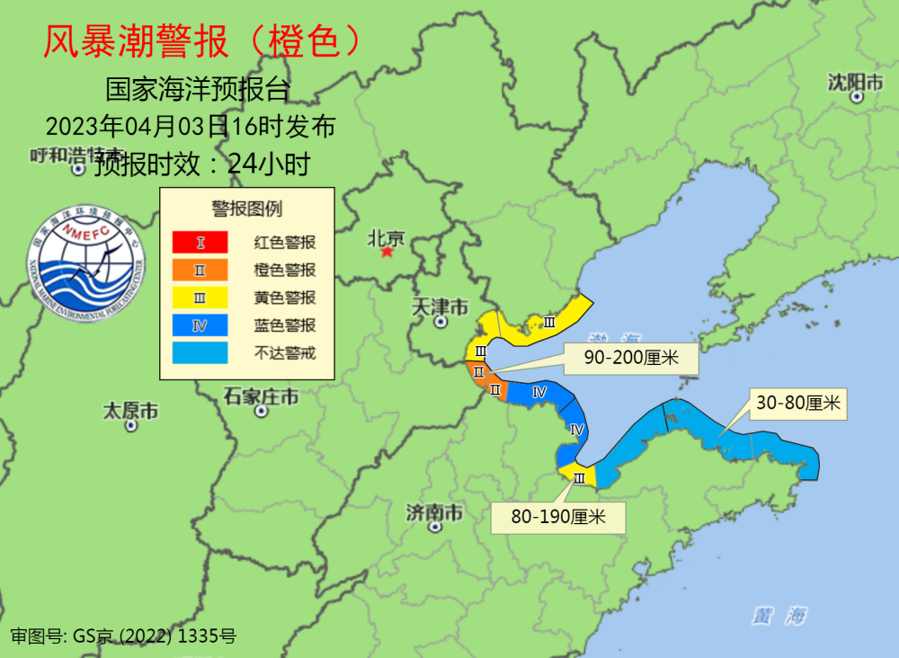

# 近十年来，我国4月份首次拉响温带风暴潮橙色警报

新京报讯（记者张建林）4月3日，国家海洋预报台同时发布风暴潮橙色警报和海浪黄色警报。据了解，这是近十年来，4月份首次拉响温带风暴潮橙色警报。我国是受风暴潮灾害影响比较严重的国家之一，风暴潮灾害也是我国沿海最主要的海洋灾害。

风暴潮是指由台风、冷空气和温带气旋等强烈天气系统引起的海面异常升高现象。按照引起风暴潮的天气系统类别，可分为台风风暴潮和温带风暴潮。温带风暴潮持续时间有长有短，增水过程相对平稳，多发生于春冬季节，夏季也时有发生。

记者从自然资源部获悉，受出海气旋和冷空气的共同影响，渤海湾、莱州湾和山东半岛北部沿海将有一次较强风暴潮过程，其中重点影响时段为4月4日中午到5日中午。同时，渤海、黄海、东海将有大浪到巨浪过程。

风暴潮方面，预计4月3日夜间至5日凌晨，渤海湾将出现90厘米到200厘米的风暴增水，莱州湾将出现80厘米到190厘米的风暴增水，山东半岛北部沿海将出现30厘米到80厘米的风暴增水。河北沧州市和山东滨州市的风暴潮预警级别为橙色，河北唐山市、天津市和山东潍坊市的风暴潮预警级别为黄色，山东东营市的风暴潮预警级别为蓝色。

_国家海洋预报台供图_

海浪方面，预计4月3日夜间到4日白天，渤海、黄海、东海北部将出现3米到4.5米的大浪到巨浪区；河北、山东近岸海域将出现2.5米到3.8米的大浪，该近岸海域海浪预警级别为黄色，天津、江苏、上海、浙江北部近岸海域将出现2米到3.4米的中浪到大浪，该近岸海域海浪预警级别为蓝色。

_国家海洋预报台供图_

国家海洋预报台提醒在上述海域作业的船只注意安全，沿海各有关单位提前采取防浪避浪措施；同时沿海相关部门加固海上渔业养殖设施，开展海堤、水闸等设施的巡查维护，做好薄弱和危险地区的海堤加固工作，做好防潮准备，并停止海边露天集体活动和垂钓、游泳、冲浪、潜水等涉海娱乐休闲活动。

编辑 刘梦婕

校对 李立军

