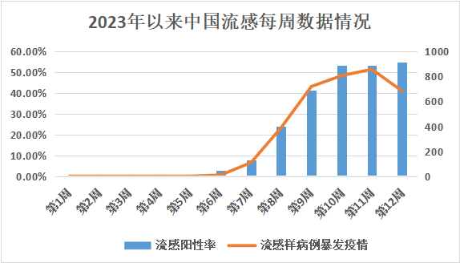

# 连续6周上升后病例数首次下降，专家：此轮流感高峰基本已过

**人民日报健康客户端记者 王艾冰**

3月29日，国家流感中心发布了2023年第12周《中国流感监测周报》，数据显示，本周南方省份流感病毒检测阳性率上升趋缓，北方省份持续下降。本周共报告683起流感样病例暴发疫情。人民日报健康客户端记者梳理2023年以来发布的《中国流感监测周报》发现，自流感样病例数据公布以来，本周次实现了首次下降。

“从临床上看，这一数据和临床我们观察到的患者就诊量基本一致。近两周来看，我们的流感病人较前几周有一个明显的下降趋势。”4月2日，云南省第一人民医院感染性疾病与肝病科副主任医师夏铵冬告诉人民日报健康客户端记者，随着确诊流感的人数下降，本轮流感高峰应该已经过去。

_2023年以来中国流感每周数据情况。王艾冰
图。 注：流感样病例暴发疫情0，为官方当周未公布数据，表述为“南、北方省份流感病毒检测阳性率均处于较低水平。_

据国家流感中心的官方数据，流感样病例暴发疫情在第11周（2023年3月13日- 2023
年3月19日到达高峰为858例。自第6周公布该数据以来，该数据一直呈现上升态势，并在第7周-第9周上升态势较明显；在第12周，该数据首次出现下降态势。

此外，流感病毒检测阳性率自第2周（2023年1月9日-
2023年1月15日）公布以来，连续10周仍旧处于上升趋势。第10周周报显示，该周南、北方省份流感病毒检测阳性率上升趋缓；第11周的周报显示，本周南方省份流感病毒检测阳性率上升趋缓，北方省份下降。

哈尔滨医科大学附属第一医院感染科副主任陈国林也告诉人民日报健康客户端记者，“从临床来看，近10天，前来就诊的流感新发患者确实有所减少，此轮流感高峰基本已过，但是随着天气的转暖，要开始注意消化道传染病的发生，比如细菌性痢疾、伤寒等，大家仍然要注意饮食卫生，饭前便后洗手，避免生食，熟食和生食刀、砧板分开。”

“随着气温的逐渐转暖，大家应该更加注重诺如病毒感染、感染性腹泻等，依然要注意手部卫生、饮食卫生等，以免发生消化系统传染病。”夏铵冬也指出。

