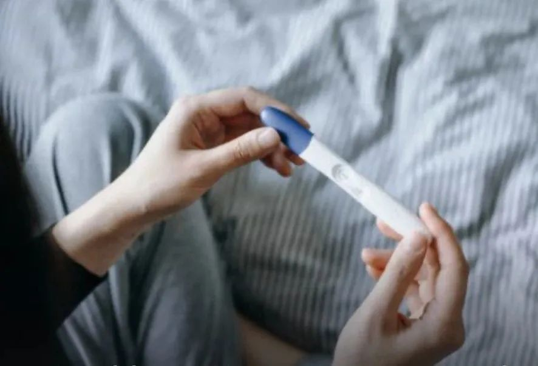

# 不孕症影响全球六分之一男女，涉及我国近5000万人

不孕症正在成为一个重大而普遍的健康问题。世界卫生组织（WHO）在4月3日发布的一份报告中表示，全球约有六分之一的生育期成年人经历过不孕症，并敦促各国积极收集有关该疾病的数据。

在我国，2019年《中国妇幼健康事业进展与展望报告》提示，中国不孕不育问题突出，不孕率高达10%-15%，将近5000万人群面临不孕症的困扰。

世界卫生组织将不孕症定义为一种男性或女性生殖系统疾病，定义为在12个月或更长时间的定期无保护性生活后仍未能怀孕。

世卫组织最新发布的这份报告分析了从1990年到2021年进行的研究，表明全球约有17.5%的成年人受不孕症的影响。

“受影响人口的绝对比例表明有必要扩大这部分人群获得生育保健的机会，并确保不孕症在卫生研究和政策中不再被边缘化。”世卫组织总干事谭德塞表示。

报告还显示，高收入国家不孕症的发病率略高于中低收入国家。高收入国家约有17.8%的成年人至少经历过一次不孕症，这一比例在中低收入国家为16.5%。

报告指出，各个国家和地区的人在生育治疗上的花费以及治疗的可及性方面存在较大差异。

世卫组织生殖健康与研究司司长帕斯卡尔·阿洛泰（Pascal
Allotey）表示：“不孕不育是一个重要的公共卫生问题，因为它会对受影响人群的生活产生广泛的负面影响。世卫组织呼吁普及负担得起的高质量生育保健。”

影响生育能力的因素有很多，年龄是最重要的因素之一。中国目前也面临大量女性晚婚晚育的现状。此外，情绪、压力等因素也会影响生育能力。

不孕症可以通过药物、手术或辅助生殖技术（例如体外受精或试管受精）进行治疗。不过由于成本高昂，许多患者仍然无法获得不孕症的预防、诊断和治疗解决方案。

考虑到我国生育力降低的现状突出。国家医保局正在研究出台相关方案，将逐步把辅助生殖技术项目纳入医保，以减轻不孕症家庭的医疗负担。

公开数据显示，2016年，我国主动的人工流产达到964.7万人次。

生殖医学专家、中国科学院院士黄荷凤近期接受第一财经记者采访时称：“国家终于将辅助生殖技术纳入医保，对于不孕不育的家庭而言是特别大的福音，我们认为非常有必要，尤其是对于一部分没有支付能力的家庭而言。”

不过她强调，要从根本上解决人口问题，辅助生殖技术并非首选。“保证妇幼健康，促进适龄夫妇的健康生殖才是解决人口问题的重要保障。”黄荷凤表示。

为了提高人口生育率，黄荷凤认为，提倡健康生殖，保护生育力迫在眉睫。包括做好青少年性教育
；鼓励适龄生育，避免非必要的生育年龄延迟；保护生殖环境、减少男性精液参数持续性下降的现状；同时也需要倡导健康的生活方式，减少吸烟、酗酒等不良生活嗜好或肥胖等亚健康状态对生殖健康的损害；此外，提倡备孕夫妇在孕前进行生殖健康的相关咨询，达到优生优育的目的。

