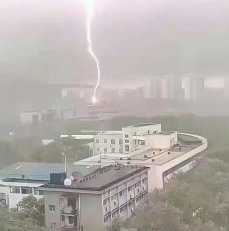
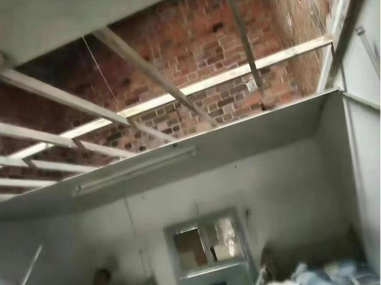

# 华中科技大学有宿舍遭遇雷击？校方辟谣：吊顶被风吹落 目前已修好

4月4日，有网友发帖称，华中科技大学有宿舍遭遇雷击，网友发布的一张照片中可以看到，有闪电从天而降，另一张照片中可以看到有宿舍内的吊顶脱落。消息发布后引发了网友热议，相关内容一度是微博热搜第一。

4月4日，北京青年报记者从华中科技大学相关部门工作人员处了解到，确实有宿舍吊顶被风吹落，但事情与雷电无关。据介绍，事发在4月3日，当天武汉出现暴雨天气，有宿舍楼的吊顶被风吹下来，目前吊顶已经修好。

文/北京青年报记者 屈畅

