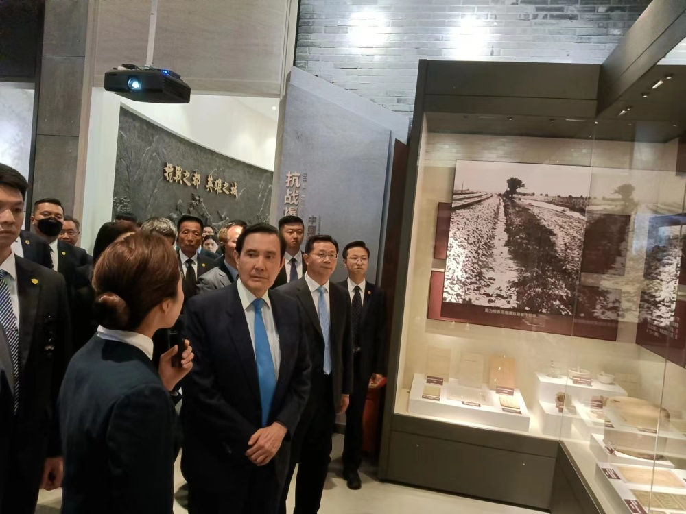

# 参观重庆抗战遗址博物馆，马英九颂赞英烈，回顾《开罗宣言》

【环球时报-环球网报道 记者 吴薇】4月4日上午参访张自忠烈士陵园后，马英九一行下午又来到重庆抗战遗址博物馆。

重庆抗战遗址博物馆位于重庆市南岸区黄山景区内，是为纪念抗战胜利60周年在原重庆黄山抗战遗迹基础上修缮而成，现保存有15处文物建筑遗址。马英九参观了综合陈列馆、孔园、松厅和云岫楼。其中综合陈列馆展出了从1931年“九一八事变”到1945年日本投降的14年间，包括台湾人民在内的中国人民奋起反抗侵略的历程。

在综合陈列馆，当解说员介绍1931年重庆王家沱发起抗日行动收回日本租界时，马英九连说两次“精彩”。他在参观时特别提到《开罗宣言》的一段典故。马英九指着照片上的一个人说，此人叫王宠惠，在有关日本归还中国领土问题上，他毫不含糊，最后中国领土主权问题在《开罗宣言》中得到庄严声明：日本战败后，窃取于中国的领土，例如东北、台湾、澎湖列岛等，归还中国。

