# 在北京，金鼎轩是中年男人最后的庇护所

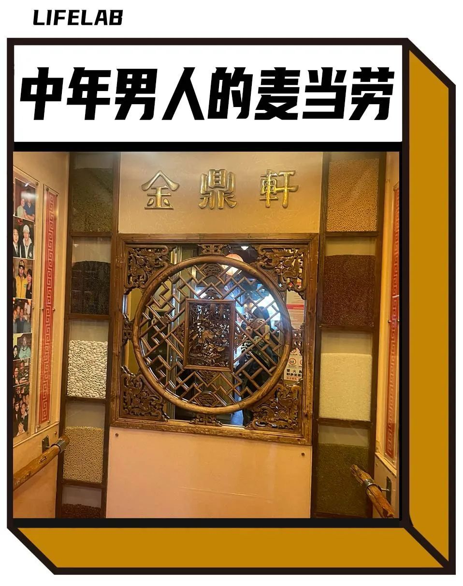

在北京，一个中年男人会在哪里消磨时间？

答案有很多，金鼎轩一定是其中一个。

北京最广为人知的24小时营业餐厅有三个：麦当劳、海底捞和金鼎轩，它们是散落在城市里的局部永昼，时刻准备着拥抱任何一个都市孤魂。

但，对于一个中年男人来说，麦当劳太寒酸，顶多算是停泊在街头的诺亚方舟，深夜独自一人在里面啃麦辣鸡腿堡，是一种只有年轻人咀嚼起来才不丢脸的感伤。

而海底捞太吵了，夜晚的海底捞已经变成了夜店卡座的延伸，被蹦迪的00后占领，在一群用火锅就精酿的年轻人中间，中年男人不必去那里，反衬自己的寂寞和清高。

留给中年男人的地方已经不多，金鼎轩，就是他们最后的庇护所。它的总店金碧辉煌、雕梁画柱，像一截被落在二环之外的盗版故宫，理直气壮地盘踞在了地坛公园门口。

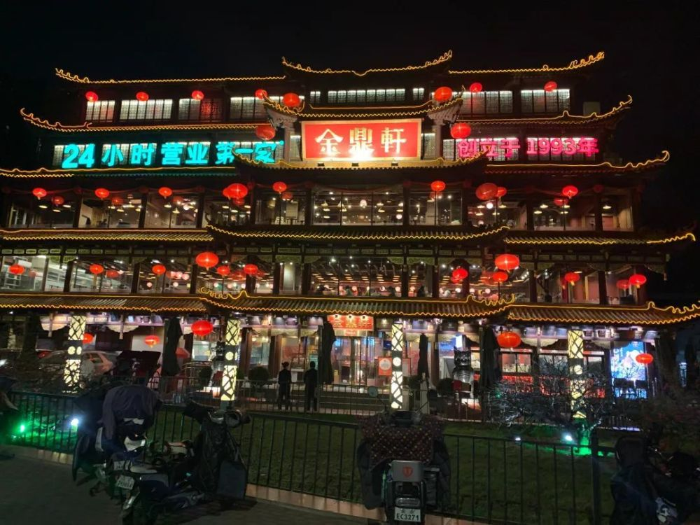

古色古香的建筑风格，披挂上满身艳丽的霓虹灯，金鼎轩就像一个混搭的庞然大物，你会一时分不清这里究竟是御膳房，还是海鲜大排档。

我身边一位常去金鼎轩的朋友却告诉我，以上二者皆非，只有一个词能概括这种审美风格——中年。

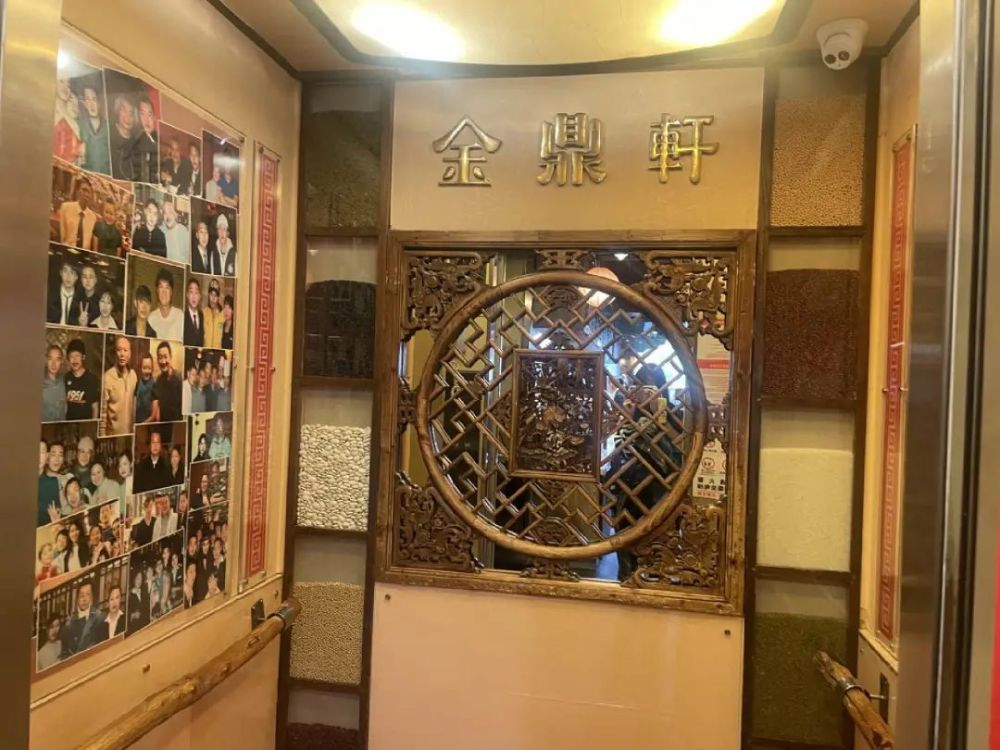

在中年男人心目中，金鼎轩不是饭店，而是行宫，在寸土寸金的二环，金鼎轩地坛店旁边竟然配备了近500个停车位。

因为规模太过庞大，金鼎轩的停车场被简称为——车场。

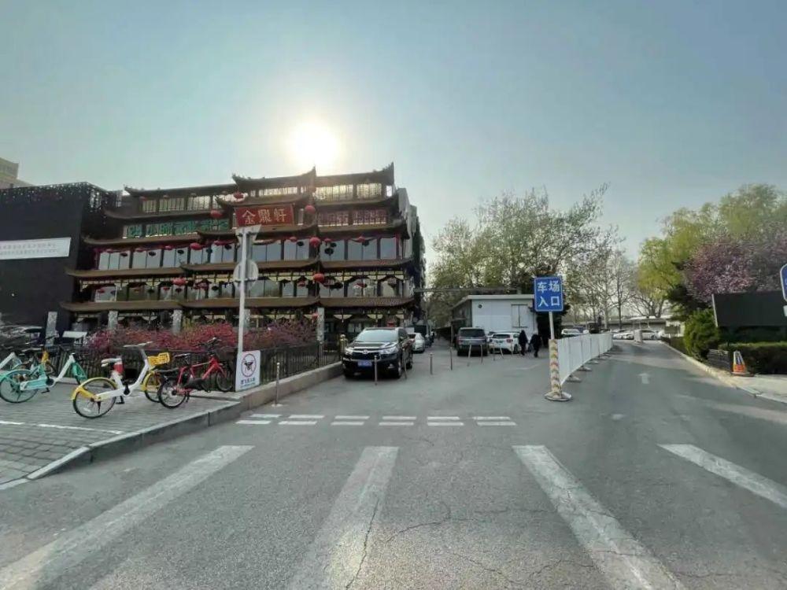

这种吃字的省力感，让每个开车来到的中年人心中泛起满意

它那以假乱真的器宇轩昂，足以体面地将每一个中年男人的夜间游荡，变成一次下江南。

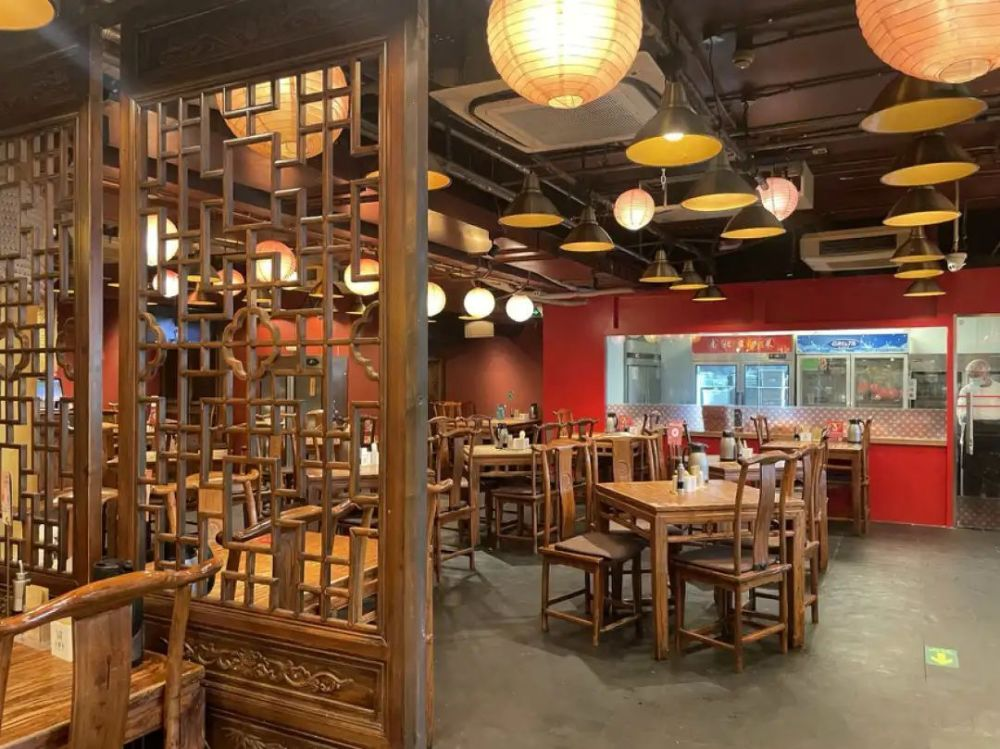

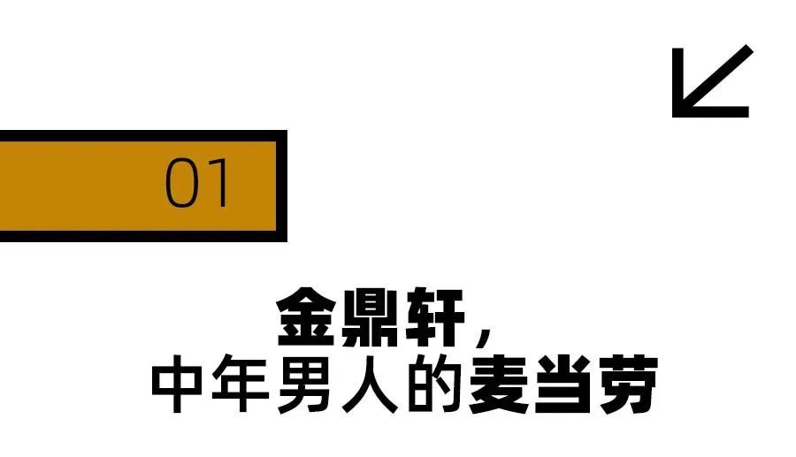

即便在北京这样的美食荒漠，金鼎轩的菜品也并不值得称道，在社交网站搜索“金鼎轩”，跳出来的对味道最客气的评价是“中规中矩”。

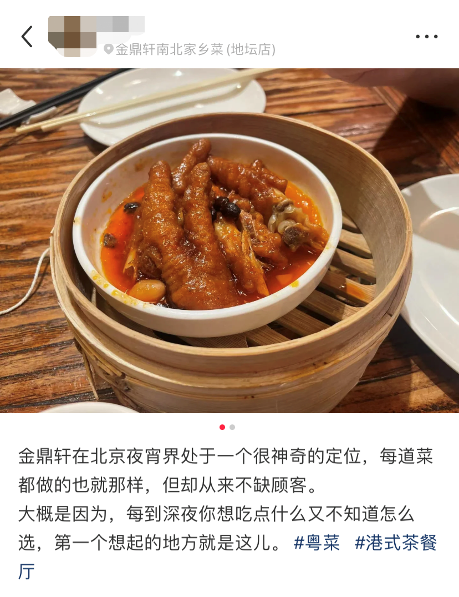

这里最早主打粤式茶点，后将菜单延展为“南北家乡菜”，既有广州的肠粉，也有四川的毛血旺和东北的锅包肉，主打一个“什么都不太行，但什么都有”。

甚至连金鼎轩也很有自知之明地并不夸耀自己的味道，而在菜单上重点强调食品安全和待客之道。

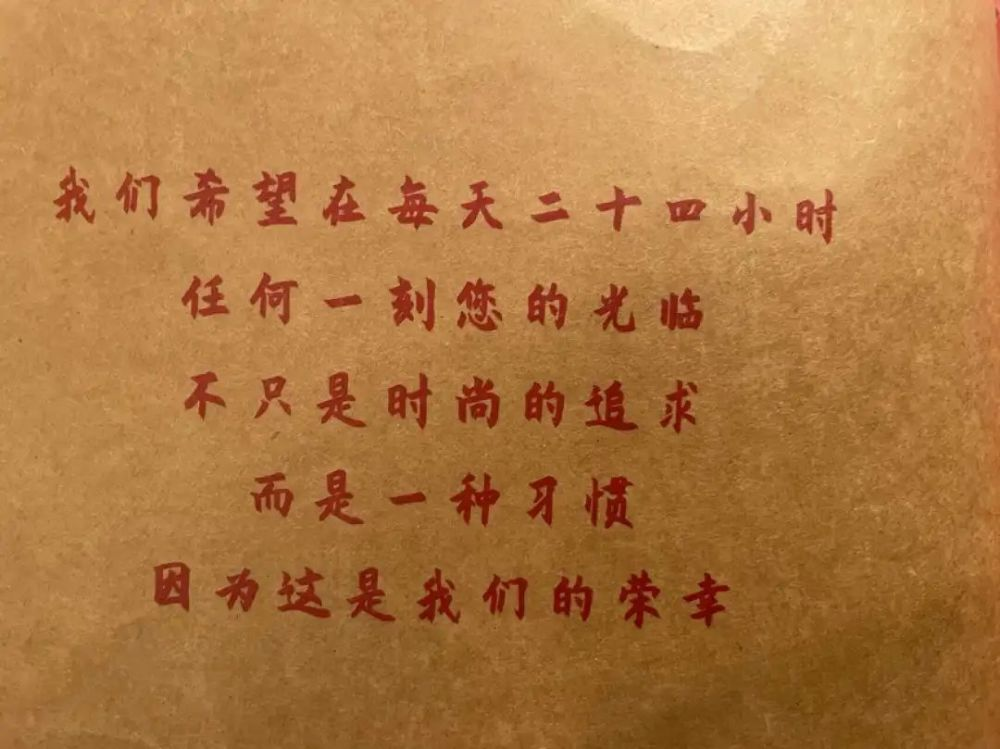

资深顾客派派告诉我，“如果一家饭店，突然有一天不好吃，那种感觉叫‘失望’，但如果它十年如一日的不好吃，那种感觉就叫做‘归属感’”。

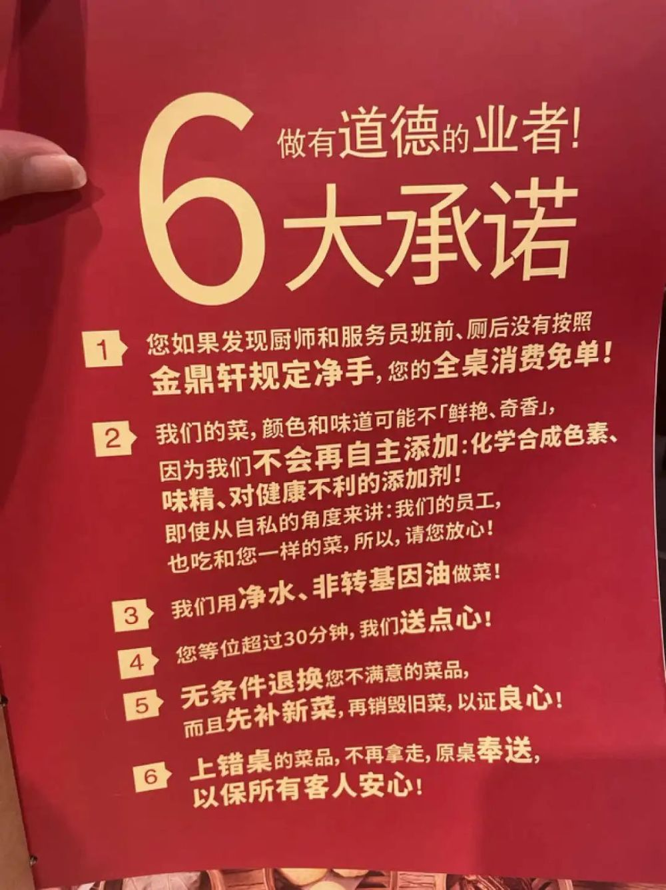

从金鼎轩的菜单上你就能感受到，这家餐厅的优点是宾至如归的坦诚，虽然没有秘方，但也没有地沟油，这使得它的不好吃，也变成了另一个令人放心的理由。

“毕竟，虽然你也知道米饭的制作流程是怎样的，但只有这里，会在米饭旁边画上电饭煲。”

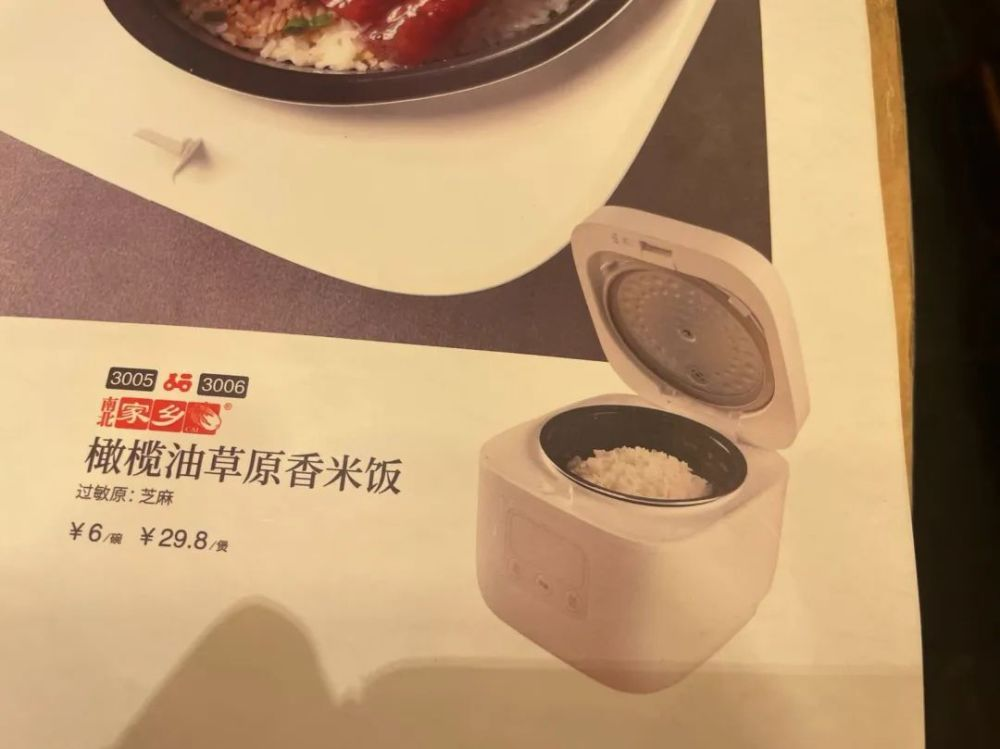

派派今年35岁，自从去年被某大厂裁员，每天就多了很多自由支配的时间，晚上他不愿意在家呆着，常常开车出来转悠，有时候去茶馆、有时候去一家肉夹馍，其余的时候会来金鼎轩，点上一盘虾饺一壶茶，一坐就是两个小时。

他告诉我，自己的夜间巡游，“既不是因为自命不凡感觉无人理解，也并非是家里人施加了什么压力。”

“就是想找个地方，这个地方在两个小时之内不受宇宙旋转控制，唯一确定的事情是，只要扫码就能坐下。”

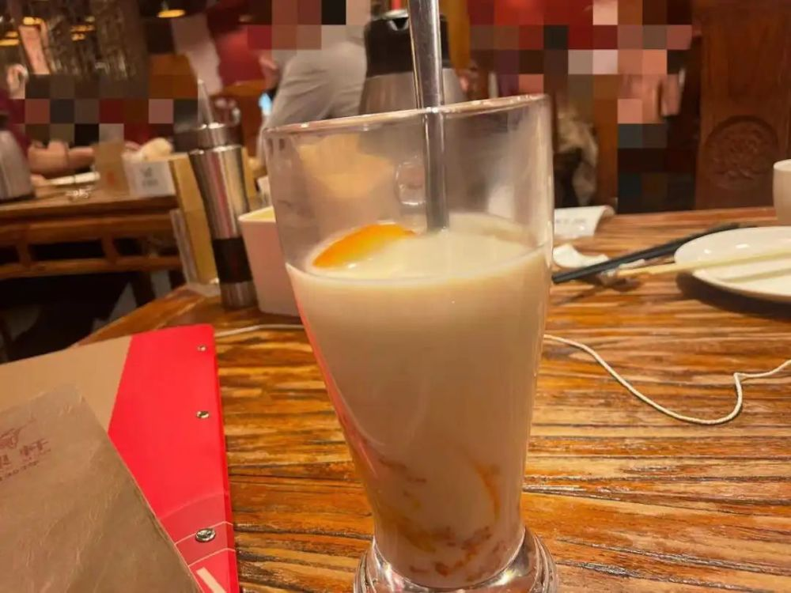

派派形容，吃惯了各种“科技与狠活”后，金鼎轩就像一个外观气派的食堂，稳定供应着一份不必期待的中庸味道。

“即便这里的点心会让人感觉是速冻产品，很多菜都有一股预制菜的味道，但一个中年人愿意消费的，就是一段又一段无功无过、能够确定与预期相符的休闲时光。”

对于从5年前就经常来金鼎轩吃夜宵的大瓷来说，金鼎轩有着很多中年男人才懂的“恰到好处”。

“这里的店面和桌子不会像兰州和沙县那样局促，32块钱4个虾饺的价位，不算便宜也不算贵，刚好能在保证就餐环境的基础上，不会让你承受额外的殷勤和关注。”

“当你感到自己很舒展又很普通时，这就是一个中年男人最自如的状态。”

大瓷告诉我，中年男人对寻找消遣，有一套自己的标准，其中最重要的一条：“有同类就是安全的，所以，但凡是你能看到很多黑色书包和平庸男人的地方，就是好的。”

“去消费的地方，我不喜欢太热情的，花钱能有服务，但别关注我，所以以前会去茶馆，但现在不去了，因为老板娘会在察觉到你剥了一个橘子后又端上一碟花生。”

一个中年男人的疲惫在于，他们已经不指望别人真正的关心，但又到了必须体面的年纪，于是向别人回之以势均力敌的礼貌，已经成为了彻底的情感劳作，“有时候只想享受一下贴会儿冷屁股所带来的心安理得。”

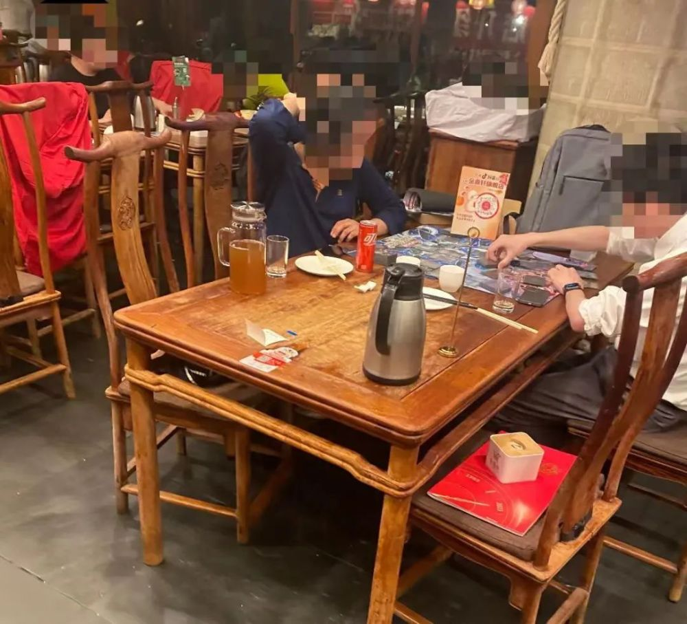

_深夜在金鼎轩玩桌游的男人_

采访那天，大瓷告诉我，他刚刚才接到一通来自特斯拉销售的电话。

“你看，现在去4s店，都是打电话和你预约，彬彬有礼关怀备至，免费可乐按摩座椅，总是没有错，但你不想被别人用温柔的方式索取，因为你连拒绝他，都得是温柔的。”

“今天特斯拉给我打电话，假装替我规划了一下指标问题，只是为了我能订购一台车，我温柔地拒绝了，请她不用为我考虑。”

他试图用这个例子说明金鼎轩的魅力。这个营业了21年，已经对顾客的任何赞誉或者诟病脱敏的老餐馆，用有些粗糙的服务，给中年人留下了自处的空间。

大瓷给我举了一个例子：“金鼎轩桌子上放的热水壶有时都是空的，但我总是可以自己从隔壁桌找到一壶满的，这就够了。”

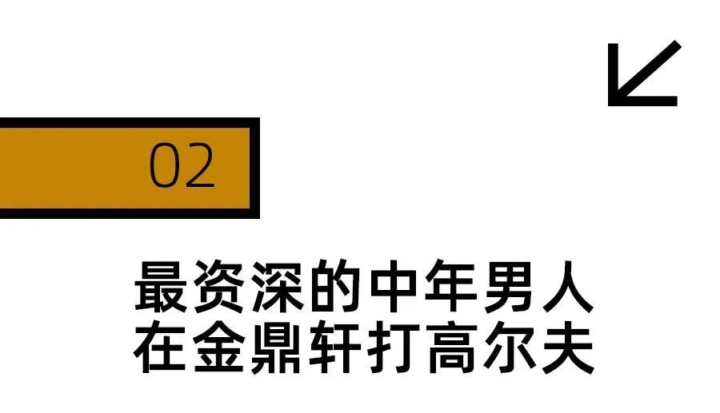

即便是金鼎轩的资深食客也可能不知道，在金鼎轩亚运村店，乘电梯直达四层，你会进入一家24小时营业的室内高尔夫俱乐部。

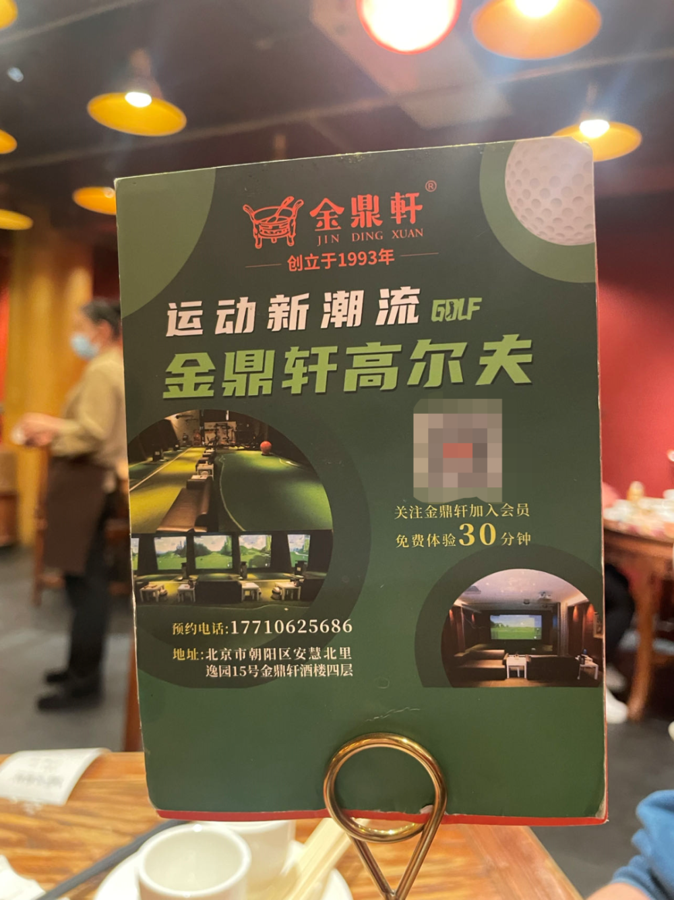

为一家餐厅匹配室内高尔夫似乎是离奇的，但这里的员工告诉我，这里有些顾客确实有吃完饭上来打一杆的习惯。甚至，在四层的包房，你可以直接点单，实现一边打球，一边吃饭。

在金鼎轩的室内高尔夫球大厅，你可以办理三种年度记名卡：24小时可以使用、含50个小时的全天卡；上午8点到12点使用、不计时的晨练卡和晚上11点到凌晨7点使用、不计时的夜练卡。三种价格都为3999，算下来比KTV还便宜。

老叶向我形容，对于一般人来说，金鼎轩只是一家饭店，但对于一个资深的中年男人来说，金鼎轩却是一个特殊的存在，类似于一家不能洗浴的洗浴中心。

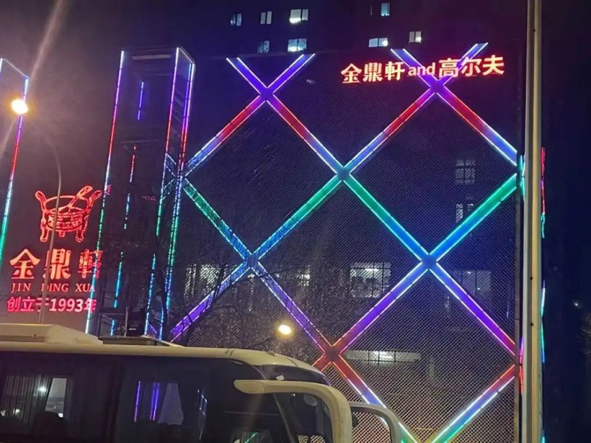

去年7月，老叶在失去工作的同时也开始了创业，原因是其负责的某公众号也算作离职赔偿的一部分，彻底从公司转移到了他自己手中。那段时间，老叶最大的娱乐就是在金鼎轩吃完夜宵后，在凌晨一点的金鼎轩顶层，打一个小时的室内高尔夫。

他像我描述那种感觉，“周围很安静，大厅里一般只有一个工作人员，跟其他场地不同的是，这个工作人员不是陪练，甚至都不怎么会打高尔夫，水平差不多只够教突然闯入的初学者正确的握杆姿势”，没人打扰同样不怎么会打的他。

“我只是听着球杆抽打空气的声音，感受自己的肌肉和呼吸。”

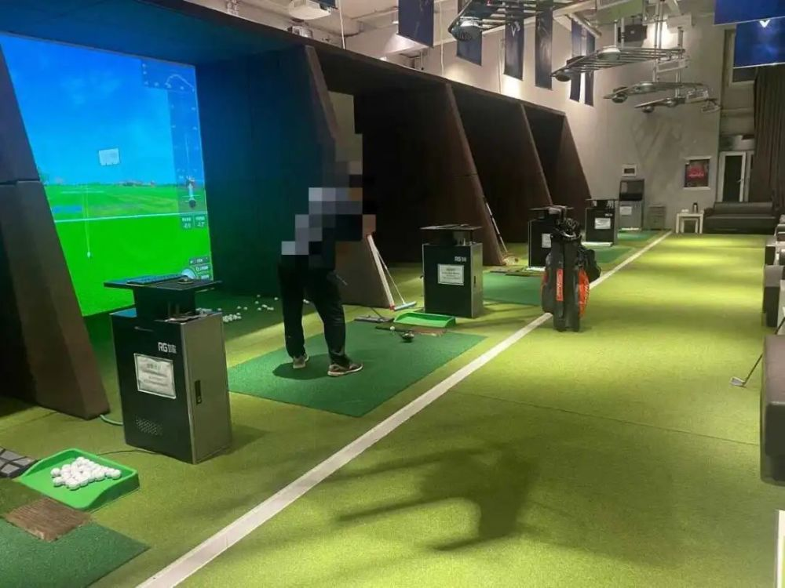

_在金鼎轩的顶层，高尔夫几乎褪去了贵族运动的属性，彻底回归了中年男人的自娱自乐。_

对于老叶来说，去顺义的高尔夫球场打高尔夫费用太贵，也太大动干戈。围着北京五环的170多座高尔夫球场，将高尔夫变成了一项封闭的游戏，一年上百万的会员年卡，巩固的只能是阶级。

“去那种动辄上千亩的高尔夫球场打3、4个小时球的人，很多只是寻找一个啃下生意的契机，那里的销售和球童远远看你一眼，就知道你在同行人中的说话的分量。”

人到中年，老叶更明白自己不应该把焦虑投射进珍贵的消遣时光里，他告诉我，身边的同龄人，比较成功的爱玩射箭，更成功的爱打高尔夫，当一切兴趣活动都被对应进了衡量奋斗进程的地图，金鼎轩顶层的室内高尔夫球场，就成了那个他不舍得告知别人的秘密宝地。

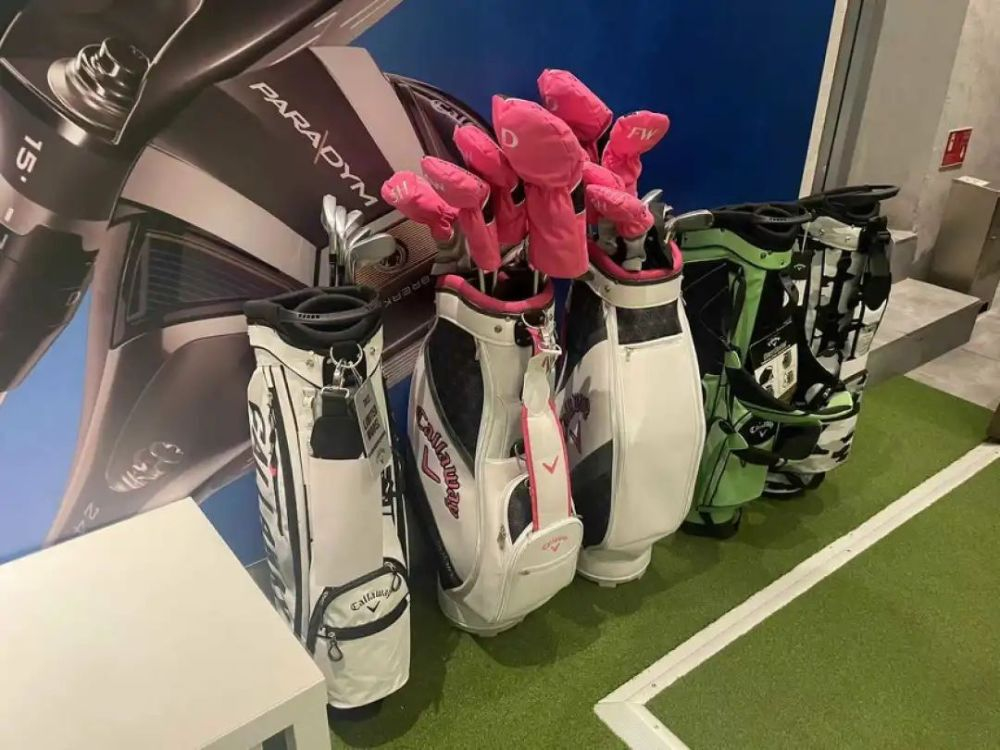

**ending**

在老叶的推荐下，我也尝试了一次在金鼎轩一楼吃个饭，接着直接上四楼打高尔夫。

晚上10点过，大厅里只有一位大哥正独自挥杆，另一位工作人员为我打开了设施，在得知我完全不会之后，他热情地向我演示握杆的姿势。

“你没事儿吃完饭就来这儿练呗，”他说，“以后等你接触了大老板，你会打高尔夫，就多一个跟人家切磋接触的机会，咱就是说，现在开始练没有坏处”。

他边说边把球打在屏幕上，球的力度只飞了30多码，“我也是初学者”，他直截了当地告诉我，“我就练了一个月，今天一天没练，又不会了。”

“没事没事，”他又说，“咱们一起练，共同进步”。

我有些震惊于他的坦诚，但也感觉到，我此时可能置身于全北京气氛最松弛的高尔夫场地。

我跟他一起练习了一会儿，试着感受“打在球前面的草皮上，把球挤出去”的手感，一直到我离开，身边的大哥仍然在独自挥着球杆。

对于他来说，这又是一个享受自我的夜晚。

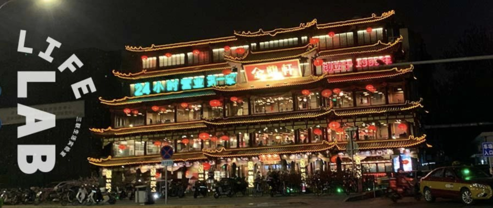

**作者 ✎ vasta**

**编辑 ✎ 婷宝、WEIFAN**

**图源 ✎ 受访者提供**

