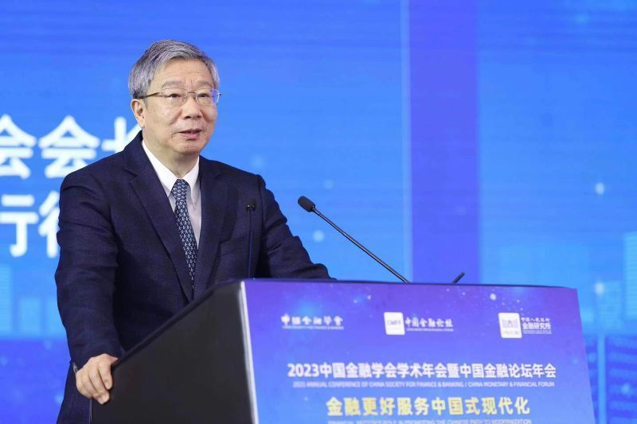

# 央行行长：守护好老百姓的“钱袋子”，不让老百姓手中的钱变“毛”

每经编辑：李泽东

据中国人民银行官网4月4日消息，易纲行长在2023中国金融学术年会暨中国金融论坛年会上讲话，
**易纲称要维护币值稳定，维护金融稳定，促进充分就业和经济增长。**

**易纲称，物价稳定和汇率基本稳定，最终都是为了守护好老百姓的“钱袋子”，不让老百姓手中的钱变“毛”。全文如下。**

_易纲 图片来源：央行官网_

尊敬的各位来宾，大家上午好！

非常高兴今天在线下见到这么多老朋友，包括香港金管局总裁余伟文先生，大家有机会进行面对面交流。首先，我代表中国金融学会，向参加此次年会的各位来宾表示热烈的欢迎，对大家一直以来关心支持中国金融学会工作表示衷心的感谢！

今年年会的主题是“金融更好服务中国式现代化”，借此机会，我从建设现代中央银行制度所要求的货币政策、金融稳定和金融服务等角度，与大家分享一些思考。

党的十九届四中、五中全会和党的二十大都明确提出建设现代中央银行制度。1995年出台、2003年修订的《中国人民银行法》，对央行职责进行了最凝练的概括，就是“制定和执行货币政策，防范和化解金融风险，维护金融稳定”。同时规定，“货币政策目标是保持货币币值的稳定，并以此促进经济增长”。因此，维护币值稳定和金融稳定是人民银行的两项中心任务。在这一点上，这些年大家的认识越来越统一。这两项任务完成好了，就能够促进充分就业和经济增长，也就能更好地服务中国式现代化。

第一，维护币值稳定。

**币值稳定有两重含义，一是物价稳定，二是汇率基本稳定。物价稳定和汇率基本稳定，最终都是为了守护好老百姓的“钱袋子”，不让老百姓手中的钱变“毛”，从根本上说，这是以人民为中心，维护最广大人民群众的利益。**

近几年，全球经济面临的超预期冲击较多，经济环境和政策效果的不确定性较大。我国一直实施稳健的货币政策，货币政策调整适当向“稳健的直觉”靠拢。这个“直觉”，从历史看，可以是我们的经验值；从时间轴看，可以是过去不同周期的平均值；从国际视角看，可以是地区之间的平均值。这些经验值、平均值都具有很好的参考价值，可以告诉我们周期过后的情形，使我们的政策具有前瞻性。因此，我们制定稳健的货币政策，主要立足本国的国情，从时间轴、国际视角看跨周期、跨区域的平均值。

总量方面，我们主要通过降低存款准备金率，把过去“冻结”的流动性释放出来，提高货币乘数，以基本稳定的央行资产负债表支持货币信贷的合理增长。过去五年，人民银行资产负债表规模年均仅增长3%左右，保持了基本稳定，同期我国广义货币供应量（M2）和社会融资规模年均增速都在10%左右，与近8%的名义GDP年均增速基本匹配。

利率方面，我们同样保持相对审慎和留有余地，政策利率波动比较小。比如，2018年全球主要央行连续加息，人民银行公开市场操作利率仅在年初小幅上调5个基点后即保持不变。2020年疫情暴发后，全球主要央行大幅降息至零利率水平，同期人民银行公开市场操作利率下调20个基点后保持稳定，市场利率也一直保持在适当水平。2022年以来，全球主要央行持续大幅加息，我们不仅没有加息，而且还适当降息，公开市场操作利率下调了20个基点，市场利率稳中有降。利率是重要的生产要素价格，直接影响消费、投资、国际收支等，利率水平过高或过低都不利于经济平稳持续增长。从过去二十年的数据看，我国实际利率总体保持在略低于潜在经济增速这一“黄金法则”水平上，与潜在经济增长水平基本匹配，符合保持物价基本稳定的要求，发挥了促进宏观经济平衡和资源有效配置的重要导向作用。同时，我国的一年期存款基准利率是1.5%，银行通常还会有一定上浮，达到2%左右，使老百姓的存款有一个合适的收益。因此，我们在制定货币政策时，充分考虑了对经济、就业、投资以及老百姓存款收益率等方方面面的影响，是以人民为中心的。

汇率方面，我们实行以市场供求为基础、参考一篮子货币进行调节、有管理的浮动汇率制度，人民币汇率保持弹性、双向浮动，发挥了调节宏观经济和国际收支的自动稳定器功能。汇率是另一个重要的宏观变量，但汇率和利率不是并列的关系，汇率在利率政策影响下主要由市场供求和预期决定。汇率机制缺乏灵活性是约束货币政策自主性、在宏观上导致经济金融脆弱性的重要原因。因此，我们坚持让市场在汇率形成中起决定性作用，总体上人民币汇率是由市场决定的。同时，我们十分重视提高换汇的便利化程度，目前每人每年5万美元的换汇额度，可以满足绝大多数老百姓的需求，让老百姓和企业能够比较自由地购汇结汇，满足就学、旅游、贸易等合理的外汇需求。

我国国内物价和人民币汇率都保持了基本稳定，得益于国家对粮食和能源的保供稳价，同时货币金融条件保持稳定适度是物价稳定的重要基础，总的看，宏观政策的效果比较理想。在去年全球高通胀背景下，我国居民消费价格指数（CPI）同比上涨2%，过去五年和十年，我国CPI年均涨幅也都在2%左右，而且波动幅度较小。过去五年，人民币对美元汇率波动率均值约4%，比以前有所提高，略小于实施浮动汇率制度的主要货币的平均波动水平，说明人民币汇率是比较稳定的。过去五年，人民币对美元三次“破7”，第一次是2019年8月，第二次是2020年2月，第三次是去年9月，前两次用了5个月回到7下方，去年用了3个月，这是市场供求的结果，说明我国外汇市场具有韧性，有能力实现动态均衡。

物价稳定和人民币汇率在合理均衡水平上的基本稳定，能够为我们实现中国式现代化的战略目标提供有力的支撑。2022年，我国GDP总量121万亿元，折合约18万亿美元；人均GDP8.6万元，折合约1.27万美元。过去二十年，国际清算银行计算的人民币实际有效汇率升值了约40%，年均升值约2%；人民币对美元升值了约20%，年均升值约1%，支撑了我国GDP总量和人均GDP换算成其他国际货币后，能保持平稳增长。国际上，有国家因为汇率大幅贬值，难以跨越“中等收入陷阱”。

第二，维护金融稳定。

在保持币值稳定的基础上，中央银行还必须维护好金融稳定。币值稳定和金融稳定多数情况下是一致的，但币值稳定不一定能保证金融稳定。如果出现了金融风险，就会损害广大人民群众的利益，甚至会引发社会问题。

近年来，我们遵循市场经济规律，不断优化利率政策，汇率由市场决定、双向浮动，这有利于从宏观层面保持经济金融稳定运行、防范系统性金融风险。近期的一些案例表明，如果宏观变量出问题，就会引发不稳定因素，带来金融风险。从中国的情况看，我们的利率、汇率、经济增长率、失业率等宏观变量是比较合理、协调、稳定的，这可以在很大程度上防范系统性金融风险。同时，我们采取了一系列措施，推动金融风险整体收敛，守住了不发生系统性金融风险的底线。稳妥化解重点企业集团和金融机构风险，高风险中小金融机构数量从高峰时的600多家压降一半到300多家。压缩“类信贷”高风险影子银行规模30万亿元。近5000家P2P网贷机构已全部停业。压实金融机构及其股东、监管部门、地方政府等各方责任，使得好人得好报、坏人得坏报，使各利益相关方都能在正向激励机制的基础上形成正确的预期。完善金融基础设施建设，推动制定金融稳定法，建立金融稳定保障基金。这些工作都是为了维护金融稳定，保护好广大存款人、中小投资者和被保险人的合法权益。

第三，促进充分就业和经济增长。

实现币值稳定和金融稳定，有助于促进充分就业和经济增长。党的二十大报告强调，高质量发展是全面建设社会主义现代化国家的首要任务，提出实施就业优先战略。过去五年，我国经济年均实际增长5.2%，高于同期世界经济2.3%左右的平均增速；城镇新增就业年均约1300万人次，就业保持在比较充分水平。

在此过程中，人民银行积极支持稳住宏观经济大盘，促进经济增长，始终把充分就业作为重要任务目标。我们注重发挥好货币政策工具总量和结构的双重功能，推出了适度的结构性货币政策工具，鼓励金融机构按照市场化方式，支持稳增长、稳就业的重点领域和薄弱环节。目前这些结构性工具的余额有6.4万亿元，占人民银行资产负债表规模15%左右，规模总体适度。

其中，支持小微企业和绿色发展是我们的两个重点。支持小微企业方面，将稳就业作为政策切入点，2020年疫情发生后，分阶段推出3000亿元、5000亿元和10000亿元再贷款再贴现，利率越来越市场化，政策覆盖面越来越广。设立两项直达工具支持小微企业获得贷款。2022年末，普惠小微贷款余额接近24万亿元，授信户数超过5600万户，利率由2018年初的6.3%降至4.9%。支持绿色发展方面，2021年11月，设立碳减排支持工具，支持金融机构为碳减排重点领域提供优惠利率贷款，要求金融机构披露贷款带动的碳减排量和其他碳足迹信息，并推动加强社会独立第三方的监督，带动2022年碳减排超1亿吨二氧化碳当量。

总的看，中国式现代化对建设现代中央银行制度提出了新的要求，任务包括方方面面，概括起来，最重要的任务就是实现币值稳定和金融稳定。这两项任务实现了，就能够促进充分就业和经济增长。

下一阶段，人民银行将以习近平新时代中国特色社会主义思想为指导，深入贯彻落实党的二十大、中央经济工作会议和全国“两会”精神，建设现代中央银行制度，维护币值稳定和金融稳定，并以此促进充分就业和经济增长，更好服务中国式现代化。

谢谢大家。

每日经济新闻综合中国人民银行官网

