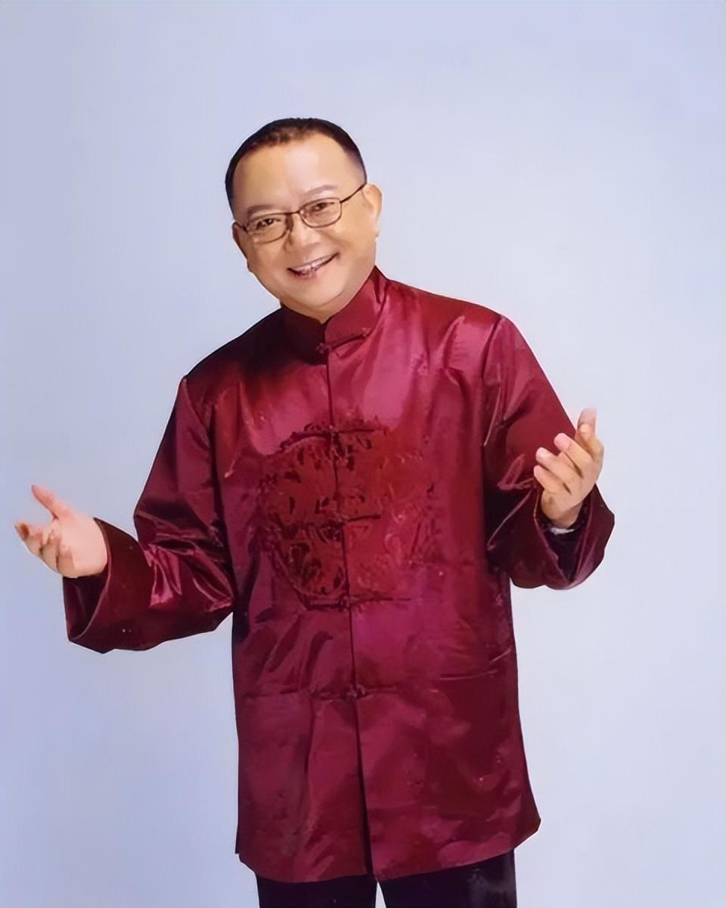
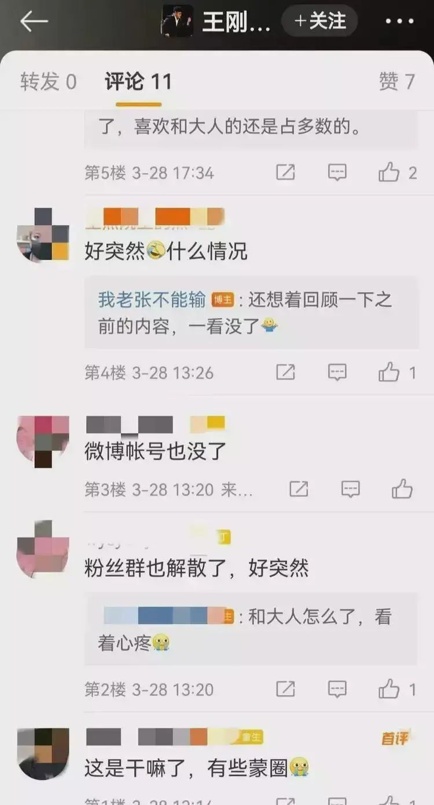
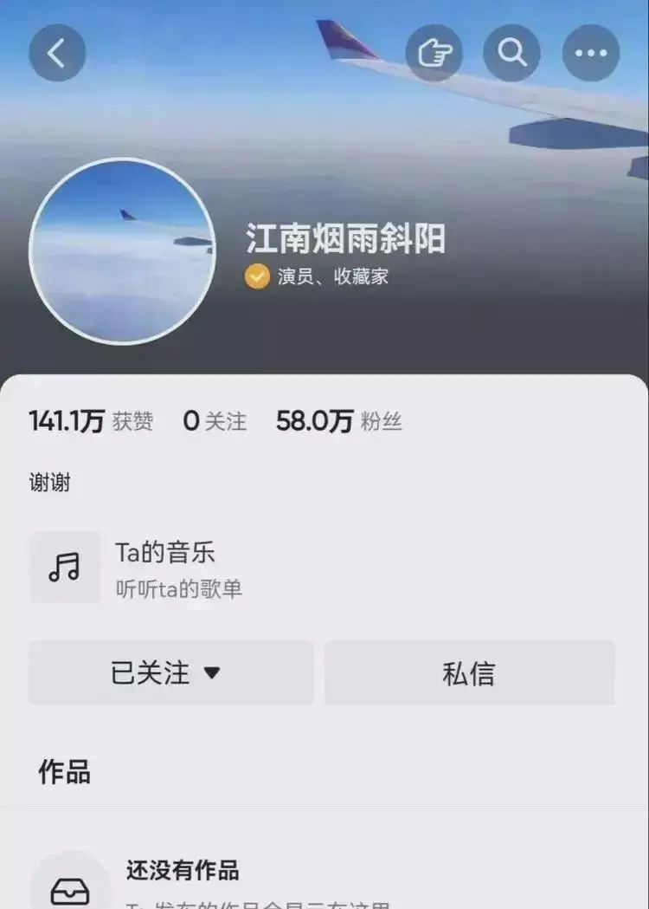
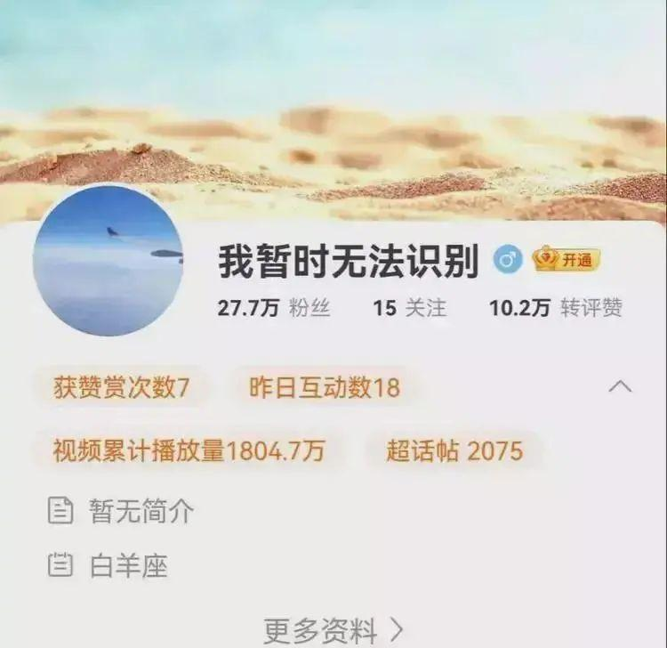

# 好突然！知名男演员王刚清空账号、解散粉丝群

近日，有网友发现“和珅”的扮演者演员王刚，将多个社交平台账号下的内容全部清空，并且解散了粉丝群。

此前，王刚在短视频平台上偶尔会记录、分享自己的生活动态。

然而就在一夜之间，王刚几十万粉丝的账号还在，但账号里面的内容全部不见了，而且他还毫无征兆地解散了粉丝群。

王刚，1948年出生，生于辽宁锦州，中国内地男演员、主持人，国家一级演员、演播艺术家。1994年，在《宰相刘罗锅》中饰演和珅而被人们所熟识，并凭借该剧获得北京电视艺术春燕奖和第14届中国电视金鹰奖最佳男配角。2001年，因在古装喜剧《铁齿铜牙纪晓岚》中与张国立、张铁林合作而获得铁三角称号。2002年，主持北京电视台《天下收藏》栏目。2021年，获得第32届华鼎奖终身成就奖。

来源：杭州交通918综合

