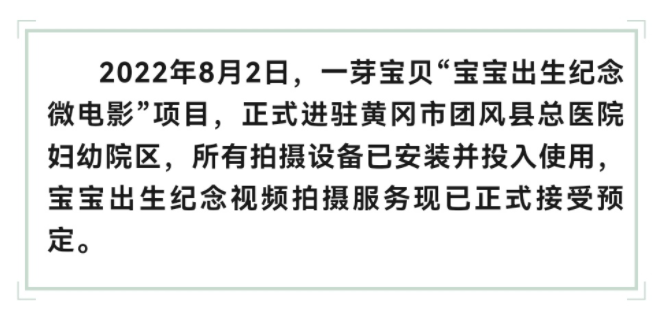
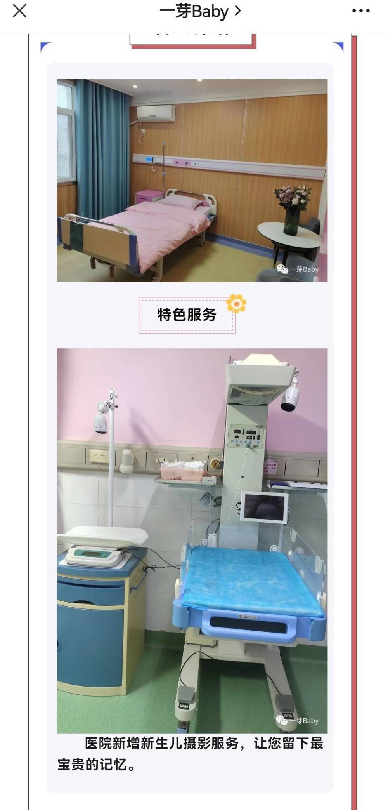

# 湖北黄冈部分医院在产房装摄像头，拍“纪念视频”，律师称泄露隐私

封面新闻记者 石伟

4月3日，湖北黄冈的孕妈邓女士反映，她在当地医院产检时，被一家公司的工作人员推销了一项“新生儿出生微电影”服务，让她心里不安。

“说是在产房里装了摄像头，拍摄新生儿的视频，交给这家叫做‘一芽’的公司剪成微电影，再卖给家属作纪念。”邓女士担心，摄像头可能会拍到产妇的隐私，存在隐私泄露风险。

这家名为“一芽”的公司，在微信公众号上宣称已进驻50多家医院的产科。在每一篇宣传文章中，会详细介绍合作的医院和项目情况，并放出一段新生儿剪脐带的护理过程。

有律师表示，一般情况下产房和病房内不能擅自安装摄像头，这一项目存在侵犯隐私风险，如果发生隐私泄漏，医院也要承担责任。

**公司进驻50多家产房安装摄像头 产妇担心隐私被泄露**

邓女士介绍，工作人员称微电影项目是“一芽”公司与妇幼医院的合作项目，家属签订同意书、缴纳299元，就可以将胎儿在产房出生后、交给家长前的这段时间的影像资料剪成小电影，交给家长做纪念。

“一芽”公司的官方账号发布了50多篇“喜讯”，每一篇都是公司进驻某一家医院的消息。文章开头宣布，公司的拍摄项目已成功入驻医院，所有拍摄设备已安装并投入使用，宝宝出生纪念视频拍摄服务正式接受预定。每篇文章中均对应配有不同医院的产房、病房照片，以及安装了拍摄设备的医疗操作台。拍摄内容为宝宝脱离母体后的系列过程，包括脐带护理、身体检查、脚印采集等。

_宣传资料中的摄像头_

封面新闻记者根据公众号上的信息，分别联系了湖北、河南、江苏等多家医院的产房。其中，河南卫辉市妇幼保健院、湖北黄冈团风总医院、徐州沛县国泰医院产科均表示有此项业务，湖北罗田县妇幼保健院则表示“有规定不允许对这些环节拍摄，我们没有这项业务，我去找科室核实后再回复你”。截至发稿时，记者未收到该院回复。

“我其实也有点心动，但突然想到这是不是涉及隐私问题。比如她的摄像头会不会拍到产妇生产过程，小宝宝的原始视频，被社会上的公司拿出去剪辑，会不会泄露，或者拿去做别的用途。”邓女士说，她曾向工作人员表达疑问，对方称“会有基本的职业道德”。

**产房称不知道原始视频会去哪里 公司称“搞定院长就能装设备”**

卫辉市妇幼保健院产房工作人员介绍，现在这项业务的价格不止299元，产妇办理住院时咨询一下护士，之后会有人与家属联系，“孩子在产房里生出来就开始拍。钱交给公司，视频资料也是公司处理，原始资料不知道会拿到哪里。”

团风县总医院妇幼院区值班人员介绍，该项目是孕产妇自愿选择，由孕产妇与第三方公司直接联系，妇幼保健院没有参与，产生的费用也与医院无关。“公司签了保密协议，如果信息泄露会追究公司的法律责任。”

沛县国泰医院产房工作人员介绍，是从小孩分娩出来之后就开始拍摄，但不拍产妇。“有公司的人在医院，你们先找公司的人开手续，拿着条子到医院收费窗口交钱，不用说交什么费，条子给过去就行，医院再把钱转给公司。视频资料不知道传到哪里去了，是公司的人在剪。”

通过公司官网上的联系方式，记者联系到该公司的项目总监彭某。彭某介绍，目前一套作品的价格已涨到399元，其中公司分走一部分，医院分走七八十元，剩余200多元归代理商。“硬件设备包含主机、影像采集、加密传输等一系列设备，图像采集设备安装在辐射保温台上，只拍图像不录声音，且拍摄范围只有方圆60公分，不会录到孩子的声音，更不会拍到产妇。”

彭某表示，会与每一位顾客签订详细的勾选协议，“我们都是加密传输，成片交给家属后不保留原始视频资料。泄露顾客隐私是违法的，肯定会追责。”

彭某坦言，这一项目不需要经过卫健委和市场监管局批准、管理，“只需要搞定院长，或者医院能拍板的人，就可以进去安装设备。”

**律师：产房和病房一般不许安装摄像头 隐私泄露后医院要担责**

河南泽槿律师事务所主任付建介绍，我国一些地方性条例中都有规定，旅馆客房、医院病房、集体宿舍、公共浴室、卫生间、更衣室、哺乳室等涉及公民隐私的场所和区域禁止安装公共安全视频图像信息系统，所以一般情况下，除非有特殊需要，医院不能在产房护理区、普通病房擅自安装摄像头。

“医院在一些特殊病房安装摄像头，有的是出于对患者安全的考虑，避免发生意外情况。但也要以必要性为限度，避免侵犯患者隐私权。”付建表示，这些场所安装和使用摄像头，需要通过张贴告示等方式提前告知患者，并尊重患者的选择权，如后期患者要求删除相关影像资料，院方也要积极配合。

“如果家属同意，医院可以在护理区安装摄像头，拍摄婴儿出生之后剪脐带等各种护理过程。但是，将视频资料交给第三方的商业公司处理，视频内容可能会泄露，或者成为不法分子牟利的工具。”付建介绍，新生儿从出生的一刻起就拥有了肖像权和隐私权，如果仅靠经营者自律，产妇和婴儿的隐私有严重的安全风险，一旦出现侵犯隐私权的现象，医院作为医疗行为实施方和影像资料拍摄的配合方，同样须要承担侵权责任。

