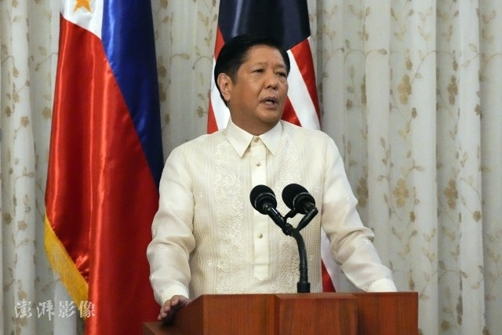
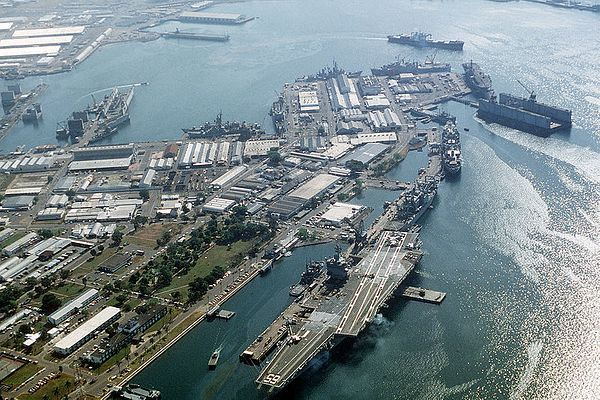

# 菲律宾公布新增4个美军基地位置，其中一处距离中国台湾岛仅400公里

【文/观察者网
熊超然】当地时间4月3日，菲律宾政府正式公布此前同意向美军开放使用权限的4个新增军事基地的具体位置，其中3个位于吕宋岛北部（卡加延省2个，伊莎贝拉省1个），另1个位于巴拉望省的巴拉巴克岛。

此前，菲律宾总统马科斯就曾透露，这些基地将“分散”在菲律宾全国各地。位置公布后，菲律宾总统府声称这些基地是“合适且互利的”，菲律宾国防部长声称基地位置“非常具有战略意义”，而美国国防部则声称这些基地“将加强美菲两军的互操性”，以应对“印太地区”一系列挑战。

美联社、路透社和菲律宾《商报》在解读基地选址时指出，吕宋岛的基地朝北即与中国台湾岛“隔海相望”，其中1处距离台湾岛仅约400公里，而巴拉望省巴拉巴克岛的基地则靠近中国南沙群岛，面向的是中国南海海域，该地区在全球贸易版图中极为关键。此外，这些基地为美军提供了靠近中国的“集结地”，可能会激怒中方。

值得注意的是，菲律宾总统马科斯此前曾有过表态，他预计美国和菲律宾之间的军事关系将加强，但排除了重启美军在苏比克湾和克拉克的前军事基地的可能性。他还明确指出，允许外国在本国领土设有军事基地是违反菲律宾宪法的。

_美联社、路透社报道截图_

据报道，菲律宾此次公布的4个新增军事基地分别是位于吕宋岛北部卡加延省的卡米洛·奥西亚斯海军基地（Camilo Osias）和拉洛机场（Lal-
lo），位于吕宋岛北部伊莎贝拉省加穆镇的梅尔乔·德拉·科鲁兹营地（Melchor Dela
Cruz），以及位于巴拉望省巴拉巴克岛（Balabac）的1处基地。

对于这4个基地的选址，路透社认为“意义重大”，卡加延省的2处基地和伊莎贝拉省的1处基地，都位于吕宋岛北部，朝北即是中国的台湾岛，而巴拉巴克岛上的基地，则靠近中国的南沙群岛。

_红圈处为基地大致位置，其中一些较之以往基地位置更为北移。谷歌地图截图_

美联社同样分析认为，此次一些基地的选址位于吕宋岛北部，与中国的台湾岛“隔海相望”，可能会激怒中方，因为这些基地将为美军提供一个靠近中国南方地区和台湾地区的“集结地”。菲律宾中文报纸《商报》则指出，其中的1处距离中国的台湾岛仅约400公里，即卡米洛·奥西亚斯海军基地。

菲律宾国防部长卡利托·加尔韦斯（Carlito Galvez）声称，这些基地的位置“非常具有战略意义”，并强调菲律宾在南海地区“对国际社会负有责任”。

“这是一条贸易路线……（每年）大约有3万亿美元的贸易往来。我们共同确保这一点的责任是巨大的。”加尔韦斯这样表示。美联社则指出，菲方此次在巴拉望省巴拉巴克岛的1处基地，面向的正是中国南海海域这一全球贸易的关键通道。

据报道，菲律宾总统府声称，此次为美军新增的4处军事基地是“合适且互利的”，而美国国防部则在一份声明中声称，新基地“将加强美菲两军的互操性，使我们能够更无缝地共同应对‘印太地区’的一系列共同挑战。”

_资料图：菲律宾总统马科斯
图自澎湃影像_

今年2月2日，菲律宾国防部同意向美军再开放4个军事基地的使用权限。美菲两国国防部的声明提到，根据美菲两国于2014年签署的《加强防务合作协议》（EDCA），美军被允许进入菲律宾的5个军事基地，加上此次开放的4个军事基地，美军在菲律宾将会拥有9个军事基地。

根据《加强防务合作协议》，美军已经被允许在菲律宾的5个军事基地预先部署装备、建造飞机跑道、燃料库以及军事宿舍等基础设施，但是并没有被允许在菲律宾常期驻扎军队。

《华盛顿邮报》此前分析认为，美军在菲律宾新增军事基地这一事态发展，反映出美菲对“印太地区”日益严峻的安全环境的担忧，对于此次“扩张”，美方意图加强其军事姿态，巩固盟友关系，遏制中国，而菲方则有加深与美国联盟的意愿。

在历史上，菲律宾曾是美国殖民地，自1951年以来一直是美国的条约盟友国，美国在菲律宾曾经拥有多处军事基地和大量驻军。1992年，美国关闭在菲最后一处军事基地——苏比克湾基地，这也是美军在亚洲最大的海外军事设施。

1998年，美菲签署《访问部队协议》，美军能以“访问”名义实现在菲律宾的长期军事存在。2014年，美菲签署《加强防务合作协议》，允许美军在菲指定区域兴建或升级军事设施。在美军撤离30年后，去年5月，菲律宾开始允许美军使用苏比克湾。这一举动引发热议，不少外媒猜测“美军可能重回菲律宾”。

_美军在菲律宾苏比克湾的前军事基地（资料图）_

值得注意的是，今年1月19日，前往瑞士参加达沃斯论坛的菲律宾总统马科斯在接受英国《金融时报》专访时，再次谈及中美关系和南海问题。他当时表示，预计美国和菲律宾之间的军事关系将加强，但排除了重启美军在苏比克湾和克拉克的前军事基地的可能性，并称此举“违宪”。

此前一天（1月18日），马科斯在达沃斯论坛上谈及南海问题时则表示，这一问题让他“夜不能寐”，但补充称，菲律宾奉行“和平政策”，军事手段绝对不是南海问题的解决方案。他强调，军备竞赛不是菲律宾的选项，南海地区的未来必须由该地区决定，而不是由外部势力决定。

在中美地缘政治议题上，马科斯当时表示，菲美同盟关系“仍然强大”，但这并不等同于菲律宾会在持续的中美紧张局势中“选边站队”。

对于菲方允许美国使用菲律宾4个军事基地，中国外交部发言人毛宁此前就曾明确指出，中方一贯认为，国家间的防务安全合作应当有利于地区和平稳定，不应针对第三方或损害第三方利益。美方出于一己私利，抱持零和思维，不断在本地区加强军事部署，是在加剧局势紧张，危害地区和平稳定。地区国家应当对此保持警惕，避免被美裹挟利用。

**本文系观察者网独家稿件，未经授权，不得转载。**

