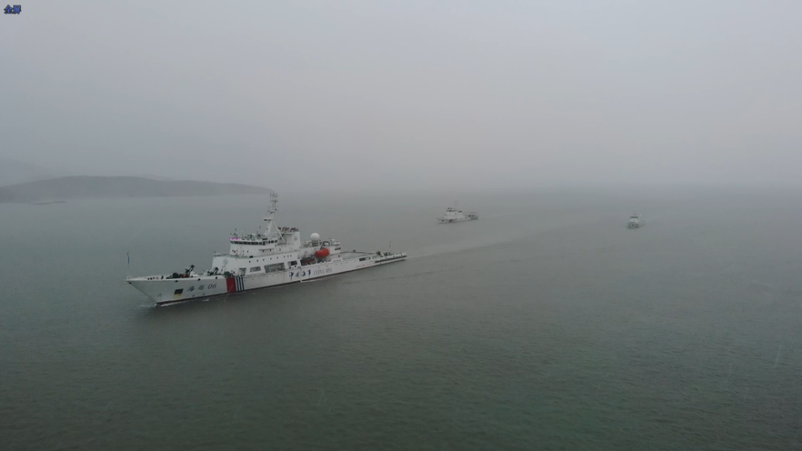
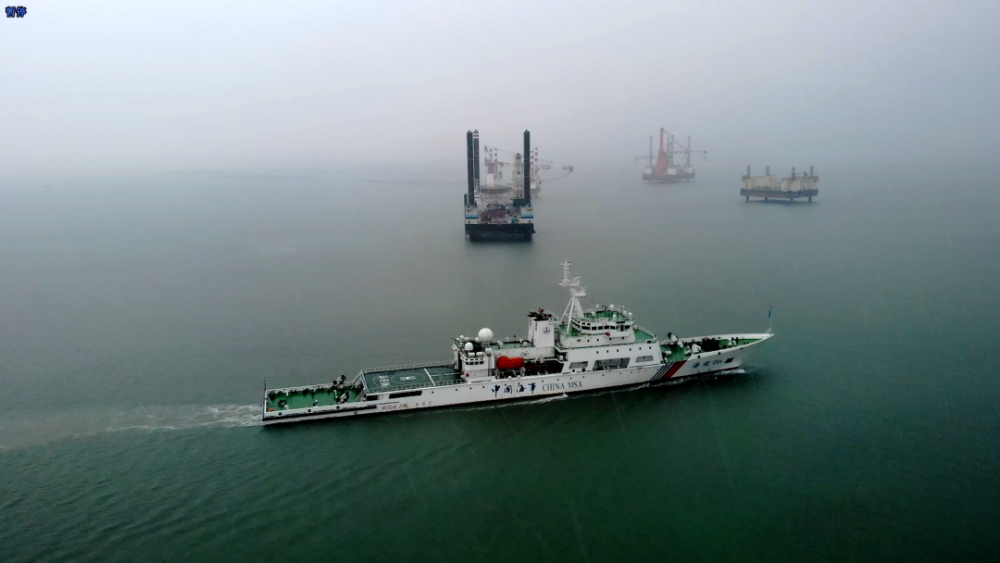
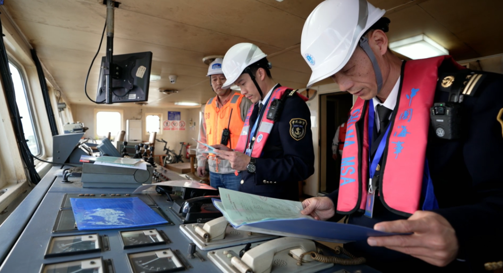
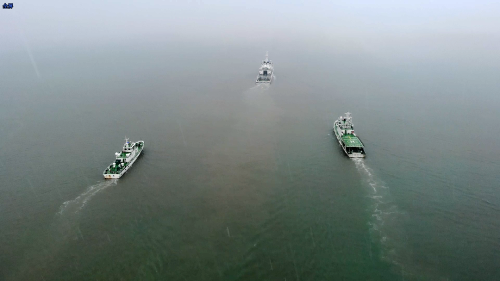

# “海巡06”轮编队出动，将在台湾海峡中北部开展3天巡航巡查行动

4月5日上午9时，由台湾海峡大型巡航救助船“海巡06”轮领衔的海事执法船艇编队驶离福建海事局平潭海事监管基地，开启台湾海峡中北部联合巡航巡查专项行动。

本次专项行动为期3天，福建海事局出动“海巡06”轮编队和海事执法人员，会同东海救助局、东海航海保障中心等相关力量，将对平潭对台直航集装箱航线、“小三通”客运航线、台湾海峡船舶习惯航路、商渔船通航密集区以及非法采砂活动多发区等水域开展巡航巡查。

行动期间，海事执法人员对两岸直航货船、施工作业船实施现场检查，确保船舶航行安全，保障水上重点工程作业安全有序。

未来两天，“海巡06”轮编队将持续在台湾海峡中北部开展巡航巡查行动。

