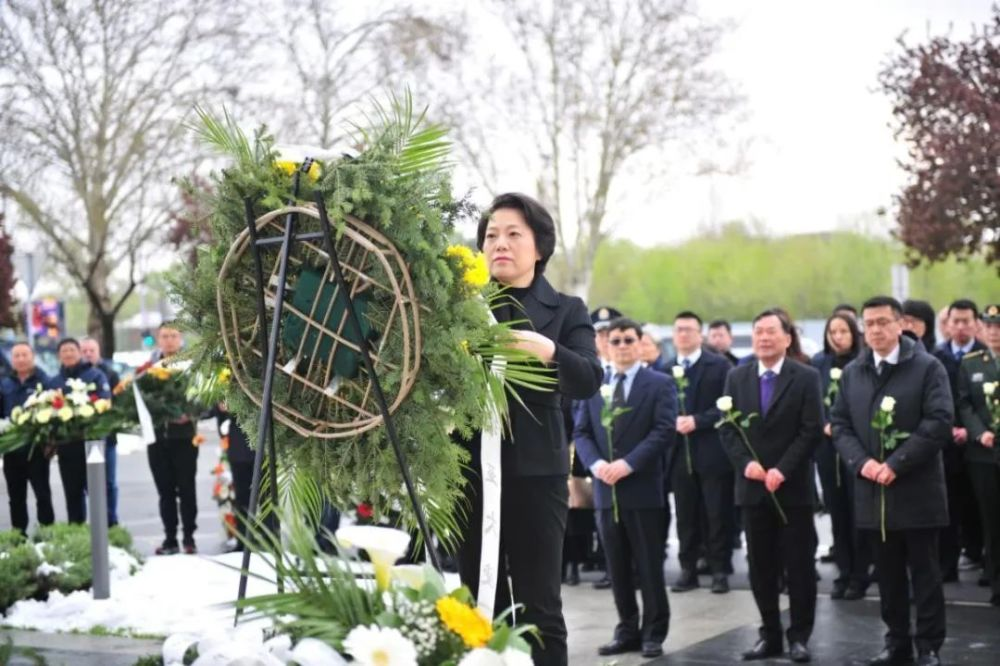
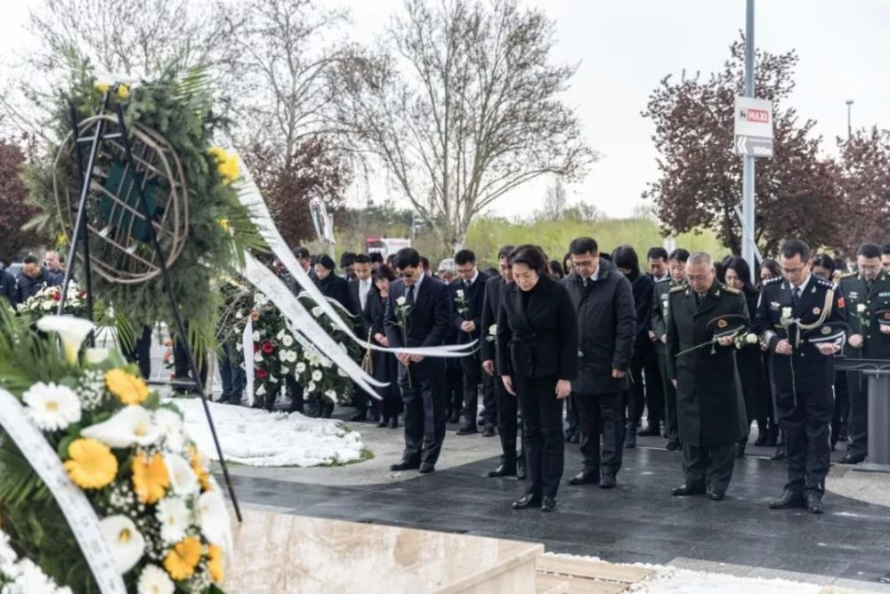
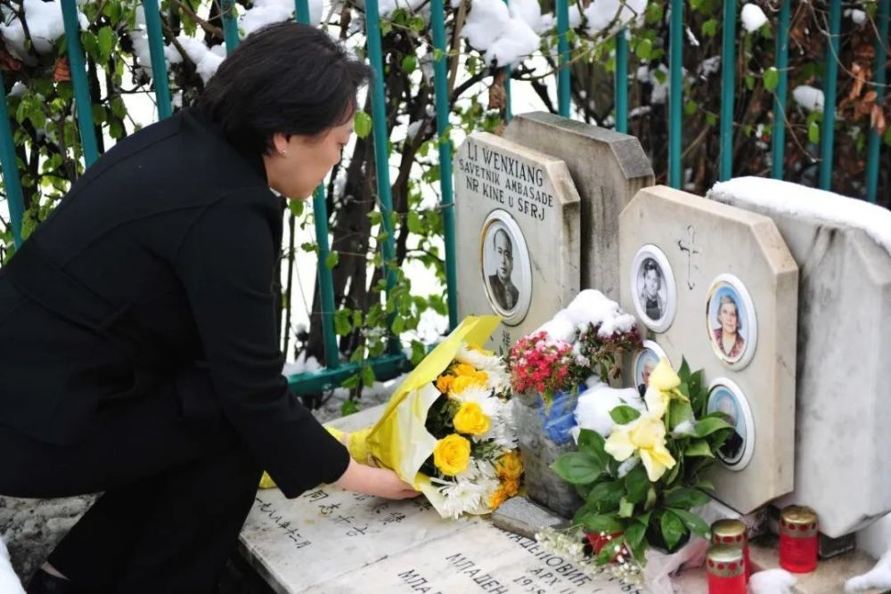

# 中国驻塞尔维亚使馆举行纪念活动，深切缅怀在北约轰炸中牺牲的3位烈士

来源：中国驻塞尔维亚大使馆

4月5日，驻塞尔维亚使馆在我驻南联盟使馆旧址举行纪念活动，深切缅怀在1999年北约轰炸中牺牲的邵云环、许杏虎和朱颖三位烈士。

中国驻塞尔维亚大使陈波缓步走上纪念碑台阶，整理花圈缎带，并带领驻塞使馆全体馆员、中国媒体、中资机构和旅塞中国公民代表近百人鞠躬默哀。随后大家一一献上花束，表达对先烈的深切缅怀和崇高敬意。

春花烂漫，傲雪凌寒，正如英烈们的精神永远激励着我们踔厉奋发、砥砺前行，为捍卫国家主权、安全和发展利益，为促进世界和平发展做出贡献。

当天，陈波还率驻塞使馆馆员前往贝尔格莱德新公墓，祭奠因公殉职的优秀共产党员、模范外交战士李文祥同志。

