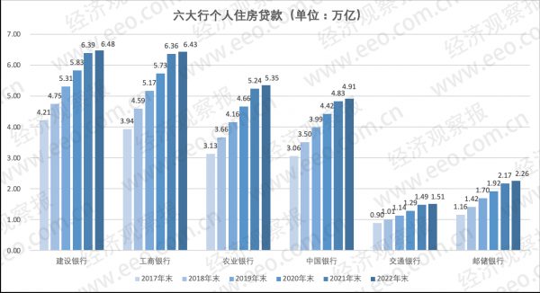

# 六大行个人房贷业务“刹车”：2022年新增房贷仅占全年新增贷款4.66％

**经济观察网 记者 胡艳明**

银行眼里的优质资产——个人房贷在2022年步入罕见的低谷期。

个人住房贷款新增有限，存量客户还在“疯狂”提前还贷款，成为银行新的烦恼。

而在两年前，银行为房企和按揭放发放贷款时，都要掂量掂量是否会超出监管要求的红线，因为2020年最后一天，房地产贷款集中制度横空出世，成为了戴在银行头上的“紧箍咒”。

经济观察网记者统计的国有六大行2022年报数据显示，建行、工行、农行、中行、交行、邮储银行在2022年新增个人住房贷款分别为930.26亿元、693.06亿元、1043亿元、902.95亿元、231.31亿元、924亿元，合计为4724.58亿元。

这与过去几年单家国有大型银行每年几千亿的新增形成了鲜明对比。比如仅工行一家，在2021年度的个人住房贷款就增加
6343.70亿元，当年六大行合计增加了2.5万亿元。

滑坡

截至2023年3月31日，国有六大行公布了2022年年报。除了营收、净利润等经营数据，作为国内发放按揭贷款的主力军，六大行在2022年个人住房贷款的增长情况也备受关注。

2022年度，六大行共新增了10.13万亿的贷款，其中，个人住房贷款新增了4724.58亿，仅占全部新增贷款的4.66%，这与前几年的情况大为不同。

按照往年数据，新增贷款中，房贷一直是国有大行的重要投向。2018年，六大行新增贷款及垫款共计5.13万亿元，其中，个人住房贷款新增2.53万亿元，占到了新增贷款的49.39%；在2019年，6.4万亿的新增贷款中，个人住房贷款新增2.53万亿元，占新增贷款39.5%；2020年和2021年的比例均有所下降，分别约为35.2%和29.4%。

_记者根据银行年报整理_

在2018年、2019年，国家对房地产进行调控，但房贷增势依然迅猛。为了防范金融体系对房地产贷款过度集中带来的潜在系统性金融风险，提高银行业金融机构稳健性，2020年底，央行联合银保监会发布《关于建立银行业金融机构房地产贷款集中度管理制度的通知》，给金融机构分档设置了房地产贷款占比的上限。六大国有行均位于第一档，其房地产贷款占比上限不得超40%，个人住房贷款占比上限不得超32.5%。

在2020年的业绩中，市场关注的热点之一也在于六大国有行是否触及了32.5%
的“红线”。当年建行和邮储银行，在2020年末个人住房贷款余额占比分别为34.73%、33.6%，都高于32.5%的监管红线。工行、中行和农行占比都超过了30%，未及32.5%，交行占比较低，为22.12%。

_记者根据银行年报整理_

为了满足房地产贷款集中度的要求，当时多家大行均表态将合理控制涉房贷款增速。在2020年度业绩发布会上，建行管理层表示，建行将对房地产开发贷继续实施从严的名单制管理，专注于为一二线城市的优质客户提供支持，开展项目合规审查，严格把关贷款的投向和项目用途。对于个人住房贷款，优先支持刚需群体，满足人民群众合理的一般住房需求和住房改善的需求。

_记者根据银行年报整理_

到了2022年，不仅居民贷款买房的动力减弱，很多背负房贷的银行客户也在提前偿还贷款。“提前还房贷”是2022年的金融领域的热点话题（详见报道：提前还贷遇难题：银行上演长时间“系统升级”，线下渠道排到两月后）。

“关于提前还款，我们注意到自去年5月以来，个人住房贷款提前还款需求明显增多。从农行看，个人住房贷款提前还款情况与市场总体情况基本一致，提前还款占总还款额比重有所上升。部分客户选择提前偿还房贷，主要是基于其自身财务规划，也和金融投资收益率中枢下降、存量房贷利率与新发放房贷利率倒挂等因素有关。”农行副行长张旭光在该行2022年度业绩发布会上表示。

波及零售业务

提前还款潮始于2022年初，据2022年上半年的财报显示，六大行的个人住房贷款合计增加了4155亿元；2022年年报显示六大行全年合计增加为4724.58亿，也就是说，2022年下半年，个人房贷仅增加了569亿。

六大行合计新增了10万亿的贷款中，主要由公司贷款贡献。相比公司贷款业务的双位数增长，个人贷款的增幅仅为个位数，不过略好于按揭增速。

_记者根据银行年报整理_

近年来，银行发力零售业务，对个人贷款的重视程度增加。但2022年度房贷数据明显拖累了个人贷款。建行行长张金良直言“去年零售信贷市场不是很理想。”

六大行普遍在个人经营贷、个人消费贷等业务增幅比较大，建行、工行的个人经营贷增加超过了个人住房贷款。

比如，虽然建行在2022年个人住房贷款增幅仅为1.46%，但个人消费贷款、个人经营贷款分别较上年增加624.64亿元、1888.81亿元，增幅分别达到26.81%、83.40%，个人经营贷新增超过个人住房贷款新增930亿的数据。

另外，工行的个人贷款比2021年末增加2917.80亿元，增长3.7%。其中，个人消费贷款增加470.62亿元，增长25.1%；个人经营性贷款增加2275.99亿元，增长32.4%，相比之下，个人住房贷款增加仅693亿。

农行在个人消费贷和个人经营贷的增速也保持了较快增长。个人贷款较2021年末增加4280.70亿元，增长6%。其中，个人住房贷款较2021年末增长2%；个人消费贷款增长10.2%；个人经营贷款增长23%；农户贷款增长29.3%。

交行在2022年的个人贷款余额为2.37万亿，较上年末增加 814.11 亿元，增幅 3.56%，在客户贷款中的占比较上年末下降 2.4个百分点至
32.43%。其中个人住房贷款较2021年末增加 231.31 亿元，增幅
1.55%，在客户贷款中的占比较2021年末下降1.97个百分点至20.73%。但是，境内行个人消费贷款余额 848.93亿元，较上年末增长 58.38%。

2023年前景如何

进入2023年，提前还款情况是否有所缓和？

3月31日，工行副行长王景武在2022年业绩发布会上表示，今年1-2月份，工行按揭贷款提前还款979亿元，虽然同比增加220个亿，但同比增幅有所回落，按揭贷款保持了正增长，影响总体可控。

中行行长刘金表示，很多人都在讨论中国房地产市场，关心中国房地产市场未来将如何。他说：“中行以及像我这样的大型金融机构行长比你们更关心中国房地产的健康发展，比你们更关心我们房地产行业的不良贷款机制，我每天都在看账本、看报表，每天都在看违约项目进展并采取积极措施。”

刘金表示，去年下半年以来，国家相关部门采取了很多支持房地产企业平稳健康发展的措施，个别贷款违约和个别境外债务都陆续得到了解决。随着中国各项支持房地产政策陆续落地，市场会有一个恢复的过程，房地产企业一定会回到正常健康发展的轨道。特别是国家现在优化房地产供给，多措并举，未来会形成更加良好健康运行的房地产行业。

王景武认为，“后续随着经济的加快复苏以及金融16条和保交楼等政策的有序推进，预计房地产风险会逐步得到有效化解。”

截至2022年末，农行的个人住房贷款余额5.35万亿元，较年初增加1043.15亿元，是六大行中增量最高的一家。

张旭光称，农行将继续贯彻落实房地产宏观调控各项要求，支持国家“稳地价、稳房价、稳预期”要求，助力房地产行业良性循环和健康发展。一是坚持“房住不炒”定位，因城施策落实好差别化住房贷款政策，紧紧围绕“居民刚性和改善性住房贷款需求”，在持续巩固县域地区传统优势的基础上，契合国家重点区域战略和人口流动趋势，做好个人住房贷款投放。二是加大对新市民、青年住房需求支持力度，发挥好新市民安居贷等特色产品的优势，做好民生安居保障。三是加强个人住房贷款业务统筹，持续开展产品创新和流程优化，着力提升业务办理效率和客户体验，有效增强客户服务能力。

