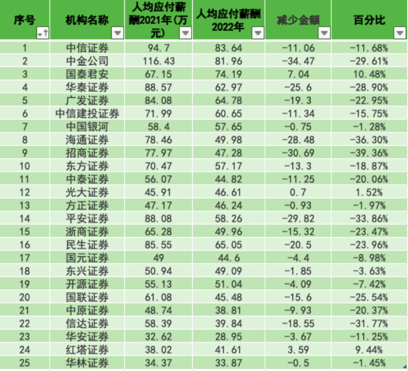

# 券商“降薪潮”来临，8成券商人均薪酬下降，有高管年薪缩水500万

截至4月5日，已有25家上市券商披露2022年年报。红星资本局注意到，随着年报的披露，券商员工的薪酬变化再次成为市场焦点。

“高薪”一直是证券行业的代名词。但从去年中开始，“券商降薪”的消息不断传出，如今年报出炉，“券商降薪”似乎已成了行业趋势。

红星资本局统计发现，有22家券商均有不同程度的降薪，降薪券商数量占比高达88%，有6家券商人均降薪金额超过20万元，招商证券员工人均薪酬减少近4成。

不过，此轮“降薪潮”中，券商高管的薪酬降幅更为明显。

**券商密集交出年度“成绩单”，8成券商员工薪酬下降**

从已公布年报的25家上市券商数据来看，有13家券商2022年营业收入超百亿元，占比超五成。

其中，中信证券暂居榜首，营收为651.09亿元；国泰君安、中国银河元、华泰证券分别位列二、三、四名，均超300亿；中信建投、中金公司、海通证券、广发证券紧随其后，2022年营收超250亿元。

截至目前，2022年净利润超过百亿元的券商有3家，中信证券、国泰君安和华泰证券，分别为213.17亿元、115.07亿元和110.53亿元。

除了过去一年的“成绩单”，备受市场关注的还有券商员工的薪酬变化。

“高薪”一直是证券行业的代名词，屡次引发社会热议，但从去年中开始，“券商降薪”的消息不断传出。红星资本局注意到，随着2022年年报的披露，“券商降薪”似乎已成了行业趋势，

红星资本局统计发现，对比2021年，只有3家券商涨薪，其余22家券商均有不同程度的降薪，降薪券商数量占比高达88%。

可以看出，降薪是券商行业的大趋势。红星资本局注意到，从绝对金额来看，有6家券商人均降薪金额超过20万元，如招商证券的人均薪酬从77.97万元下降至47.27万元、平安证券的人均薪酬从88.08万元下降到58.26万元、海通证券则从78.46万元下降到49.98万元等等。

而降薪金额在10-20万的有8家，如广发证券人均薪酬下降了19.3万、信达证券人均薪酬下降了18.33万、国联证券人均薪酬下降了15.6万等等。降薪金额10万以内的也有8家，如中原证券、国元证券等。

从比例来看，有12家券商降薪比例超过20%。其中招商证券人均薪酬降幅近4成，为目前披露中降幅最高；海通证券、平安证券、信达证券降薪比例也达到39.37%、36.30%、33.86%和31.77%。

不过也有券商逆势涨薪，如国泰君安2022年员工人均薪酬为74.19万元，同比增长10.49%，涨幅最高。红塔证券和光大证券的员工人均薪酬也均有涨幅，分别同比上涨9.4%、1.52%。

**降薪先降高管，有高管年薪少了500万**

在降薪的大趋势下，红星资本局发现，券商高管的薪酬降幅更为明显。

如东兴证券，2022年高管年度薪酬总额为1435.38万元，2021年为3702.81万元，同比减少61.24%，也是披露数据中降幅最大的券商。

此外，中金公司的高管也出现了大幅降薪的情况。2022年董监高年度薪酬总额为4126.20万元，2021年为9441.6万元，缩水超一半，同比下滑56.30%。红星资本局注意到，紧随其后的是海通证券，其高管年度薪酬总额下降了41.84%。

被称为“券商一哥”的中信证券，其高管薪酬总额从2021年的1.66亿元，减少至2022年的1.04亿元，同比减少37.51%。例如，中信证券总经理杨明辉与投资银行管理委员会主任马尧2022年薪酬分别为469.35万元和596.16万元，较2021年分别下降了529.33万元和566.47万元。

还有华泰证券、方正证券、中国银河、中信建投证券、中泰证券、高管年度薪酬总额也在下降，分别减少20.09%、26.32%、27.00%、34.74%、38.22%。

有业内人士表示，券商行业此轮“降薪潮”，高管降薪明显，基层员工变化幅度较小，此后，券商高管“年薪千万”的现象已不复存在，薪酬在500万元以上的高管数量也会减少。

对于降薪一事，3月30日，中信证券董事长张佑君在公司业绩说明会上表示，公司的薪酬以及激励严格按照公司治理结构的相关规定，由董事会、薪酬委员会、职工代表大会共同研究制定薪酬体系，也会考虑按照主管机构的薪酬指引和指导意见来设定薪酬管理办法。

**券商限薪早已靴子落地，业内人：符合行业趋势，利于长期服务**

红星资本局注意到，近年来，证券行业的薪酬话题曾屡次引发社会热议。

2022年1月，中泰证券被曝出其非银首席分析师在小红书上晒出税前224万年薪、申报税额62万的截图，尽管当事人随后否认了此事，但仍然将中泰证券推向舆论的风口浪尖。

紧接着1月13日，网上流传出一份来自某券商的内部文件《固定收益融资部员工社会行为准则（试行版）》，对其员工在多方面提出要求，要避免炫富等行为给公司及行业带来负面影响。其中包括：“不允许开豪华车（100万以上）、戴高档手表（15万以上）、使用高档包（5万以上），以及其他不合时宜、奢华定制的物品。”

上述事件引发了社会对证券行业高薪酬的关注，武汉科技大学金融证券研究所所长董登新曾接受红星资本局的采访时表示，如果整个券商行业薪酬高得离谱，监管层可能会对券商采取限薪措施。

2022年5月，券商限薪靴子落地。5月13日，中国证券业协会发布《证券公司建立稳健薪酬制度指引》（以下简称《指引》），对券商内部薪酬制度做出了具体规范。

中证协指出，该指引是为指导证券公司建立稳健的薪酬制度，健全薪酬激励约束机制，促进证券公司稳健经营和可持续发展，更好承担社会责任。

“削峰填谷”，一位不愿意透露姓名的某头部券商首席分析师对上述的调整形容到。他提到，以前券商人的工资是十年不开张，开张吃十年，波动很大，如今调整后，会导致研究所和投行部门的整体薪资更加平稳，人员流动也更小，有利于长期服务客户，也符合行业趋势。

除了券商，红星资本局还注意到，部分上市银行也处在“降薪潮”中。截至目前，已有13家全国性上市银行发布了2022年年报，7家股份行中有4家人均薪酬下滑。同样，银行降薪在管理层体现明显，如平安银行董监高薪酬总额同比下滑了8.49%。

红星新闻记者 强亚铣

