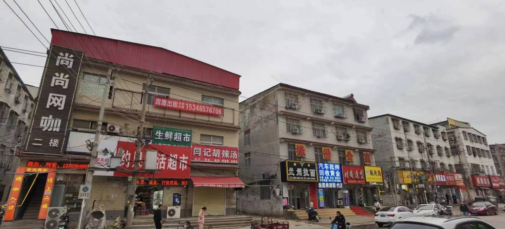
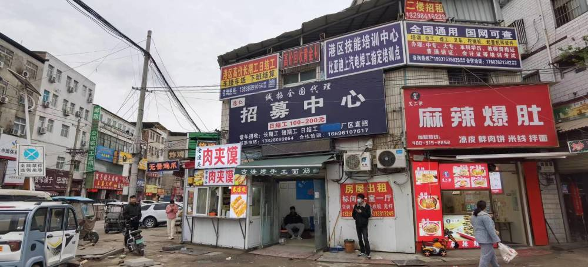

# 富士康走了吗？实探郑州富士康员工聚集地：冷清程度远超往年

曾被富士康改变的一个镇，又一次受到关注。

这里叫张庄，距离富士康郑州科技园（下称“富士康”）仅有数公里距离。在一则“富士康走了，郑州整座城市安静了”的视频中，一个视频博主将张庄商业街的冷清，与富士康工厂的员工减少结合起来。

张庄，曾是中牟县的一个普通乡镇。2013年，伴随着河南省成立郑州航空港实验区（下称“港区”），张庄便被划入了港区，之后，张庄镇便成了张庄办事处。

与河南很多乡镇不同的是，张庄的街道上，各种店铺尤其多，在主要的商业街上，一排又一排，一间又一间，全是餐饮、美发、百货等各种店铺。也因此，在当地人的口中，张庄甚至被戏谑为“港区‘小香港’”。

**“一年中最淡的时候”**

4月4日下午，第一财经记者漫步张庄街头，粗略统计后发现，仅街头叫得出名字的大小超市，就是五六十家。

“（富士康没来）之前，在镇上常住的（人口）有一万多人，现在，多的时候得有一二十万人。”在张庄街头开设电动车维修店的一名土生土长的当地人士说，这些“多出来”的人，大部分都是在富士康打工的年轻人，还有一些，则是被张庄巨大的客流量吸引，来张庄开店、做生意的人。

已经在富士康干了两年多的李晓东，便是其中一员。他告诉第一财经，虽然富士康安排有员工宿舍，但他还是更愿意住在张庄，原因之一是，大部分员工宿舍，都是八人间，几乎没个人隐私，而且自己现在有女朋友，住在员工宿舍，很多事情不方便。

在位于张庄十字街的一个民房，房东郭振刚说，自己这栋高五层的房子，一共有30间房，每间房内，配备的都有卫生间，其中，（房间）带空调的，每月400元，不带空调的，每间300元。

如今，郭振刚的30间出租房中，空出来的有七八间。

“现在人少，到（富士康）忙的时候，一间都不剩下。”郭振刚指着一间空荡荡的出租房说，这间房的租客，昨天才刚走的，说是现在富士康的返费太少，等返费高的时候，再回来。

郭振刚口中的“忙的时候”，是每年的7月份以后，他说，到那时候，伴随着订单回升，富士康开始大量对外招工，流失的打工人，也会渐次回到张庄。

除了出租房子，郭振刚还在一楼，和家人开了一家主营麻辣烫、串串香的餐饮店。

“这时候是淡季，是一年中最淡的时候，再没有比这个淡的了。”郭振刚说，传统的麻辣烫店，都是秋冬季生意最好，但他这个餐饮店，反而是7月份之后，生意开始越来越好。

“这么多年，几乎每年都这样。”对于眼下的生意清淡，郭振刚倒是显得挺乐观，他说，如今，他的麻辣烫店，每天能收入两三千块钱，但等到7月份以后，每天的收入能到四五千块钱。

“在张庄做生意，后半年能让你忙死，前半年能让你闲死。”已经在张庄开了七年理发店的王坤明也说，“你别看现在（张庄）街上没啥人，但富士康的（打工）人一回来，那又是一个样儿”。

**“小香港”的人少了**

那人多时候，到底啥样儿呢？

“看见我店门口这个小路（辅道）没，人多时候，连这上面都全是人。”王坤明的理发店，位于张庄的主干道上，这是一条双向四车道的大路，宽度有近10米，但王坤明说，往年，人多的时候，赶上富士康员工上下班，近10米的道路，全都被各种轿车、电动车、行人填满了，就这，还是有好多人没路走，有些电动车，干脆就从辅道的犄角旮旯里“见缝插针”。

“我买的（轿）车，停在辅道上，好几次都感觉他们要剐住我的车了。”不过，即便如此，王坤明还是很怀念那种日子，“生意真是好啊，你看，就我这不到二十平的小理发店，一天就能干五六千块钱。”

王坤明说，旺季时，不光自己的理发店生意好，连街对面晚上摆摊卖烧烤的生意，一到晚上也基本都是爆满，“下班了，不想做饭，就想着去街对面吃烧烤。我们晚上10点下班，到对面一看，发现凉菜全卖空了。”

李晓东也说，富士康的工人，实行的是“两班倒”，上午的五点半和下午的七点半，是他和同事们交接班的时间节点，一到这个时间，张庄的大街小巷，就被突然涌出、涌入的人流包围了，涌出的人想早点去富士康厂区上班，涌入的人想赶紧回出租房休息，两群人就在张庄的路口遇上了，堵车，几乎是每天不可避免的事情。特别是遇到刮风下雨，更是堵成一锅粥。

但这样的境况，到了淡季，却“淡”得让人心慌。

与王坤明的理发店相隔不远的，是另一家面积同样大小的理发店。4月4日下午，记者走进店内，目之所及看到的，只有两名坐在椅子上百无聊赖的店员，没有顾客。“往年（旺季）的时候，周六、周日，（人）都是爆满的。”其中一名店员赵金辉说，现在，同样是周六周日，却很少出现爆满的现象。

与郭振刚的乐观不同，赵金辉的除了把这种冷清归结与以往既有的淡季外，他的另一个最大的感受是，今年的生意，即便是淡季，也没像现在这么闲过。

“这么多年，（像现在这种情况）以前也没出现过。”赵金辉说，有时，他们坐在店里，一天都没几个客人，这种状况，即便是往年的淡季，也很少出现过。

**人为何减少了**

尽管当地多位受访者都将目前的冷清归于惯有的“淡旺季”，但他们也有一个一致的感受：张庄街上的人，今年确实比往年少了。

已经在张店从事劳务中介多年的王坤说，人少的原因，一方面确实是因为，时逢富士康的用工淡季，在工厂上班的工人，比旺季减少了。“现在厂里剩下的，可能也就相当于去年高峰期的一半左右吧。”王坤说，另一个原因是，今年的富士康招工的返费，比去年少的太多了，很多工人觉得不划算，就干脆辞职走了。

王坤告诉第一财经，目前，富士康的招工政策是，正式工底薪2200元，干满三个月，会另外给返费2500元，和去年高峰期的最高15000+的奖金相比，目前的返费甚至不及去年的零头。即便如此，有时每天甚至还没有用工名额，即便放出一些名额，也需要拼网速才能抢到。“很多人（中介）都在抢名额。”

据王坤分析，一方面，是一些在职的富士康工人觉得现在的薪资待遇和去年相差太大，选择了主动离职，另一方面，富士康又在收紧招工名额，导致的结果就是，眼下留在富士康上班的工人，越来越少。

而且，受富士康薪资待遇下调影响，周边的一些用工企业，也都主动下调了招工待遇，“今年开的工价都不高，比去年降得多。”王坤说，去年，企业招聘的小时工，开价普遍都是一小时二三十元，今年，很多都下调到了一个小时十七八元。

多重因素之下，仍留在张庄的打工人，便开始肉眼可见的减少了。

“感觉今年是整个大行情都不是特别好。”王坤明也忍不住一边感叹，一边甚至开始着手转让店面了。

促使他做出转让决定的另一个因素，是最近热炒的富士康产能转移。

此前,据彭博社等媒体报道，富士康将在印度投资7亿美元，继续扩建工厂，预计未来将给印度带来超过10万工作岗位。

此消彼长之下，未来，富士康郑州科技园能否重现当年的辉煌，成为王坤明颇为担心的重要因素。实际上，第一财经采访发现，不仅是王坤明，那些在张庄街头开店的生意人，那些每年靠房租开上豪车的张庄土著，同样对这一问题颇为敏感。

（文中受访者均为化名）

