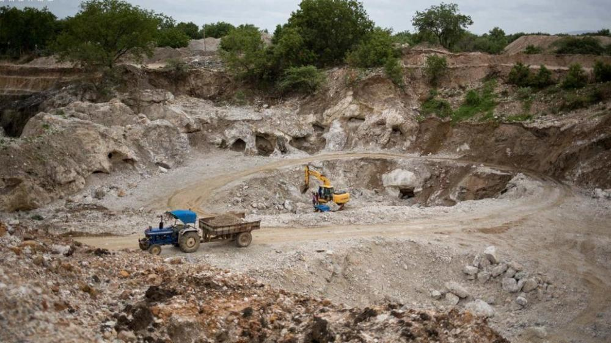
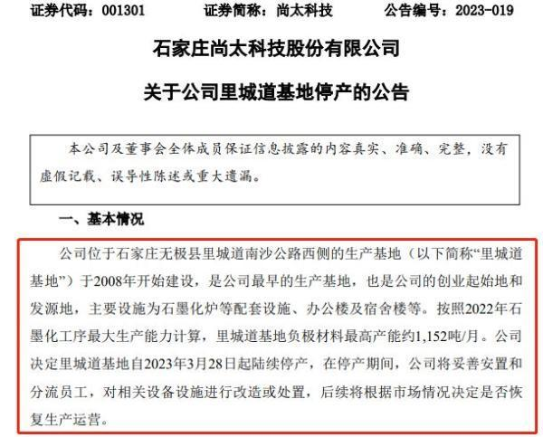

# 新能源电池风向标碳酸锂跌超60%，江西部分云母提锂企业停产以挺价

这个春天，国内锂电新能源产业链正经历着剧烈动荡。4月4日，作为行业风向标的国内电池级碳酸锂价格跌至22.4万元/吨，较去年11月末58万元/吨的高位已经跌去逾60%。

4月5日，澎湃新闻从江西宜春一家主要的云母提锂企业的负责人处了解到，面对近日每天跌近1万元/吨的碳酸锂价格，宜春四大云母提锂企业中一半已经选择了停产。

“前段时间是中央环保整治风暴，被动停产，”该负责人说，“现在是面对市场行情，主动停产。”

据国新证券的研报，目前宜春拥有云母提锂技术和成熟产线并拥有锂云母矿的企业主要有四家，分别为永兴材料旗下的永兴新能源，已有1万吨产能，规划2万吨云母提锂产能；已拥有1.5万吨云母提锂产能的江特电机；已拥有2万吨云母提锂产能的飞宇新能源，飞宇新能源是九岭锂业的全资控股子公司；以及已拥有6万吨云母提锂产能的南氏锂电。

此外，成立于2021年的志存锂业在宜春也拥有云母提锂产能。据消息人士透露，目前该公司碳酸锂产线也有近一半停产。

据了解，2021年，江西宜春的碳酸锂产量8.1万吨，超过全国碳酸锂总产量的四分之一。
截至2022年7月，宜春碳酸锂产能18万吨，全国碳酸锂产能约45万吨，宜春产能占全国的40%。

25万元/吨的碳酸锂价格，被业内认为是不少宜春云母提锂企业的利润盈亏点。

据一些业内人士指出，江西锂云母的品位（氧化锂含量）较低，高的有0.4%—0.6%，低的在0.2%—0.3%，普遍低于四川锂辉石的品位（平均在1.2%—1.4%左右）和西藏、青海的盐湖品位，使得从其中提取碳酸锂的成本普遍高于锂辉石和盐湖。

通常而言，从锂云母原矿中冶炼碳酸锂要经过脱泥、选矿、浸出提锂的过程。有国内机构测算，其中脱泥的收率是80%，根据原矿品位的不同（若以0.2%—0.55%计算），选矿的收率为60%—85%，浸出的收率为74.29%—83.64%，总收率为35.66%—57%之间，碳酸锂的完全成本为7万元/吨—33万元/吨。

上述企业负责人告诉澎湃新闻记者，目前其公司的云母提锂完全成本约为30万元/吨，而受矿石原料配置的影响，公司选矿厂50万吨/年的产能，目前利用率也只在30%—40%左右。

**行业不景气的情绪正在蔓延**

除了碳酸锂的价格暴跌，锂电产业链上的电解液六氟磷酸锂，电解钴、电池级硫酸镍、电池级硫酸锰等产品的价格，近期也呈现出全面下跌的态势，而停产的也不仅仅是碳酸锂企业。

3月底，锂电负极材料国内市占率前五的尚太科技发布《关于公司里城道基地停产的公告》称，公司决定里城道基地自2023年3月28日起陆续停产，在停产期间，公司将妥善安置和分流员工，对相关设备设施进行改造或处置，后续将根据市场情况决定是否恢复生产运营。

公告显示，尚太科技里城道基地建立于2008年，是该公司最早的生产基地，也是创业起始地和发源地。按照2022年石墨化工序最大生产能力计算，里城道基地负极材料最高产能约1152吨/月。

对于停产的原因，尚太科技表示，从需求来看，2023年开年以来，新能源电动汽车增速放缓，动力电池市场受去库存影响，锂电池客户排产不积极，导致整个负极材料市场需求增长放缓甚至疲软。

从供给来看，经过前几年行业大幅度扩产，包括行业头部企业在内的负极材料厂家均进入产能释放期，行业以石墨化工序为核心的有效产能大幅增长，整个负极材料行业供需已经反转，面临产能过剩的局面。

“受前述市场环境影响，公司目前没有满产满销，且前期维持石墨化工序满产状态，在里城道基地停产后，公司目前的在产产能和库存能够满足公司客户的产品需求。”尚太科技说。

3月30日，国内锂盐龙头赣锋锂业在接受投资者调研时表示，国内当前锂盐价格迅速下跌的原因之一，是下游需求变动、尤其是汽车厂商竞争激烈(燃油车价格战等)。原因之二，则是之前市场预计供应量有较大增幅，包括锂云母和锂盐湖，有供过于求的预期。导致锂盐价格走低市场开始观望，包括储能等需求也都在等待锂价继续下跌，从而出现了去库存的情况。

根据中国动力电池创新联盟发布的2023年2月国内动力电池装车数据，今年2月，我国动力电池产量为41.5GWh，而动力电池装车量仅为21.9GWh。如果不计算出口的部分电池，以及不计算应用于两轮车以及电动工具等小部分动力电池，2月份的动力电池装车量仅占动力电池产量的52.7%。

在3月初的两会中，赣锋锂业董事长李良彬对媒体表示，“锂盐价格有60万元/吨的昨天，也可能会有10万元/吨的明天。”但恐怕没有一家锂盐企业愿意看到这般惨淡的“明天”到来，即便是之前被认为将从锂价大降获得利好的锂电池企业，实际也是作为“不太景气”的行业中的一分子，不能幸免于难。

据《时代财经》4月4日的报道，总部位于常州市的国内第三大动力电池企业中创新航因订单减少、厂区生产效益下滑，已经开启了人员优化，“之前整个常州基地人数最多有一万多，现在只有五千人上下。”员工的加班时间有了限制，不少员工被要求上六休一甚至上五休二。

此前市场一度传闻在近期的南昌锂会闭门会议中，赣锋锂业、天齐锂业等国内主要锂盐商同意将每吨碳酸锂的底价定为25万元，以减缓电池原材料价格的暴跌。虽然赣锋锂业相关负责人对此否认，但公司随后表示，为应对价格波动的风险，公司在其销售模式中，目前长协客户大概占到70%-80%左右，调价周期有月度和季度。

赣锋锂业方面在接受投资者调研时也进一步“挺价”，公司称，目前终端市场对于电动汽车的需求仍在，同时出现了包括重卡和储能等在内的多元化需求。且目前澳洲锂辉石供应商集中度较高，预计短期内矿石价格下跌的空间有限。考虑到近期锂云母、锂盐湖等其他种类资源产能释放速度并没有很快，因此锂盐价格继续向下空间可能不大。

