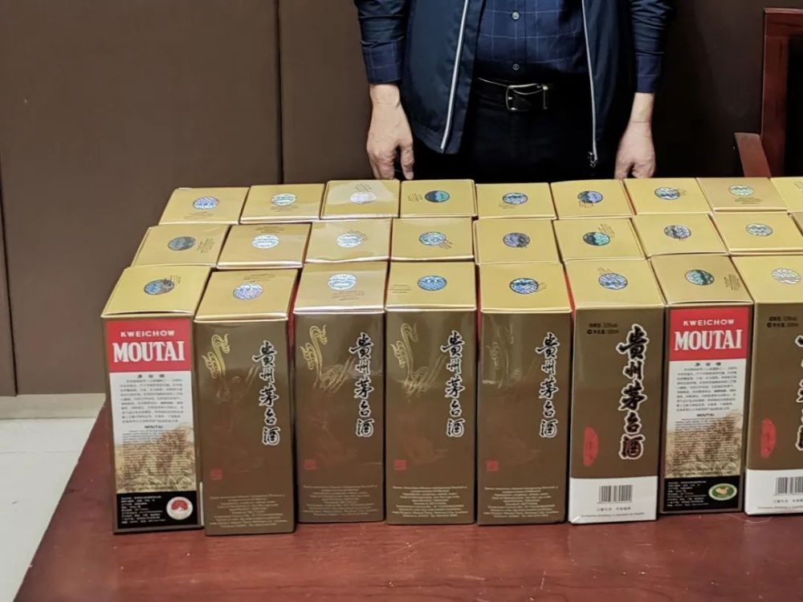

# 旅客行李箱塞54瓶茅台入境被查：通过X光机机检发现异常行李

3月26日，广州海关在广州白云机场空港口岸进境旅检渠道查获2名旅客违规携带54瓶茅台酒。

当日18时许，广州海关所属广州白云机场海关关员在对一架进境航班进行监管时，通过X光机先期机检锁定2件异常行李，并在无申报通道将携带上述行李结伴通关的1男1女两名旅客精准拦截。现场关员在其随身携带的行李箱内查获超量携带进境且未向海关申报的茅台酒，共54瓶。

根据《中华人民共和国海关对中国籍旅客进出境行李物品的管理规定》（海关总署第58号令），香港、澳门地区居民及因私往来香港、澳门地区的内地居民可以免税携带入境12度以上酒精饮料限1瓶（0.75升以下）；其他旅客可以免税携带入境12度以上酒精饮料限2瓶（1.5升以下）。

