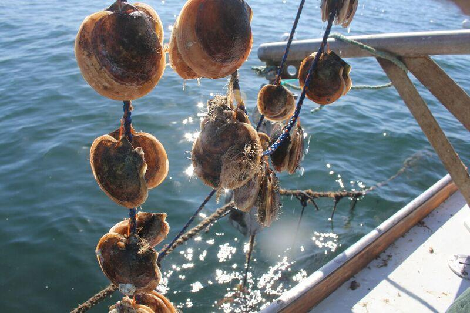
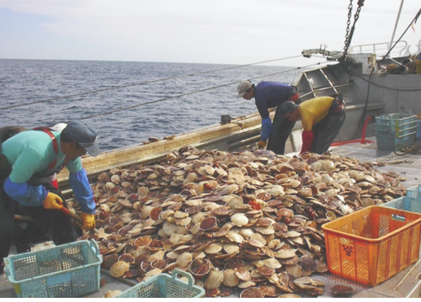

# 日本出现扇贝大规模死亡事件：约有1.8亿粒死亡，原因不明

“扇贝跑了”“扇贝死了”……多年来，股民用段子调侃上市公司獐子岛。如今，日本也出现扇贝大规模死亡事件。

据媒体报道，近日，日本北海道网走市发生了一起扇贝大面积死亡事件，目前已确认约1.8亿粒死亡。由于影响面太大，当地水产界甚至担忧未来产量将受到长远影响。

**幼扇贝大面积死亡，产业界担心“绝后”**

近日，养殖幼扇贝的网走市能取湖报告发现大量幼扇贝已经死亡，损失金额估计约为7亿日元。

据悉，每年9月，养殖者都会将扇贝贝苗淹没在能取湖里的养殖篮中，让它们在水里度过冬天。但今年3月下旬开始，养殖者们发现，能取湖的养殖筐内开始有大量幼扇贝死亡。

据西网走渔业合作社称，目前已确认约1.8亿粒死亡，占该渔业合作社今年计划产量的90%。

_↑日本渔民养殖扇贝_

目前，网走市水产研究所正在对幼扇贝和湖水水质进行测试，但截至目前，扇贝大面积死亡的原因尚不清楚。

西网走渔协扇贝委员会副会长表示，“一些扇贝品种的生存能力目前正在变弱，影响很大。这是前所未有的情况，所以我们无法预测未来的趋势。”另外一位渔业合作社负责人说，“即使是现在，幼扇贝仍在继续死亡，目前尚不清楚损害会蔓延到多远。”周边地区尚未确认类似的损坏，而在能取湖养殖的幼扇贝约占北海道养殖总量的6%。

事故发生后，网走市市长水谷洋一牵头带队，与西网走渔业合作社成立了一个对策本部，以探索今后如何对渔民进行支持以及如何处理死去的幼扇贝尸体。

**日本扇贝出口倍增，中国市场是消费主力**

日本农林水产省日前发布的数据显示，2022年农林水产品和食品的出口额比上年增长14.3％，增至1.4148万亿日元。日元贬值促使日本农渔业出口额连续10年创历史新高。

水产品出口增长显著，其中扇贝的出口量达到12.78万吨，增长了10.5％。出口业务相关人士表示，在中国、东南亚等市场“在家制作扇贝料理的方法传播较广，家庭餐使用扇贝的情况增加”。同时由于日元贬值，对美国出口也有所增长。

_↑日本渔民打捞扇贝_

在亚洲地区，日本扇贝的消费主体是日料店和寿司店。日本贸易振兴机构（JETRO）农林水产与食品市场开拓科分析称，“疫情期间在不能出境旅游的情况下，曾到过日本的顾客购买日本产扇贝的热情高涨，促使出口增加。”目前访日游客的数量也在恢复增长，进一步的市场开发受到日本相关业界的期待。

**扇贝死亡事件属于“天灾难防”？**

对于渔业养殖来讲，扇贝大面积死亡的事件意味着非常巨大的损失。那么科学技术是否能帮助人们避免此类天灾呢？从很多水产界科研人员的发言来看，似乎很难杜绝扇贝死亡事件的发生。

_↑网走市湖景_

一位大连獐子岛当地的科研人员曾向媒体表示，海洋牧业也和很多农业品类一样，很多时候也是要“靠天吃饭”，气候变化对养殖也有很大的影响。极限温度、养殖容量、饵料不足等因素，都有可能造成扇贝死亡。“环境要是变化大了或者有污染，养殖肯定受影响。”气候、水质等因素的变化也可能会使海洋生物逐渐衰弱，但距离大量死亡仍会有些延缓和滞后。“就像人得了什么毛病，不是马上死，但最后如果什么都吃不下的时候，又不能打吊瓶，就处于极限了。”

此次日本网走市大面积扇贝死亡事件是否可以提前避免？对邻近区域的养殖是否有连带影响？这还需要等待当地机构的调查结果。

红星新闻记者 王雅林 实习生 郑直

编辑 张莉 责任编辑 魏孔明

