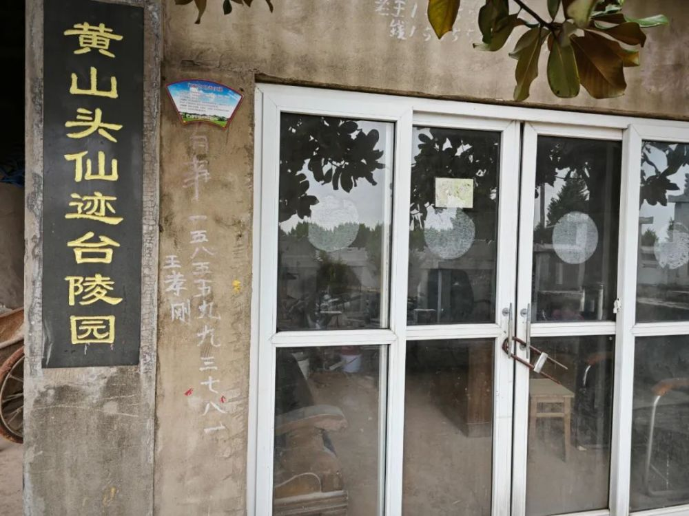

# 村中集体土地被侵占建墓地售卖，村民多次反映未果

我国《殡葬管理条例》第九条中明确：任何单位和个人未经批准，不得擅自兴建殡葬设施。农村的公益性墓地不得对村民以外的其他人员提供墓穴用地。
**但社会上仍存在非法经营公墓的行为，有人为牟取暴利，无视国家殡葬、土地管理法规和当地公墓建设规划，不经民政部门和土地管理部门批准，擅自兴建经营性公墓。**

日前，总台中国之声记者在安徽省芜湖市采访时发现，当地的白马街道义兴村黄山头自然村存在长期侵占村集体土地，私建陵园，非法牟取暴利的现象。为什么非法陵园多年未查处？中国之声一线调研：
**违法墓地侵占耕地现象调查第二篇。**

违法墓地侵占集体土地

村民多次反映未果

3月29日，记者来到黄山头自然村，看到了处于村中间位置的非法陵园，
**墓地距离最近的房屋仅几十米远，山坡和山顶大大小小的墓地粗略估算有近千个，在陵区内的显著位置还写有售卖墓地的联系方式。**

黄山头的村民们说，从2004年开始，村民钱某某、王某某两人就在这片土地上开始私建墓地对外销售，取名为“黄山头仙迹台陵园”。《公墓管理暂行办法》中要求建立公墓，需向公墓主管部门提出申请。公墓许可证是合法公墓必须要有的，是经过国家相关部门批准建设的相关手续。
**但记者多方查询，所谓的“黄山头仙迹台陵园”并没有相关资质。**

_△墓地现场_

“坟墓挨着村子，而且墓地大门就在我们村中间，现在是村子围绕着墓地”，村民们说，现在大半个山都被占了，经常有村民因为这个事起冲突。

多位村民表示，墓地最开始的售价在四千元到八千元不等，后十年涨到了一万元到一万五千元。合墓的价格则是从五六年前的三四万元，涨到了现在的五万元到七万元。此外，为了多侵占集体土地，涉事者还售卖了上百个预售墓。

多位村民向记者反映，这些年村民代表不止一次向街道、区政府反映，但问题一直没有得到解决。

已被拆除的墓地只是被沙土掩埋？

村民要求恢复土地原状

在黄山头自然村的村口和墓地入口处，记者看到多块写着“严禁私自出售墓地，如有违反者，后果自负！”的公告牌和写有“广大群众：此处黄山头陵园系违法经营，请不要购买，一经发现，从严查处，一切损失，自行承担！”的警示牌，落款是“火龙岗派出所、白马街道民政办、白马街道国土所、白马街道义兴村”。

白马街道的工作人员表示，接到了村民的举报，现在已经告知非法墓地的建造者，要求拆除未销售和没有安葬的墓地。

“我们街道部门出了一个告知书，把现有的、没有卖出去的墓砸掉；已经出售但是没有安葬的墓，要将钱款退回后将其销毁。同时，我跟村民讲，看到明显违法行为可以直接报警。”

3月30日，记者跟随村民来到陵园查看被街道要求拆除的墓地，发现
**不少墓地只是被一层薄薄的沙土掩埋，下面还是“半成品”。有的底座甚至都没有进行拆除，村民们对此非常不满。**

“半成品墓地上只要竖上墓碑就是可售卖的墓，下面全部是一个一个的底座。如果建造顺利，半个小时就能完成。”

为了了解被侵占的土地性质和违法占地的行为，记者多次联系弋江区的相关部门， **直到发稿前，记者也没有得到任何部门的正面回应。**

现在，义兴村黄山头自然村的村民代表对违法占用村民集体土地建造陵园一事，表达了三大诉求：

责令退还非法占用的土地，限期拆除墓地和其他设施，恢复土地原状。

对违法所得依法予以追缴或退赔。

涉嫌犯罪的，依法追究刑事责任。

如何推进丧葬改革？

在殡葬管理专家鲍元看来， **黄山头自然村的墓地属于非法公墓，理应撤除，并按照管理办法从严处罚。**

针对此类违法侵占土地私建墓地的情况，一位某地的基层民政局局长表示，
**按照《殡葬管理条例》的规定，违规墓地可以进行一倍以上三倍以下罚款并要求恢复原状，但罚款没有力度，恢复原状，更是难上加难。**

调研采访中记者得知，近年来，湖北省谷城县一直在大力发展城乡公益性公墓建设。当地一位村民表示，现在火化、安葬都方便了很多，大家的传统观念也在慢慢转变。

对于如何引导和带动老百姓将散葬的亲属安葬在公益墓地，谷城县民政局局长陈厚建给出了自己的建议。

“家里有老人不在了以后，免费托运、免费火化、免费冷藏让老百姓省了很多麻烦。过去老墓的整治，如果愿意迁，基本上是免费迁。县里给墓地迁移搞了补偿，这样老百姓可以得到实惠。”

殡葬管理专家鲍元表示，近年来城镇化速度加快，但殡葬设施的整体规划，没有纳入城市发展的总体规划，加上民政部门限于职责划分，无法将墓地的建设纳入城镇总体规划。

“殡葬的事情看起来是民政部门主管，但是它涉及的方面很多，比如公墓用地问题、殡仪馆和公墓的投资问题，”鲍元说。

湖北省谷城县是全国率先探索林地墓地复合利用，形成“半亩林地、10万元投入、100个墓穴”的模式，建成和在建农村公益性公墓195个，实现全覆盖。民政部也高度评价“谷城模式”为“殡葬改革北有沂水、南有谷城”。

监制丨李宇飞

记者丨李杨

编辑丨辜韵璇

