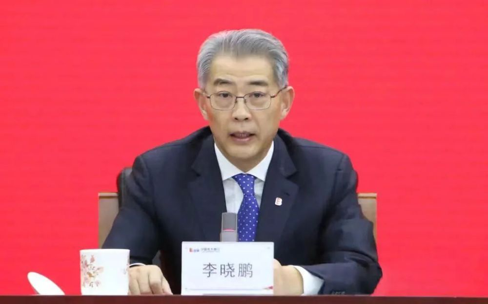

# 清明节“打虎”！‍‍‍光大集团原董事长李晓鹏被查，退休已有一年

据中央纪委国家监委网站5日消息，‍‍‍‍‍中国光大集团股份公司原党委书记、董事长李晓鹏涉嫌严重违纪违法，目前正接受中央纪委国家监委纪律审查和监察调查。

长安街知事（微信ID：Capitalnews）注意到，李晓鹏于2022年3月从光大集团退休，至今已有一年。‍‍‍‍‍

_李晓鹏 资料图_

公开资料显示，李晓鹏出生于1959年5月，在金融系统工作多年，曾任中国工商银行党委委员、副行长，中国投资有限责任公司党委副书记、监事长，招商局集团有限公司党委副书记、副董事长、总经理等职。

2017年12月，李晓鹏任中国光大集团党委书记、董事长，直至2022年3月退休。‍‍‍

