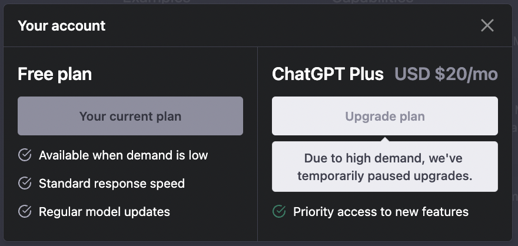
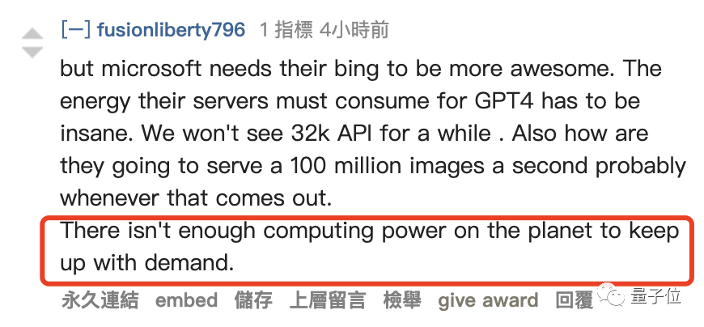
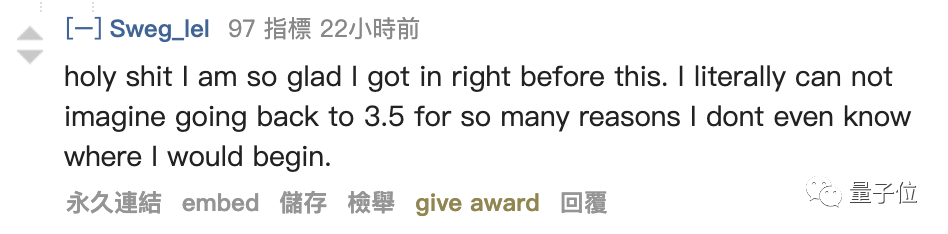
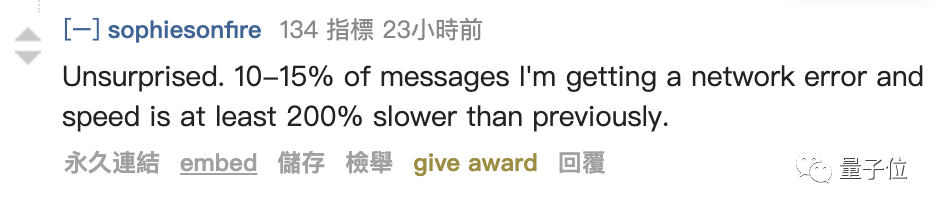
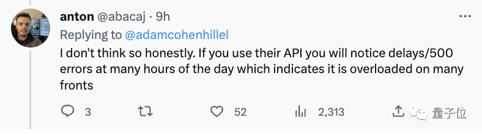
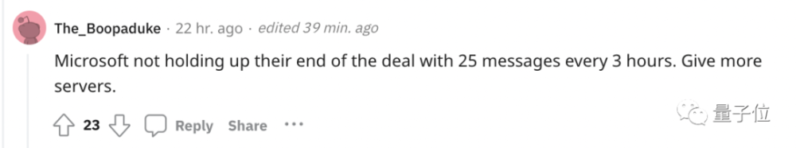
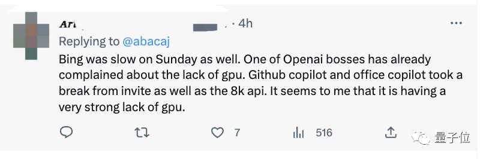
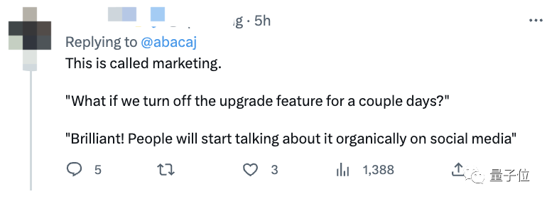

# 突发！ChatGPT Plus停售

**杨净 发自 凹非寺**

**量子位 | 公众号 QbitAI**

现在，ChatGPT已不支持Plus付费了。

原因很简单： **High demand** 。需求量太大，以至于OpenAI不得不暂停Plus的销售。

之后何时开放也没有明说。

前几天ChatGPT就因出现大规模封号引发热议，现在竟正儿八经地关闭了Plus付费会员的申请。

不少网友归因于计算资源不够了，已经不单是靠钱能解决得了的问题。金主爸爸微软还要供给自己的用户群体。

地球上已经没有足够的算力来满足需求了。

还有已经付费的网友表示庆幸：真的无法想象回到GPT-3.5的日子。

ChatGPT关闭Plus付费

消息一出，在Reddit上瞬间引发了热议，相关话题达到了570+的讨论。

不少网友认为，这也并非完全没有预兆。事实上在实际体验中，GPT-4的响应是越来越慢了，错误答案也很多。

不出所料。有10%-15%的信息出现网络错误，速度至少比以前慢200%。

一位ChatGPT的API使用者表示，会出现很多延迟错误，这表明它在很多方面都超载了。

于是乎，有人直接喊话微软：请履行承诺，提供更多的服务器。

在此之前，微软被爆曾专门为ChatGPT砸下数亿美元，打造了一台由上万张英伟达A100组成的专用超算。

甚至还专门为此调整了服务器架构，只为给ChatGPT和新必应提供更好的算力。

不仅如此，微软还在Azure的60多个数据中心部署了几十万张GPU，用于ChatGPT的推理。

但现在看来，价值数亿美元的计算资源似乎也不够了。

另外在微软那边，有网友发现，Bing在周日也很慢。而OpenAI联合创始人也抱怨过GPU不够。归根结底， **我们非常缺GPU** 。

网友：新的营销手段？

随着更多网友发现，新用户不能更新到Plus，也就有了一些质疑出现：

这会不会是一种营销手段？

先把功能关闭几天，这样一来人们就会开始讨论它。

对于这件事，你怎么看呢？

参考链接：

[1]https://twitter.com/abacaj/status/1643312603551129601

[2]https://www.reddit.com/r/OpenAI/comments/12b57q4/openai_has_temporarily_stopped_selling_the_plus/

