# 网传中国电科员工因清明加班怒喷领导，当事员工疑似已离职，公司回应

4月4日，疑似“中国电科清明节强制加班怒怼领导”的相关聊天记录在网络上传播。

根据网上聊天截图显示，事情起因是中国电科（CETC）成都区软件开发事业部的一名员工陈某，因领导安排清明加班而暴怒，将自己在过去一段时间加班的怨气一并发出，并引起了部门同事的集体共鸣，纷纷要求辞职。

目前，疑似当事人陈某回应已经离职。

5日上午，新黄河记者致电中国电子科技集团有限公司总部，一位值班工作人员表示，他们从新闻媒体上关注到此事，但具体情况并不清楚，待相关工作人员核实清楚后，会有统一的回复。

员工遭遇公司强制加班，又该如何维护自己正当权利？河南泽槿律师事务所主任付建认为，我国《劳动合同法》明确规定，用人单位应当严格执行劳动定额标准，不得强迫或者变相强迫劳动者加班。如果出现紧急事件，在危害公共安全和公众利益的情况下，法律允许用人单位延长劳动者工作时间，适当突破上述规定。没有特殊情况强迫劳动者加班属于违法行为，劳动者可以和用人单位协商，协商不成的可以向劳动监察大队举报投诉，或者申请劳动仲裁，如果对仲裁结果不满意，还可以向法院起诉，主张自己的合法权益。

**事件背景：**

**中国电科（CETC）成都员工大骂领导截图火遍全网**

深夜，被体制内一朋友投喂了个大瓜，不可谓不爽。

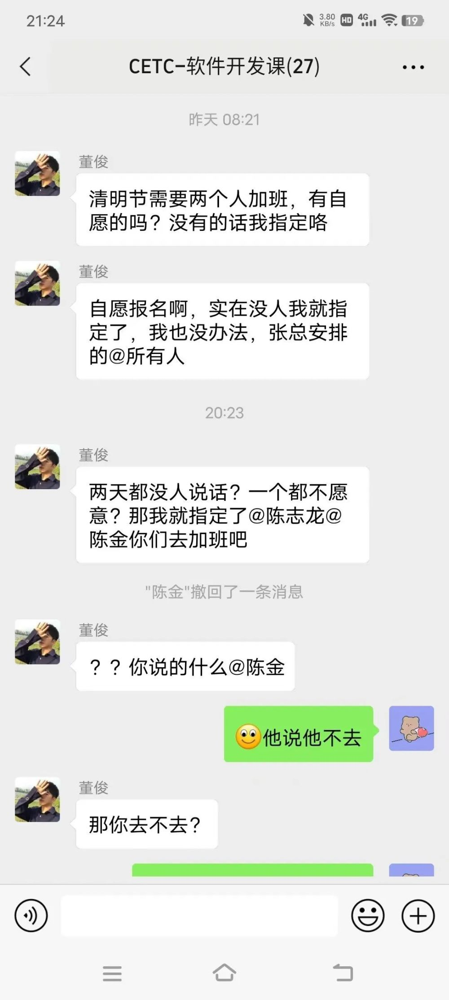

起因是中国电科（CETC）成都区软件开发事业部的一名员工，因领导安排清明加班而暴怒，将自己在过去一段时间加班的怨气一并发出，并引起了部门同事的集体共鸣，纷纷要求辞职。

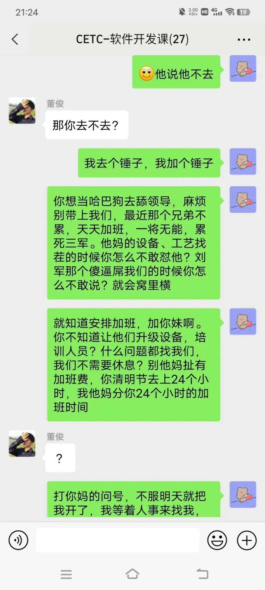

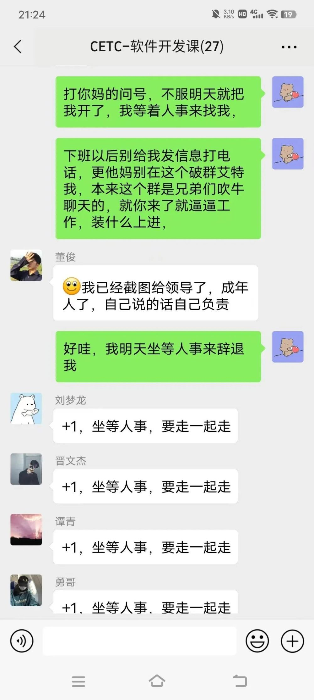

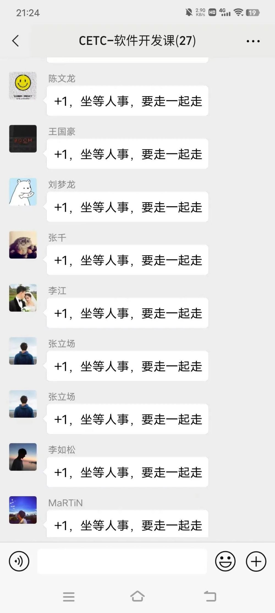

这哥们也是一肚子苦水，声称自己全部门同事整月从8点上班，到晚上11点下班，严重违反劳动法，而公司领导却在家悠闲“躺平”，激起群愤。

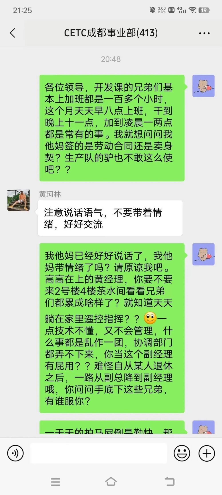

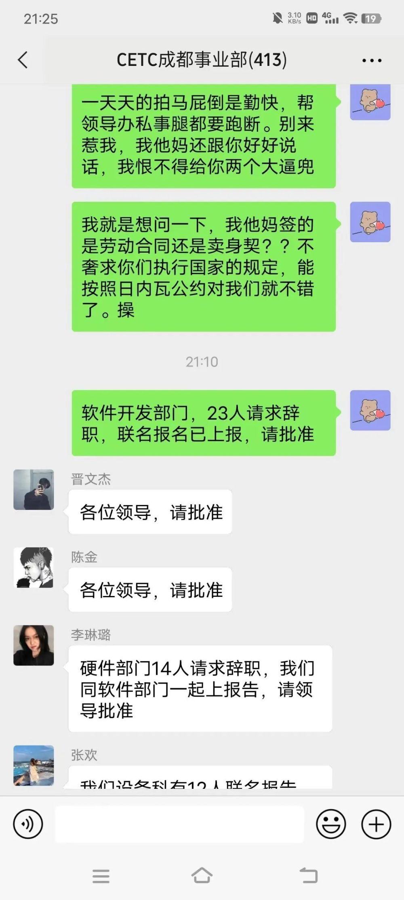

这最终导致软件开发部门23人集体请求辞职，硬件和其他部门的员工也有几十人纷纷请辞，这可是国企，这领导居然能把几个部门的人全体干辞职了，我从没见过如此阵仗。

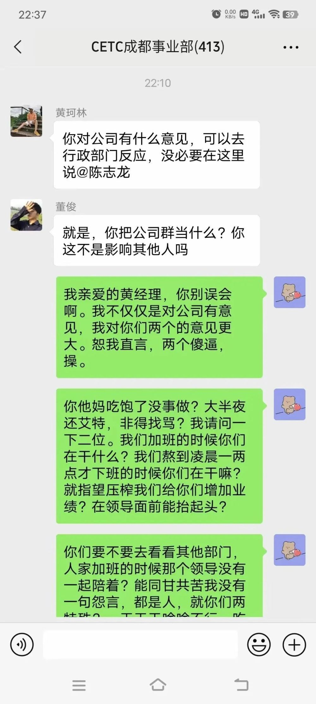

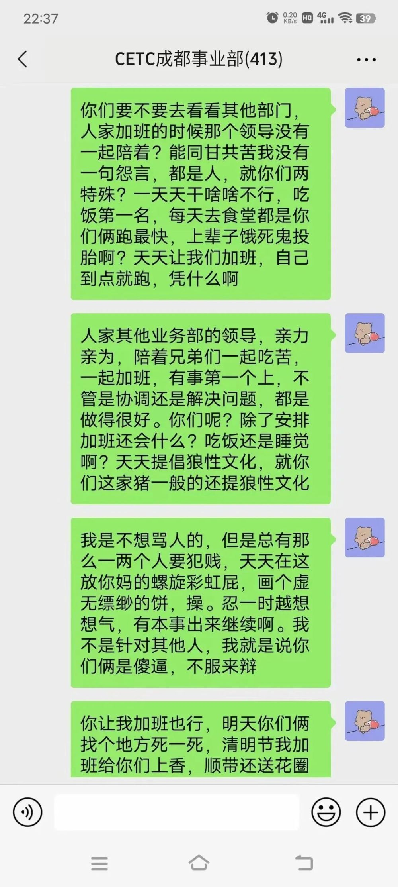

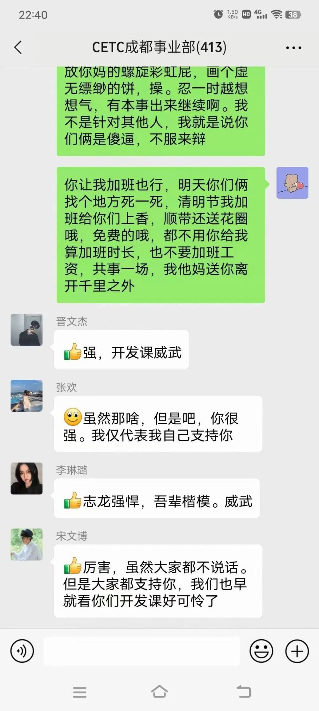

这位员工最大的不满还不是加班，而是对领导自己躺平，却选择压榨员工增加业绩的行为极其愤怒，并举例其他部门的领导并不是如此做派。

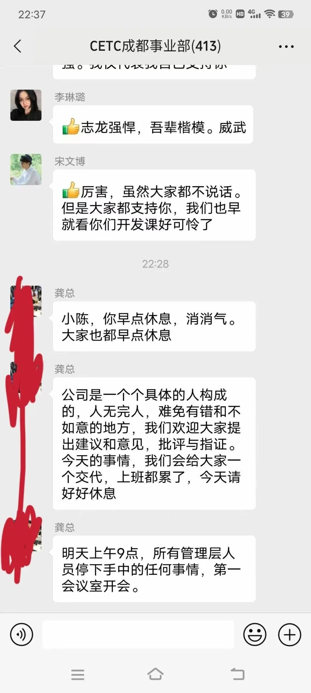

公司大领导还是识大体，知道众怒难犯，急忙打圆场，说了比较靠谱的话。

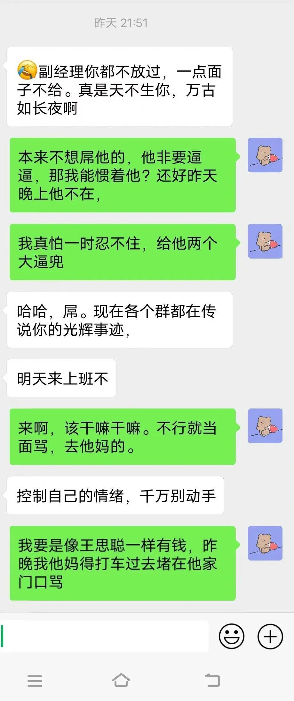

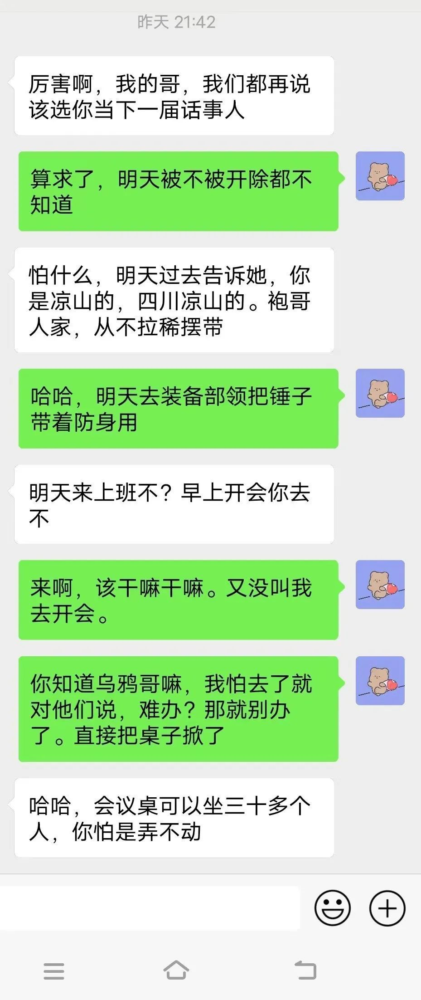

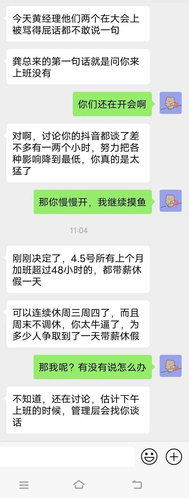

这位员工的惊天一呼立刻火遍全司，收获了无数拥趸。

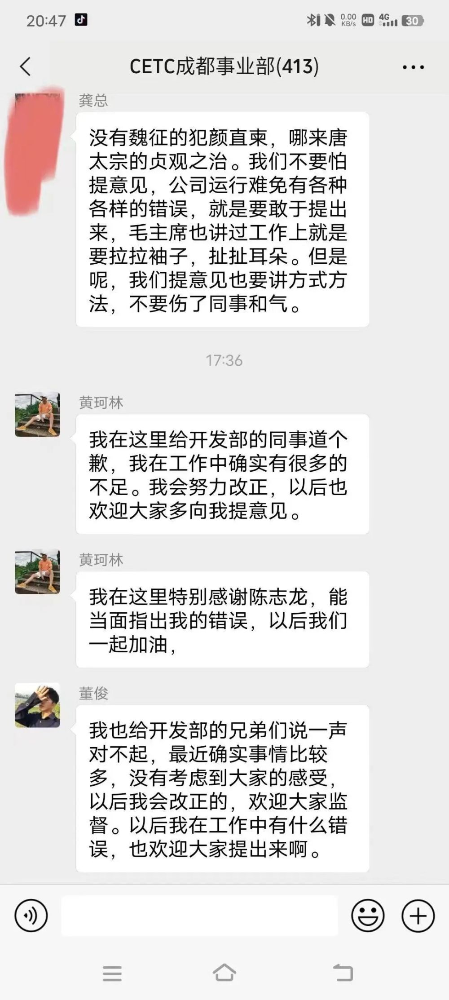

碍于大领导的话，之前两位表现强硬的领导，急忙向员工认了错。然而这并没有什么卵用，该员工继续火力全开，把公司人浮于事、管理低效、裙带关系等问题骂了个遍，堪称打工界的祖安狂人。

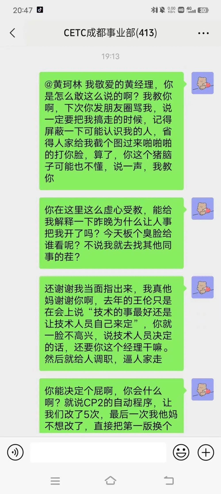

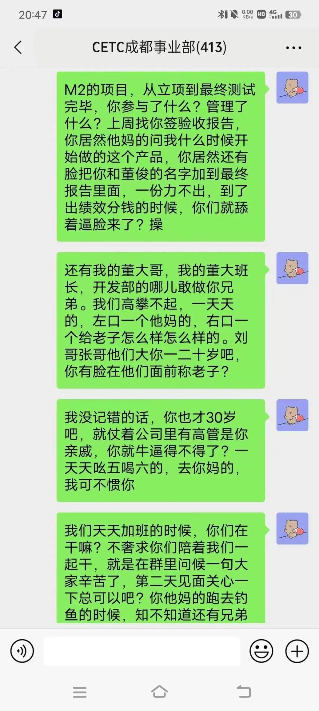

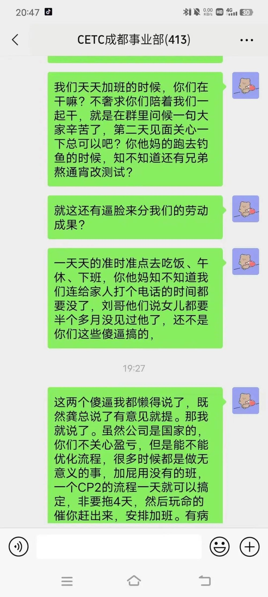

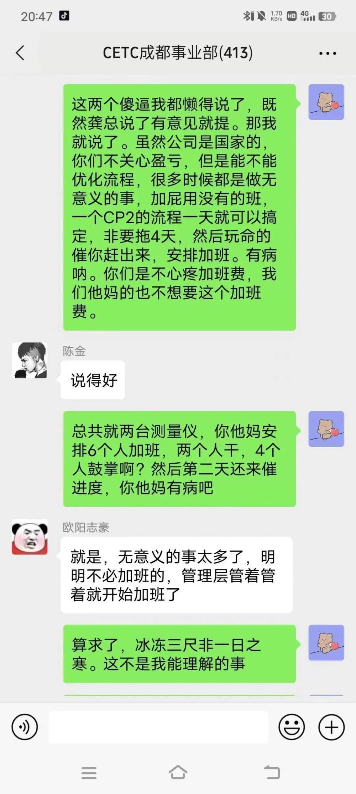

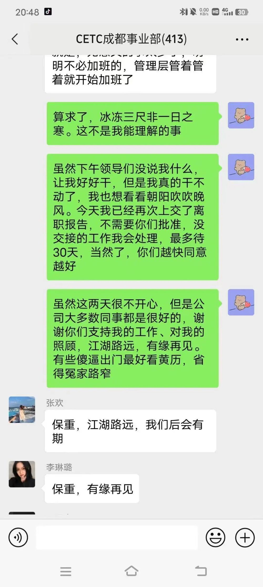

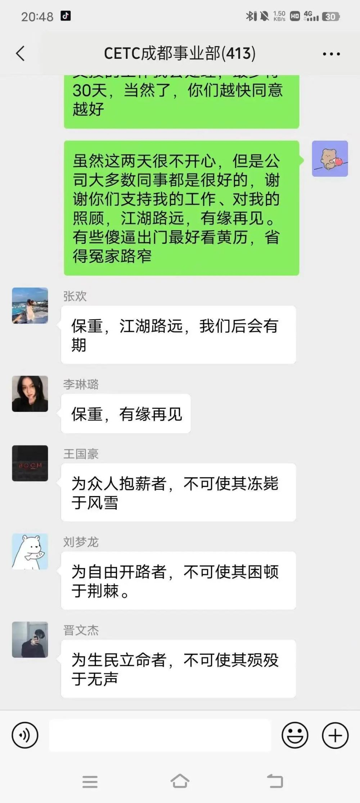

最后，我想说的是，大家都是出来打工赚钱的，都是平等的。己所不欲勿施于人，人家不爱加班就不要安排工作，况且在管理低效、无效劳动的情况下。另外，CETC毕竟是国有企业，当地部门是否存在裙带关系、违法劳动法的问题，也应该予以关注和调查。

国有企业应当为人民服务，但首先要服务好你的员工。如果小伙子说的是真话，该走的是那俩“领导”，此人应当留任加薪，因为有效地反映了公司问题，维护了国有资产的利益。

