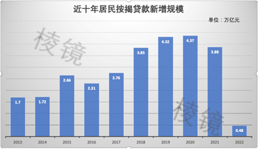
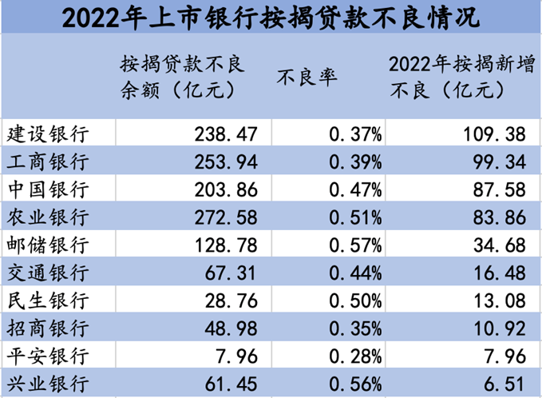

# 13家银行涉房不良贷款新增超1500亿，居民买房意愿降至十年最低

_来源：视觉中国_

作者 | 肖望

编辑 | 杨布丁

出品 | 棱镜·腾讯小满工作室

“推动泛海加快资产处置，并对部分子公司提起诉讼。”在3月28日举行的民生银行2022年度业绩会上，该行高管如是披露。

这一表态，扯下了银行与房地产公司之间表面和平的“遮羞布”。泛海集团是民生银行的发起股东之一，泛海集团董事长卢志强至今仍担任民生银行副董事长一职。今年1月21日，民生银行公告，民生银行北京分行起诉泛海控股及卢志强等，要求偿还合计70.18亿元的借款本金及其利息。

民生银行高管提到，泛海集团房地产业务在整体经营中占比较大，近年来受多种因素影响，经营困难，目前主要通过资产处置偿还债务，困难短期内难以缓解。截至2022年末，该行对泛海集团的贷款余额为212亿元。

银行业2022年成绩单披露告一段落，在主要银行净利润仍维持正增长的表象下，一些隐忧暗流涌动：建设银行、工商银行等6家A股上市银行营业收入出现负增长；招商银行、平安银行等在内的5家上市银行不良率有所上升；多家银行指出，新增不良主要集中在房地产行业。

作者梳理，主要上市银行（6家国有大行+7家股份行，浦发银行尚未披露年报）涉房不良贷款新增规模达到1537.54亿元，较上一年多增961.7亿元，其中对公房地产新增不良1067.74亿元，住房按揭贷款新增不良469.8亿元。尽管按揭贷款不良率仍维持在较低水平，但不良规模增幅创纪录，2021年，住房按揭贷款新增不良规模为20.26亿元。

为房所困的银行业，能在2023年迎来转机吗？

**房地产成新增不良重灾区**

曾是银行座上宾的房地产公司，如今成为银行新增不良的重灾区。

多家银行财报披露，房地产行业成为新增不良贷款的主要行业。作者梳理，2022年，银行业对公房地产不良新增1067.74亿元，相较上年的555.57亿元多增512.17亿元。

其中，中国银行及建设银行新增房地产不良均超过200亿元，中国银行房地产业务不良率达7.23%。股份行中，招商银行、民生银行房地产不良分别新增96.93亿元、59.71亿元，规模靠前。

民生银行副行长石杰介绍，该行对公不良率4.28%，较上年末上升1.62个百分点，这符合整个房地产行业周期性调整的现状。该行对公房地产贷款减值计提比例远高于公司类贷款平均减值计提比例，减值计提结果较为审慎。

平安银行2022年末房地产不良为40.54亿元，相较上年末6.36亿元新增34.18亿元，不良率从0.22%上升到1.43%。在业绩会上，平安银行副行长郭世邦介绍，2022年产生的不良都是此前已经爆雷、停工的房企，例如奥园，整体金额不大。他强调，尽管房地产不良率上升，但2022年不良生成率比2021年下降超过三成，这是更关键的指标，目前来讲该行房地产业务还是非常安全。

“这两年房地产行业爆雷，我们行踩雷非常少，像恒大、融创等我们都躲掉了。我们进去了，但是提前出来了。”郭世邦表示。

更多的银行业金融机构未能及早抽身。

在2021年还是出险房企“白衣骑士”的孙宏斌，在2022年开始为融创紧绷的资金链和“保交楼”奔走。过往孙宏斌在业绩会上风趣幽默被称“开相声专场”，
如今露面惟有对投资者道歉。

融创中国（01918.HK）披露，截至2022年末，集团到期未偿付借贷约为808.9亿元，而截至财报批准日期，到期未偿付借贷本金约为1005.2亿元。这背后，大量金融机构被牵扯其中。

农行副行长刘加旺在业绩会上表示，前期受房地产整个行业下行的影响，一些盲目扩张、负债水平较高的少数大型房企风险暴露，带来整个房地产行业风险有所上升。农行对公房地产不良为460亿元，不良率5.48%，较年初上升2.09个百分点。整体看，农行房地产行业资产质量总体风险可控、总体稳定，相关贷款也按照规定计提了拨备（为可能出现的风险预留的准备资金）。

民生银行副行长石杰指出，受困房企有息负债主要包括银行贷款、债券、信托、资管计划、代销基金、供应商垫资等，能感觉到受困房企融资中影子银行占比较大，银行贷款并不是最主要部分。

财报显示，招商银行、光大银行、中信银行、平安银行及浙商银行在2022年度压降了对公房地产贷款余额。

浙商银行副行长景峰表示，该行存量房地产业务风险可控，一是2022年房地产业务抵押项下占比达86%；二是信用保障类业务，国有及国有控股借款人比例达到56%；三是项目集中在经济发达的强势区域，长三角、珠三角、京津冀三个区域项目余额占比合计超过68%。

**居民购房意愿降至十年最低**

央行统计显示，2022年末，个人住房贷款余额38.8万亿元，较2021年新增4800亿元，同比增长1.2%。

这是近十年来个人住房贷款增速首次回落至个位数，且是近十年来新增按揭规模最低的一年。在2021年、2020年和2019年，个人住房贷款每年新增规模分别为3.88万亿、4.37万亿和4.32万亿元。

作者梳理，农业银行、建设银行、邮储银行、工商银行新增按揭投放靠前，分别达到1043亿元、930亿元、925亿元和693亿元，兴业银行、民生银行按揭贷款余额则下降超200亿元。不过相较于2021年，各家银行的按揭贷款投放规模均可谓是断崖式下跌。

一方面，房价高速上涨预期不再，且部分地区开发商融资能力受损，楼盘无法按时交付，导致居民购房观望情绪浓厚，宏观经济增速放缓也导致居民消费能力有所下降；另一方面，居民提前还贷潮起，导致按揭贷款余额进一步下降。

招商银行指出，该行个人住房贷款提前还款量自2022年6月开始明显上升，于2022年8月达到月度提前还款峰值。

对于提前还款原因，招行认为，一是居民受收入预期影响，倾向于降低负债、减少利息支出；二是存量与增量个人住房贷款间利率差扩大；三是居民理财等资产端预期收益率下降。而随着现阶段居民储蓄不断增加，预计2023年该行提前还款量仍将阶段性维持高位。

例如，郑州在今年1月末率先将首套房贷利率下调至3.8%，而一年半之前，这一利率还是6.12%，此前购房用户心理落差巨大。亦有深圳地区城商行人士告诉作者，由于提前还款客户大增，该行预约还款排队周期从一个半月延长至三个月。

民生银行披露，该行全年投放个人住房贷款700.27亿元，同时报告期内办理提前还款714.22亿元，由此导致按揭贷款余额出现下降。

**按揭贷款不良新增超400亿元**

一直以来，按揭贷款以其极低的不良率被视为银行业资产质量的压舱石。2022年，银行业按揭贷款不良规模则出现显著上升。

作者统计，主要上市银行2022年按揭贷款新增不良达到469.8亿元，相较2021年的20.42亿元大幅增加，而在疫情第一年，2020年新增按揭贷款不良为195.7亿元。

2022年主要上市银行按揭贷款平均不良率为0.44%，尽管相较于银行业1.63%不良率仍处于较低水平，但较2021年0.28%的平均不良水平增势明显，值得引起警惕。假设一套房屋贷款额为200万元，新增按揭不良规模涉及的房产将达到23500套左右。

建设银行是按揭贷款规模最大的商业银行，2022年，其按揭贷款新增不良达到109.38亿元，是按揭不良新增最多的银行。而上一年这一数据为15.89亿元。

招商银行2022年新增按揭不良10.83亿元，2021年则为0.62亿元。此外，其按揭逾期贷款余额达到69.56亿元。

招行在年报中指出，受经济增长放缓影响，个人住房贷款不良率、关注贷款率和逾期贷款率均较上年末有所上升，不过其抵押物充足且稳中向好，同时关注贷款余额中非逾期占比超过七成，业务整体风险可控。招行还指出，报告期内，居民就业、收入和消费受到冲击，部分客户还款能力及还款意愿受到影响，消费信贷类业务不良额增加了24亿元。2023年面对内外部不确定因素，预计消费信贷类业务资产质量仍将面临压力。

交通银行首席风险官林骅在业绩会上介绍，该行按揭贷款不良率为0.44%，较2021年上升0.1个百分点，总体仍是较低的不良率。目前延期还款按揭占比也较低，按揭贷款还是比较优质的业务。不过，他也称房地产业务受扰动的因素仍然存在，可能会对按揭贷款资产质量带来一定的冲击和影响，仍会继续高度关注房地产开发贷款、个人按揭贷款的风险状况。

**按揭需求回暖能否持续？**

房地产行业的外部环境正在逐步改善。去年11月底，中国人民银行、银保监会发布《关于做好当前金融支持房地产市场平稳健康发展工作的通知》，推出16条金融举措，促进房地产市场平稳健康发展。

今年前三个月，楼市出现小阳春行情。中指研究院数据显示，2023年1-3月，TOP100房企销总额为17589.5亿元，同比增长8.2%，是2022年以来首次实现增长。但复苏行情能持续多久，银行家们及地产行业人士仍在观测。

农业银行副行长张旭光介绍，随着房地产市场企稳回暖，整个按揭贷款需求也在转好。到2月末，农行个人住房按揭贷款的储备（即已审批未发放）规模为433亿元，月度环比增长31%；月度新收单873亿元，月度环比增长57%。此外，中国宏观经济形势积极向好，特别是消费、工业生产都持续回暖，为银行营造了积极的经营环境，前两个月的贷款投放都创历史新高。

交行方面也提到，在房地产市场政策落实以及市场回暖的背景下，一季度交行个人住房贷款需求得到改善，贷款的进件和业务储备较去年四季度有明显回升。

绿城中国（03900.HK）副总裁李骏在3月28日的业绩会上表示，市场整体已现回暖迹象，但热度及可持续性仍需时间的检验，若宏观经济持续向好，居民购房信心恢复，2023年房地产市场复苏是大概率事件。

中国银行风险总监刘坚东认为，2023年，中国宏观经济复苏的趋势确立，但由于房地产项目的特殊性，在化解过程中需要更长时间，对整体资产质量等方面的影响还会持续一段时间。

招商银行副行长朱江涛则表示，今年要集中处理掉内保外贷这类产品的风险。目前来讲，整个房地产不良处置的难度会进一步加大，所以存在一定的滞后性。因此判断今年房地产行业不良率可能还会有所上升，
但不良生成会大幅下降。

“总的来讲，展望2023 年，招行房地产行业的风险大概率在今年基本出清。”朱江涛说。

**腾讯新闻出品内容，未经授权，不得复制和转载，否则将追究法律责任。**

