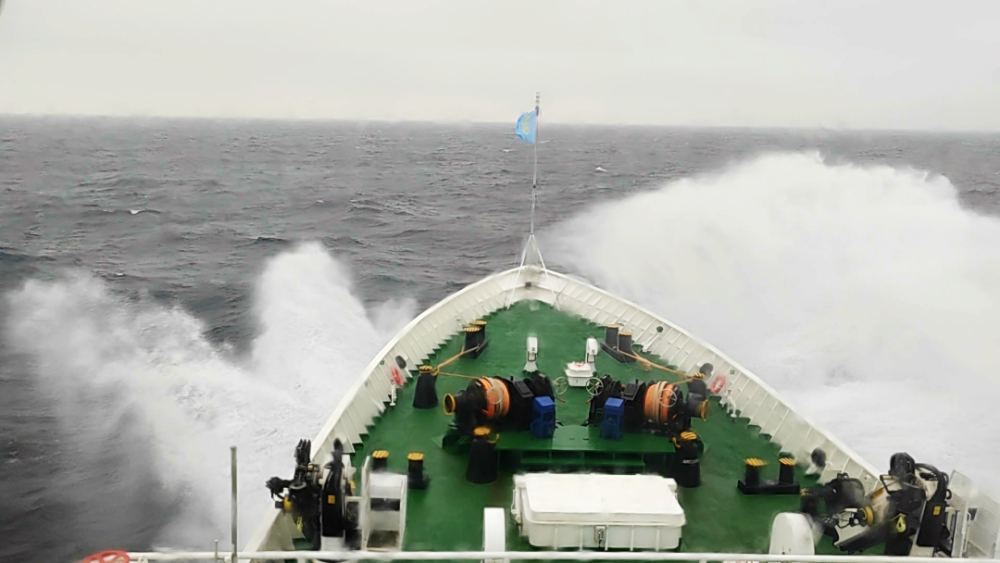
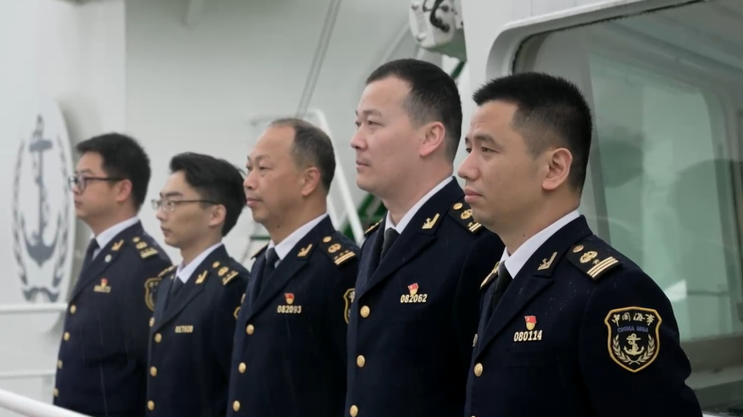
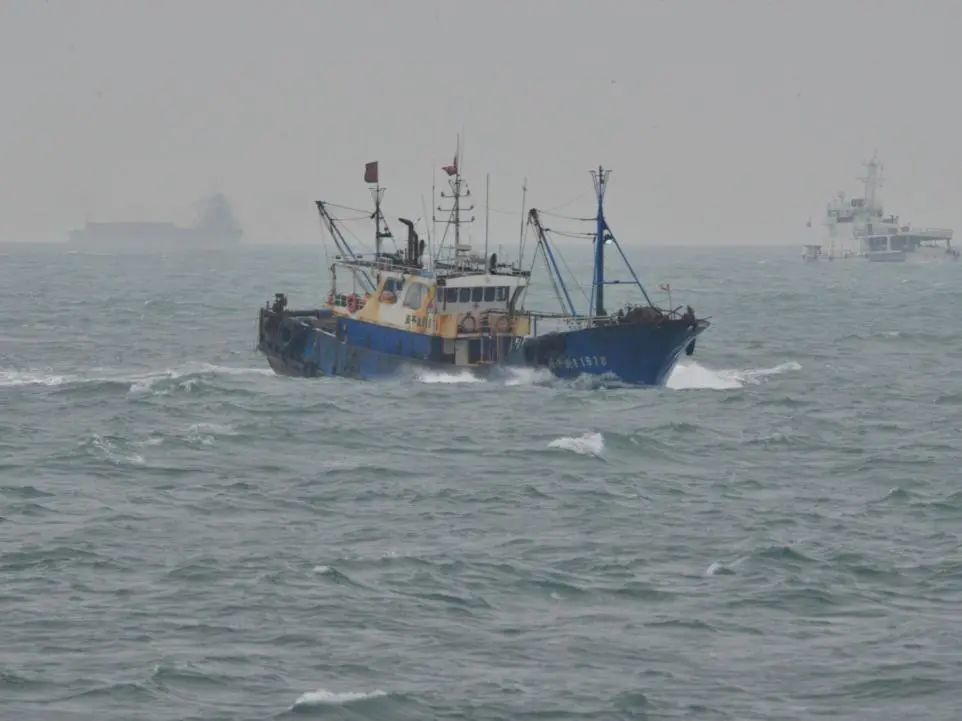
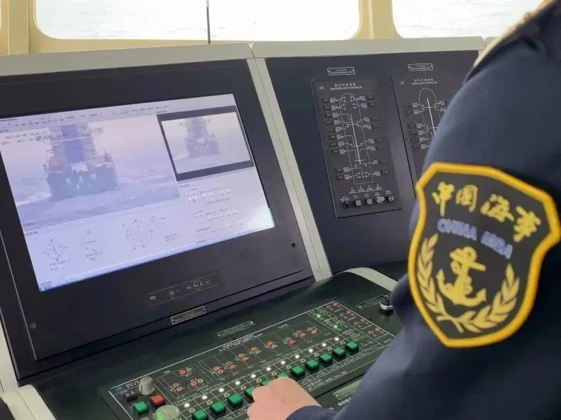

# “海巡06”轮编队在台湾海峡中部水域巡航巡查

4月6日，“海巡06”轮编队在台湾海峡中部水域开展巡航巡查专项行动。

12时10分，“海巡06”轮抵达北纬25度24.2分，东经120度27.2分位置，按照既定路线由南向北航行，巡查台湾海峡中部水域。

行动期间，“海巡06”轮执法船编队巡查了平潭对台直航货运航线、台湾海峡船舶习惯航路等水域，现场查看航路水深、洋流以及船舶流量情况，保障船舶通航环境畅通，维护台湾海峡中部水域航行秩序。

此外，编队还对商渔船航行密集区、非法采砂活动多发区进行巡查，沿途开展助航设施和船舶无线电秩序检查，防范商渔船碰撞，打击内河船非法涉海运输、海上非法采运砂行为，维护水上交通安全稳定。

明天，“海巡06”轮编队将在台湾海峡北部水域开展巡航巡查行动。

来源：福建海事

