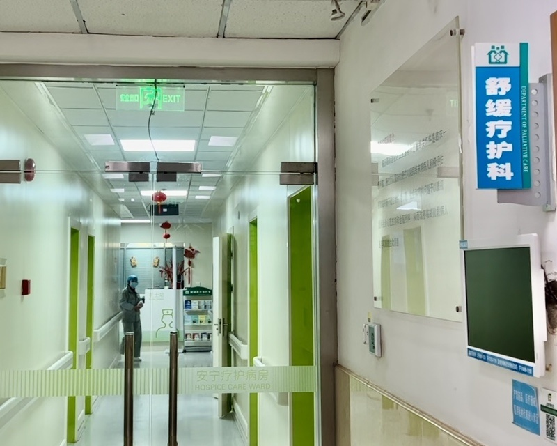
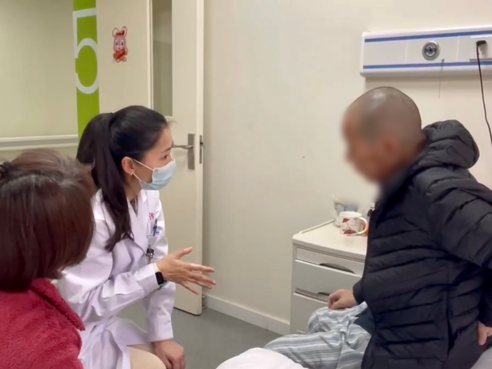
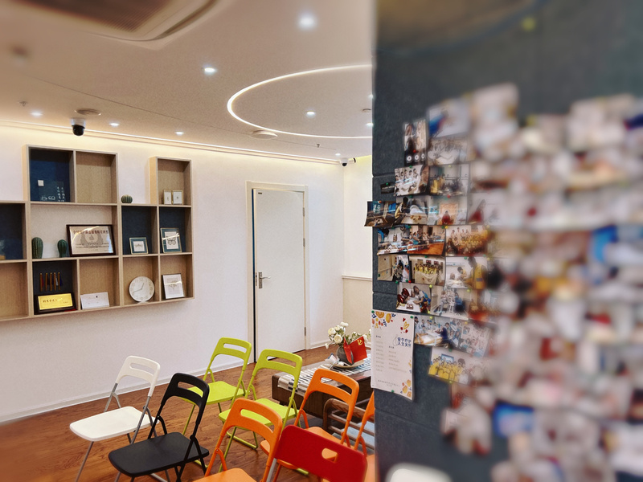

# 上海有“安乐死”医院？还是全国唯一一家？院方医护发声

上海有“安乐死”医院？还是全国唯一一家？近日，一篇自媒体文章刷爆朋友圈，提及上海市静安区临汾路街道社区卫生服务中心支持“安乐死”。解放日报·上观记者求证发现，此自媒体文章错漏百出，借“安乐死”吸引眼球，对“临终/安宁疗护”存在误读。文章中大幅内容引自2016年医疗纪录片《人间世》第四集《告别》，拍摄地是临汾路街道社区卫生服务中心的安宁疗护病房。而安宁疗护并不等于“安乐死”，上海也不存在“安乐死”医院。

《上海市安宁疗护服务规范》早就明确定义，安宁疗护是指通过控制痛苦和不适等症状为疾病终末期或临终患者提供身体、心理等方面的照护和人文关怀等服务，从而提升患者生命质量、减轻家属心理哀伤，帮助患者舒适、安详、有尊严地离世。世界卫生组织将临终/安宁疗护（Hospice
& Palliative
Care）定义为一种改善面临威胁生命疾病的患者及其亲人的生活质量的方法，“肯定生命，视死亡为一个正常的过程，既不主张加速也不推迟”。
因此，网传文章中将临终关怀描述为“安乐死”、“放弃治疗”严重背离了安宁疗护的初衷。

实际上，上海作为全国唯一一个被整体纳入安宁疗护试点工作的省市，已实现全市246家社区卫生服务中心全覆盖。近日，解放日报·上观新闻记者实地走访临汾路街道社区卫生服务中心的安宁疗护病房，向读者呈现这个临终患者可以安放身心的地方。

_安宁疗护已实现全市246家社区卫生服务中心全覆盖_

**如何凝视深渊**

临汾路街道是一个很普通的上海社区，老年人密度高，周边没有大型商圈，取而代之的是生活气息浓厚的小店。临汾路街道社区卫生服务中心（以下简称“临汾社区医院”）被密集的小店拥簇，路过时甚至很难注意到。

有30多年历史的医院外墙被涂上了粉色，在春日里与樱花相映成趣。医院一楼是社区门诊，二楼是安宁疗护病房区，一共26张床位。作为上海社区基层医疗体系中的普通一员，它却较早进入了大众视野。2016年医疗纪录片《人间世》第四集《告别》播放后，临汾社区的安宁疗护服务为人知晓，以至于一提到它，许多人误将其与临终关怀画上等号。

《人间世》拍摄组来到临汾时，医院副主任胡敏还是一名安宁病房的主治医生。他记得，医院一开始有许多顾虑，临汾能否代表上海安宁疗护水平？人们能不能理解或接受安宁疗护？医院作为社会综合矛盾聚集的场所，纪录片如何妥善展现？最后，医院上下都认为，呈现临终患者在基层安宁疗护病房的状态，是一次让公众了解安宁疗护服务难得的机会，也是医院义不容辞的责任。

纪录片见证了71岁放射科退休医生梁金兰朗读最后的手写信，见证了“文艺大叔”王学文从几个月到5年生存期的生命奇迹……因为这些临终患者直面镜头的自述，让更多人知晓安宁疗护，思考是否选择安宁疗护。此后，医院总是能接到来自全国的电话咨询、筹款资助，甚至招聘员工时，新来的医生护士都能对临汾的安宁疗护侃侃而谈。

很难想象在上世纪90年代，安宁疗护仍是一个刺耳、敏感的词汇。经过30多年的探索，上海安宁疗护服务从业者已增长到8000余名，市民对于安宁疗护的接受程度不断提高。然而在对经济欠发达城市地区的调研中，不了解安宁疗护的老年群体可达到80%。为了减少文化观念上的阻力，上海安宁疗护的先行者不断走进社区、校园，开展生死教育，“我们想让更多人意识到，医学是有边界的。跨越边界就是深渊，当深渊在凝视你时，你如何凝视深渊？”

_在上世纪90年代，安宁疗护仍是一个刺耳、敏感的词汇_

**安宁病房是缓冲带**

与一般的医院病房不同，安宁病房非常安静。病床旁只有简单的呼叫按钮和输液杆，看不到心电监护、呼吸机，病区内设活动室、读书角放了一些书籍。

“安宁疗护并非外界所说的放弃治疗，我们只是不干预疾病本身的治愈性治疗，而是针对疾病带来的痛苦症状，做对症舒缓治疗，进行疼痛管理，提高临终病人的生命质量。例如晚期肿瘤病人腹水、恶心呕吐、压疮等情况，其实都可以避免或大幅度改善。”张敏是安宁病房护士长，在来到临汾前，她在一家区级医院重症监护室（简称“ICU”）工作13年。

在那里，她看到很多病人在离世时，气管是被切开的，身上有7、8根补液管、导尿管、引流管，甚至见不到亲人最后一面。一家转来安宁病房的肺癌病人也曾告诉她，ICU灯光24小时开着，他感到非常烦躁，经常无意识地打到医护人员、拉扯身上的导管。虽然很抱歉，却没办法控制自己。某天晚上，他的额头特别痒，但是插着呼吸机无法表达、身体无法动弹，只好硬生生挺了过去，非常痛苦。后来再次被送往ICU前，他下定决心要转到安宁病房。

“安宁病房让已无治愈希望的临终患者从无法喘歇的救治状态进入缓冲带。”潘菊美是安宁病房主任，毕业后从长海医院规培结束便来到临汾。她说，这里像是一个生命旅程的驿站，临终患者身上已经千疮百孔，而疼痛管理和舒缓护理等技术的发展，已经能为他们减轻生理上的煎熬。与此同时，这个“驿站”充分尊重临终病人的感受和意愿。如果经过止痛、舒缓等手段令患者感到有了“改善”，想联系开刀医生或专科医生再进行积极治疗，可以随时安排转诊。

不仅是临汾，上海的安宁疗护体系从以社区基层为主体变成了上海各级医院都在推进，居民基本的安宁疗护服务需求已经可以被满足。在医护看来，以患者的需求为中心，整合多方资源，推进居家与医疗机构等场景的灵活切换，是安宁疗护发展的必然趋势。

_安宁病房让临终患者从无法喘歇的救治状态进入缓冲带_

**临终患者不只是病人**

检验、给药、治疗，这些在常规医院中最重要的工作退居其次。安宁病房的医护明白，一切疼痛管理、舒缓护理只是为释放心灵痛苦腾出空间。由于中国主流传统观念中对死亡的避讳，生死问题很少被中国人谈起，往往直至死神开始敲门，面对死亡的焦虑、恐惧情绪才倾泻而出。医护人员在高强度工作之外，即使注意到了这些特殊病人的需要，也力不从心。这时候，另一个角色——“社会工作者”（简称“社工”）开始接棒。

“在中国绝大部分医疗机构，社工并非‘标配’。外界对安宁病房的社工更知之甚少。”赵文蔷是临汾社区医院唯一的专职社工。表面上，她的工作总是陪在患者身边“聊天”。但哪位病人不愿意配合检查，哪位又开始绝食，只有她知道原因。

在她眼中，临终病人需要被撕下病症标签，还原成一个个鲜活饱满的社会人。只有同理一个“整全”的人，才能判断其情绪或行为背后的真正症结，从而为调整医患之间、患者和家人之间的沟通与相处提供有效建议。

_社工赵文蔷与临终患者进行面谈_

然而现实是，很多病人在进入安宁病房前并不知道自己的病情，这源于亲友不知道如何表达，只能通过“善意的谎言”瞒骗。“在不违反伦理的情况下，每个人都有权利决定生命末期如何度过，我们要做的就是尊重他们的意愿。但前提是，病人需要获得充分的信息。在得到充分、真实的信息后，病人如果仍决定和病魔奋战到底，我们就要尊重他的选择。如果病人更看重生活质量，那么在安宁疗护后，我们要全力支持他做未尽之事。”

在一次次看似随意的“聊天”中，赵文蔷逐渐梳理出患者的人生故事，逐步让临终病人将人生的末期转化为一场“漫长的告别”。他们在实践中发现，临终患者多数都希望最后的日子能和亲人在一起，完成殡葬、遗嘱和对财产归属的处理，考虑是否捐献器官或遗体，和亲朋好友相聚一次，完成最后的心愿，并跟所有珍重的人一一告别。

**家庭避难所**

安宁疗护病房也是许多家庭的避难所。病房曾遇到一个年轻的临终患者。在前期治病阶段，患者的母亲接连遭遇丧父、丧偶，独自承担起巨大的经济压力和照护压力。为了省钱，母亲总是步行买药买菜，累了就坐在路边休息。患者时而嚎啕大哭，时而大发雷霆，也唯有母亲一人承受。一时难以分清楚，谁更需要关心。

“在安宁疗护的定义中，患者家属也是服务对象。他们将陪伴患者走到最后，今后也将带着创伤继续生活。如果没有足够时间抚平情绪，可能进入极不稳定的心理状态。如何为家属提供精神、心灵、社会关系的持续支撑，也是安宁疗护着重努力的方向。”临汾社区医院副主任胡敏提到。

记者在安宁病房采访时遇到了穿粉色卫衣的石阿姨，她瘦小精干，说起话来总带着昂扬的语调。“医生当时判断我老伴的生存期只有1-3年，我铆足全力照顾他，没想到已经活到第17个年头了。”石阿姨的老伴患有脑瘤，动过手术，3年前摔了一跤从此卧床。她独自在家照护了一年多，直到累出腰颈毛病才搬来临汾。刚来安宁病房，护士很惊讶地问，一个人怎么搞的过来啊？阿姨答：“就挺啊，挺过来的。”

安宁病房不仅松绑了她的双手，还让她理解了一种新型的医患关系——以往医患之间的关系更像是“就事论事”，例行查房完毕就很难再产生交集；在安宁病房，陪伴反而是最重要的工作，“这里的医生护士隔两个小时就会看一次病人，社工基本上有空的时候就来。有一次护士长找我谈心，待了一个多小时，聊老伴的病情，聊我怎么照顾病人，还有对医院的看法。”

一些细节更让石阿姨感到温暖。老伴是上海市劳模，刚得病时总念叨自己本来还能在干几年。“五一”劳动节当天，社工专门为他庆祝。最让石阿姨感动的是，偶然间提及结婚40周年，被社工有心记下，为此策划了一场纪念活动。老伴开心得不得了，也逐渐释怀了心中的遗憾。尽管长久陪在病榻边，石阿姨仿佛忘记了那些疲惫，“现在省出了很多精力，下午还可以接孙子。我也知道了要为自己而活。”

_在安宁疗护的定义中，患者家属也是服务对象_

日本著名社会学家上野千鹤子曾调研日本居家安宁疗护的实践，在《一个人最后的旅程》中，她感叹：“生和死已然超越了个人意志，人想着要掌控生死，就是不敬畏天地神明。但在有生之年，如果努力，有些事情会有所改变。不辜负上天给予的生命，努力活到生命的最后一刻，才能创造出一个让很多人（不管有无家人），包括我们自己安心的社会。”

