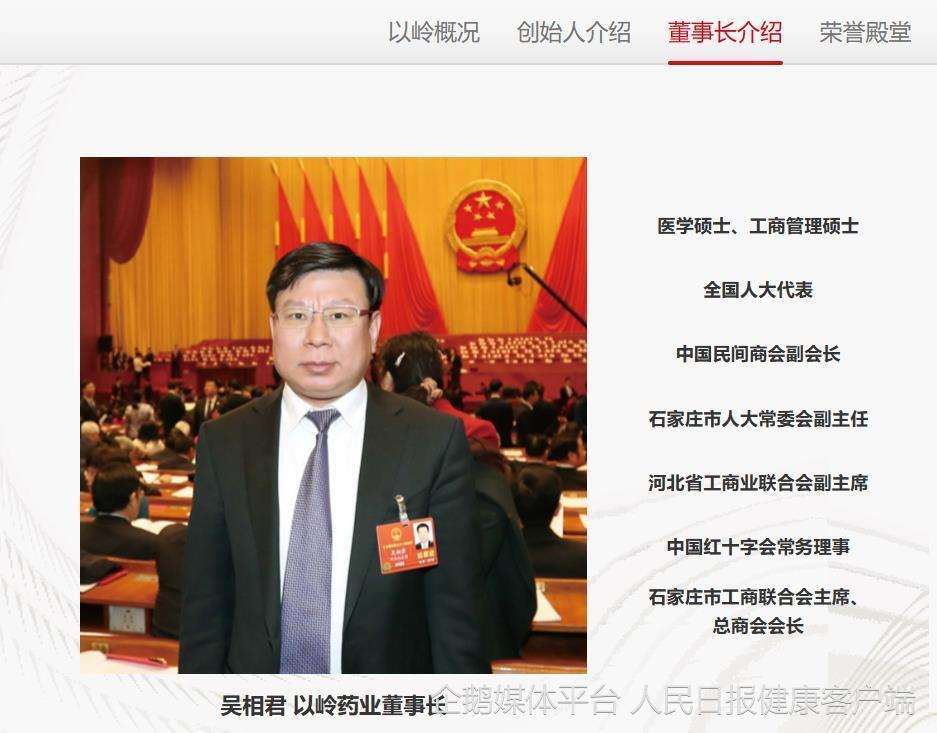
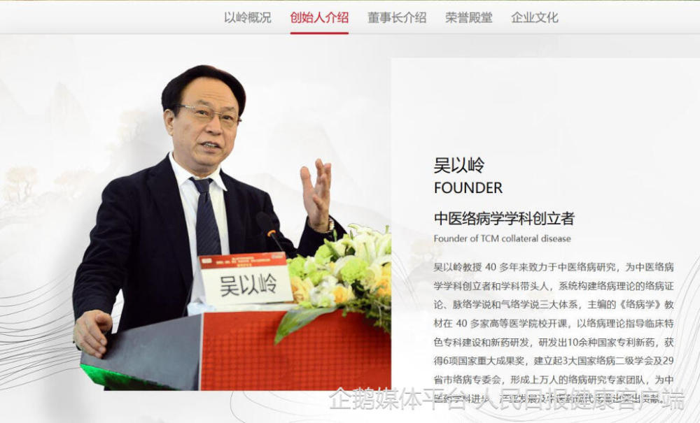

# 以岭药业完成工商变更：吴以岭卸任董事长，其子吴相君接任

据公开资料显示，4月4日，石家庄以岭药业股份有限公司发生工商变更，吴以岭卸任董事长，由董事吴相君接任；王震、高沛勇卸任董事，新增董事赵韶华、韩志国、陈刚。

人民日报健康客户端查询发现，以岭药业官网的相关栏目也已经更新。据以岭药业此前公告称，作为终身名誉董事长，吴以岭仍为公司实际控制人之一，并非公司董事，不承担亦不履行董事职责。

石家庄以岭药业股份有限公司成立于2001年8月，于2011年7月A股上市，注册资本约16.7亿人民币，法定代表人、董事长、总经理为吴相君，主营业务为专利创新中药的研发、生产和销售。
**（李欣）**

