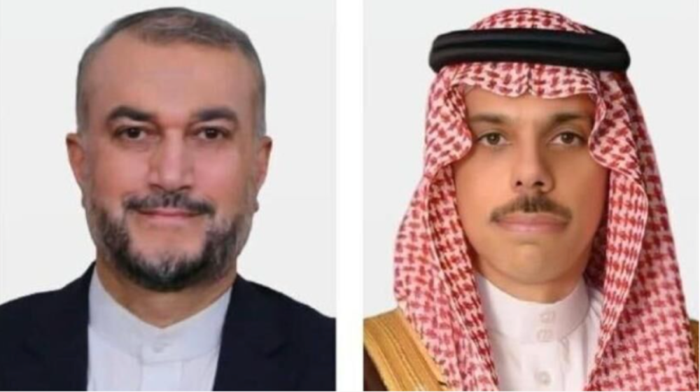

# 伊朗和沙特再次选择北京：系断交后，两国外长7年来的首次正式会晤

随着伊朗和沙特阿拉伯在中国的斡旋下重新建立外交关系，曾经互相视作眼中钉的中东死对头在北京握手言和。近一个月后，两国再一次选择了北京。

据沙特《中东日报》5日报道称，有消息人士透露，沙特外交大臣费萨尔和伊朗外交部长阿卜杜拉·希扬将于6日在北京会晤，以推进沙伊两国3月10日在北京达成的关于恢复外交关系的双边协议。

长安街知事（微信ID：Capitalnews） 注意到，此次会晤将是自2016年沙伊两国断交以来，两国外长7年多来的首次正式会晤，透露出以下三点信号：

**还得是北京**

在不到一个世纪的正式外交关系中，分别由伊斯兰教逊尼派和什叶派领导沙特和伊朗两国，关系历经起伏。

2016年，沙特处决了著名的什叶派领袖尼姆尔后，伊朗最高领导人哈梅内伊警告要对此进行“神圣的报复”，沙特驻伊朗大使馆也因此遭到围攻，两国断交。

此后，为缓解紧张局势，两国进行了漫长的谈判，但一直没有实质进展。

直到今年3月10日，中国、沙特和伊朗三国在北京发表三方联合声明宣布，沙特和伊朗达成双边协议，包括同意恢复双方外交关系，在至多两个月内重开双方使馆和代表机构，安排互派大使。

沙伊对此协议相当重视。伊朗第一副总统穆罕默德·穆赫贝尔3日证实，伊朗总统莱希接受了沙特王储兼首相穆罕默德·本·萨勒曼的邀请，将对沙特进行国事访问。伊朗外长阿卜杜拉·希扬在几天前也表示，伊朗计划邀请沙特领导人进行国事访问。

沙特官方支持的媒体《中东报》5日援引利雅得消息人士的话说，沙伊两国外长在准备赴京前已通话三次，讨论了两国重启外交关系以及启动其他协议需将采取的步骤，具体安排将在会晤时面谈。

_伊朗外长（左）和沙特外相（右），图源：伊朗伊斯兰共和国通讯社_

该消息人士还提到，北京再次被选为会晤地点，是“作为其在斡旋、促进两国沟通方面发挥积极作用的延伸”。

路透社5日也援引一名伊朗高官的话称，“由于中国促成了沙伊双边协议”，沙伊外长同意6日在北京会面。

预计在接下来的几周和几个月里，沙伊两国的高级外交官之间的会晤将继续进行，中国将继续发挥调解作用，帮助两国重建信任。

**美国主导中东的时代结束**

路透社称，中国在沙伊外交突破中发挥的作用震动了中东局势。过去几十年来，美国一直是中东的主要调解人，在该地区展示着自己的安全和外交力量。

然而，“美国介入中东地区的时代已经结束。”一名伊朗官员告诉路透社，“中东国家有能力在没有美国干涉的情况下维护本地区的安全与稳定。”

长安街知事（微信ID：Capitalnews） 注意到，近年来，中东国家政治自主性明显增强，越来越敢于对美国说“不”。

美伊关系自不必说，伊朗称美国为“地球脓疮”，伊朗民众反美游行的“保留节目”就是烧美国国旗，新仇旧账数不清。

但沙特曾是美国可靠的安全合作伙伴，近年来沙美关系也愈发紧张。

在沙特记者卡舒吉遇害后，美国中情局曾指责沙特王储是杀人凶手。沙特也越来越懒得给美国好脸色，拜登去年亲自登门请沙特增产石油，结果沙特象征性小幅提高产量，被指“打拜登政府的脸”。

《华尔街日报》3日援引知情人士的话称，去年年底，沙特王储萨勒曼告诉助手，他对取悦美国不再感兴趣。

落实在行动上，当地时间4月2日，“欧佩克+”的多个成员国宣布“自愿”削减石油产量。沙特带头减产，宣布将从5月起至年底，自愿将原油日产量削减50万桶，这是沙特近半年来第二次宣布削减原油产量。

《华尔街日报》痛批沙特无视美国的担忧，并称这一决定具有重大的政治影响，可能会加剧美沙之间本已严重的紧张关系。

美国“商业内幕”网站5日指出，沙特与伊朗的关系正常化协议是美国在中东主导时代的结束，也是新多极现实的开始。

通过调解沙伊关系，中国展示了在公正解决冲突方面发挥建设性作用的能力。中国从不依靠军售让其他国家选边站队，而美国多年来在几乎所有地区冲突中都偏袒一方并进行军事干预，包括也门、叙利亚、利比亚、阿富汗和伊拉克，并且从来是冲突地区最大的武器交易商。

美国只剩两个选择：要么登上外交的列车，要么眼睁睁地看着它驶离车站。

**中东迎来一团和气**

在中国的斡旋下，伊朗和沙特迎来一场双向奔赴，也从中获得了实打实的收获。

对伊朗而言，受美国的制裁，伊朗的经济状况堪忧，改善与沙特的关系或为伊朗带来新的贸易机会。

4月3日，伊朗商会董事会成员卡什菲表示，伊朗私营部门已经开始与沙特进行经济互动，并表示两国联合商会即将成立，“我们计划在两国大使馆重新开放后立即开始商务代表团的互访”。据他介绍，两国在能源和知识经济等多领域都有合作潜力，值得挖掘。

对沙特而言，缓和与伊朗的紧张关系是改善安全环境和安抚外国投资者的关键一步。福布斯报道称，随着沙伊关系缓和，惠誉5日将沙特的主权债务评级从“A”上调至“A+”，评级展望为稳定。

两国也致力于和地区其他国家缓和关系，中东迎来一团和气。

美国彭博社4日报道称，沙特无视美国的警告，正计划邀请叙利亚总统巴沙尔·阿萨德参加5月在利雅得举办的阿拉伯联盟峰会，正式结束叙利亚的孤立状态，将叙利亚带回阿拉伯国家核心圈。

伊朗在努力改善同阿联酋的关系。伊朗塔斯尼姆通讯社4日报道称，时隔7年多，伊朗重新向阿联酋派驻了大使。

自沙特与伊朗达成协议以来，也门局势出现了一些积极迹象，包括开放荷台达港、交战各方之间的换囚协议、伊朗同意停止向也门胡塞武装提供武器，没有再出现跨境空袭或无人机袭击。

半岛电视台专家认为，沙伊关系的改善或对整个中东的政治和安全局势产生影响。“当这两个国家存在分歧时，该地区局势就会恶化……有了双边协议，两国或会开始做出妥协，这项协议可以在该地区创造一个更好的安全局势。”

长安街知事（微信ID：Capitalnews） 注意到，就在沙伊两国外长即将在北京进行会晤之际，叙利亚通讯社2日报道称，美国还在叙利亚偷盗石油和小麦。

不仅如此，美军及其支持的叙利亚反对派武装加剧了在叙利亚哈塞克省、拉卡省等美军控制区盗取叙利亚文物的行为。

