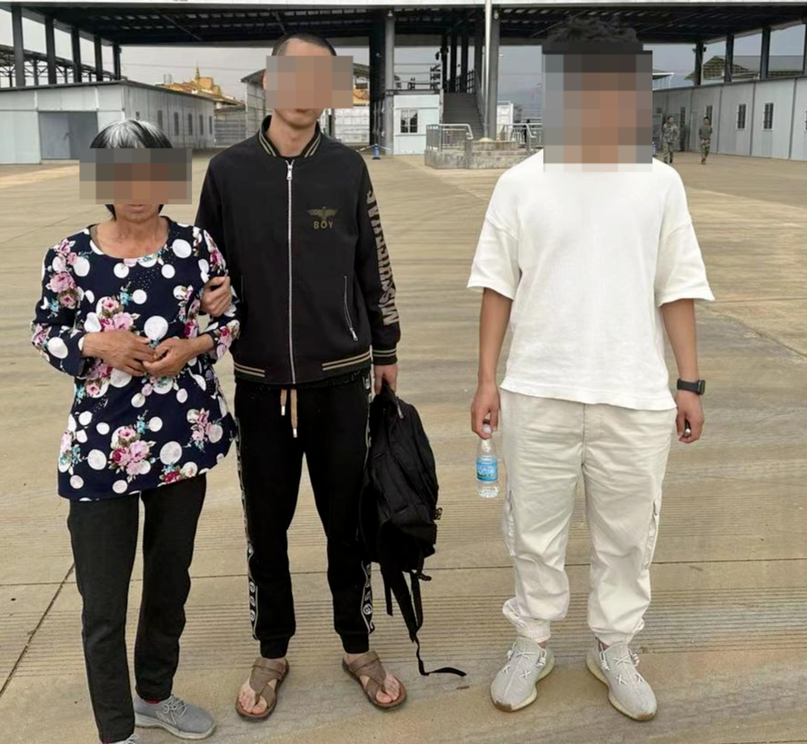
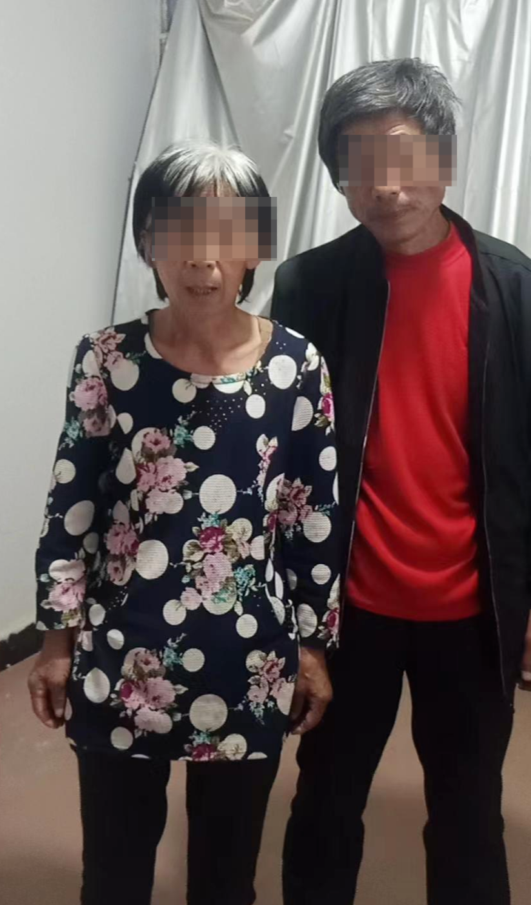

# 住中缅边境小城20元旅馆的东北老人，终于寻回陷入电诈陷阱的儿子

小郭说，4月3日下午，当他从缅甸方面的警察局里出来上车时，还以为自己要被转卖到下一个公司。直到十多分钟后，站在皮卡上的他看见了口岸“南伞”两个字，一低头看见自己的妈妈站在那里。

他终于从电诈陷阱里被营救出来了。

参与解救的警方也向红星新闻记者透露，已顺利解救小郭。

红星新闻此前报道，多地家长赴中缅边境小城云南镇康，寻找落入缅甸果敢老街电诈陷阱的孩子。（红星新闻相关报道：他们来到中缅边境小城，寻找落入电诈陷阱的孩子）

南伞就是镇康通往老街的口岸。老王接受红星新闻记者采访时表示，自己是辽宁葫芦岛人，她27岁的儿子小郭是2021年去的缅甸果敢老街，她此前在镇康住20元一晚的旅馆，熬自己带来的小米吃。老王刚从镇康回家没几天，就收到消息，孩子到了缅甸那边的警察局，但还需要给缅甸那边的“公司”交26万多的“赎金”。

儿子一度劝她放弃，但老王咬着牙说，“我就是不甘心”。从东北到西南，从西南到东北，老王把万里寻子路走成了一家三口的归途。

_↑老王（左）终于见到了儿子小郭（中）_

**母子相见：**

**“他瞅瞅我，我瞅瞅他，我娘俩就哭”**

4月3日这天，老王一大早就起来，把存在银行的钱取了出来，准备接儿子。这两天，她终于把剩下的4万多“赎金”筹到手了。下午2点多，她跟随警察来到口岸，丈夫则留在云南镇康县公安局等候。

口岸的广场上静悄悄的，没几个人。约5点，老王终于看到了迎面开来的两辆车，以及皮卡上一年多未见的儿子，周围是荷枪实弹的缅甸警察。她把包里的“赎金”交给对方，对方一捆捆点过后离开。

母子见面，一时却也说不出话来了。“一到跟前也没有啥话可说，完了他瞅瞅我，我瞅瞅他，我娘俩就哭。”老王说。

差不多20分钟的车程，从口岸到镇康县公安局，老王和儿子也没怎么说话，儿子一直在和警察聊天。

“等你真正经历了你就知道，到时候你都不知道说啥。”小郭这样告诉记者。

下车时，父亲老郭也终于见到了儿子。小郭去做笔录，老王和老郭在公安局院子里等。到天差不多黑的时候，小郭办完所有手续出来了。

老王拉着儿子的手，一家人回到宾馆。当宾馆老板上楼问一家人挤不挤，要不要加个间房时，房门外的老郭拒绝了。

“屋里的娘俩要唠一晚上嗑呢。”老王说，晚上三个人睡在一张床上，一直在聊小郭在缅甸的经历。

但当记者问小郭有什么想对母亲说的话时，他说自己还没有，“回家再说。”

**儿子获救：**

**母亲“精神起来了，衣服也干净了”**

获救后的小郭向记者讲述，自己2021年去深圳找工作，朋友介绍他到泰国、缅甸和老挝三国边境的“金三角”从事高薪工作。

他们从瑞丽偷渡到缅甸，还没到达目的地，他察觉不对，逃到了当地警察局。但他后来在两天内被转卖多次，最后被卖到了果敢老街一家公司，生活和“工作”全在一座全封闭的叫“酒坊2栋”的5层建筑里，门口有武装人员看守。

小郭身体看起来不错，在缅甸挨打没有留下伤，但耽误了此前罹患肺结核的治疗，老王说回去要尽快把这病治好了。

红星新闻此前报道，老王一家自己主要以种地为生，家里有五六亩田，这几年还养了些羊。老王正月十九从家里出发找儿子，先到北京，后到瑞丽300元租了一间小出租房，待了快一个月。

3月10日，她又来到云南边境的镇康县，镇康县公安局附近的振赢宾馆的老板同意了每晚只收她20元住宿费。她从家里带来一袋小米和小锅，每天自己熬小米吃。她住了4晚后回家了，30元的泡面和水是她回家5天行程的全部口粮。

3月30日傍晚，老王带着丈夫老郭回到镇康。振赢宾馆老板看他们两个人，还给他们换成了1.8米的床。

老板说，老王特别瘦，染过的头发根部冒出雪白，50多岁的人看上去有七八十岁。但与上次“有气无力，好像走不动路”不同，这次看着她每天笑眯眯的。儿子获救了，她“精神起来了，衣服也干净了”。

宾馆老板看见，老王从东北回来后这几天还是跟之前一样，要不到镇康县公安局去，要不到南伞国门去看看，都是走路。

_↑老王和丈夫老郭_

**一家团圆后：**

**第一次没吃泡面或小米**

老王这次来云南没带锅。她说，来时在家里煮好了小米饭带在身上，火车上就吃的这个。他们还从家里背了一箱泡面，到镇康后，夫妇俩顿顿泡面。

儿子接回来后的第一餐，老王夫妇终于不是吃的泡面或小米。他们下楼买了四五元一袋的挂面，借了锅煮。

第二天早上，宾馆老板看老王买了一笼小笼包回来当早点，心里纳闷，“他们3个人就吃一笼小包？”

原来，老王夫妇早餐吃的是头一天晚剩下的面条，一笼8个小笼包全让给儿子吃了。儿子一口一个，老王看着很欣慰。

上午，老王给儿子买了双几十元的旅游鞋，换下儿子穿的一双大拖鞋，又给他买了一条裤子。镇康不如老街那边炎热，他们也将回北方。接着，他们去做锦旗，送给镇康的警官。老王还第一次花两元钱坐车去南伞国门看了一遭，走路回的。

临走时，老王看当地鸡蛋便宜，20元买了30个，又买了10多元钱的肉，全煮熟了，配合着剩下的泡面，就当回去一路上的食物。她算着，3个人路上5天，早上晚上各吃一顿，差不多够了。

下午3点，一家三口坐上发往昆明的班车，告别这座边境城市。“再也不用来了。”老王说。

**等待的焦灼：**

**“那个包里面是他儿子的命”**

据介绍，小郭到缅方老街警察局后，经中缅警方协调，借手机跟老王通了一个电话，便失去了联系。此后10多天，老王一直在筹钱，生怕交不够“赎金”，儿子还会被抓回去。而小郭就在警察局里，静静等待，不知道自己要等多久。

老王说，他们在家里卖了第三头驴和一辆三轮车，四处借钱，凑了22万元就先赶到镇康了。一部分是现金，装在一个包里，一部分存在银行。

从离家起，这个黑色的包就没有离过老王的身。在火车上睡觉时，老王更是把包紧紧抱在胸前。宾馆老板看见，老王就是下楼买点东西，也背着那个包：“一般人不会想到包里装了那么多钱，但我们看她的动作看得出来，她出门一次就背着一次，出门一次就背着一次，丈夫老郭就在她后面贴身跟着。”

“那个包里面是他儿子的命。”老板说，他提醒老王把包背在胸前。

当记者问老王为什么不把包交给丈夫背时，她答道：“我不放心他。他喜欢睡觉。”

老王说，后半辈子就要还这20多万的债了。小郭也说，要好好找份工作还债。当记者问想找什么工作时，小郭说：“反正是国家允许的那种。”

红星新闻记者 胡伊文 赵倩

责编 任志江 编辑 郭庄

