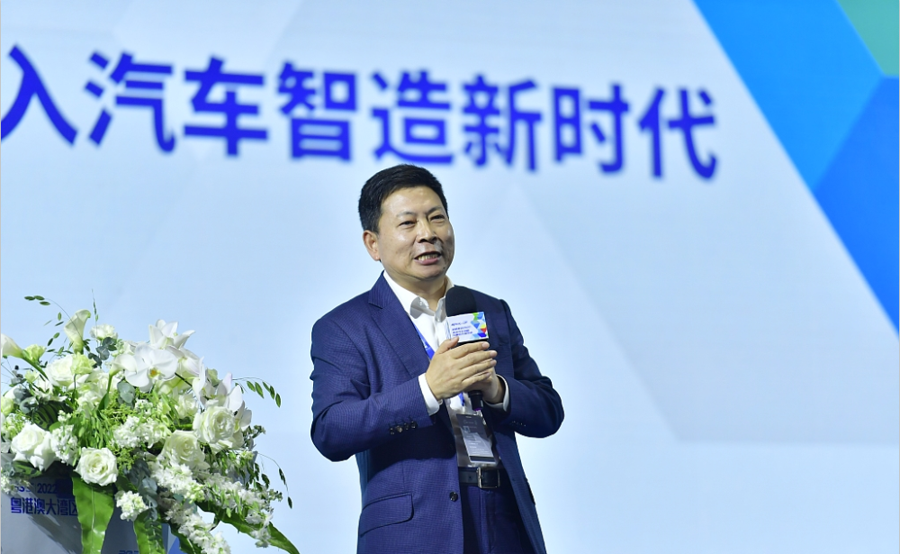
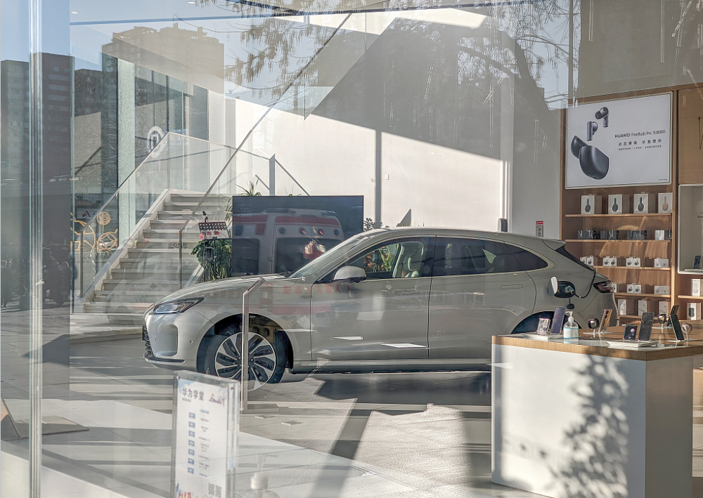

# 余承东跳槽小米谣言背后：华为因何不造车？| 深网

_来源：视觉中国_

作者丨程潇熠

编辑丨康晓

出品丨深网·腾讯新闻小满工作室

华为2022年年报发布会上的公开批评，将华为内部的“造车”路线之争与矛盾摆上台面，猜测与谣言纷至沓来。

3月31日，华为副董事长、轮值董事长徐直军重申“华为不造车”后，直言要清理整顿问界汽车物料，严禁华为品牌logo冠在任何汽车品牌logo之前。“有些人、部门或合作伙伴在胡搞华为的名声......华为辛辛苦苦建立的品牌，不应该被人随便利用。”

在外界看来，矛头直指华为常务董事、终端BG CEO、智能汽车解决方案BU
CEO余承东。当晚，余承东在华为心声社区实名发帖回应，“这个时代变了，这只会让我们更加艰难！若干年后大家都会看明白的，留给时间去检验吧！”言语中似有不甘。

4月1日，问界汽车全国上千家门店紧急下线“HUAWEI问界”物料的同时，又传出华为副董事长、轮值董事长、CFO孟晚舟严肃批评余承东违背华为战略的传言。一位华为人士告诉《深网》并未听闻此事。

但事实真假如何并不影响旁观者做大胆假设，“余承东是否会负气出走华为”的讨论越来越多。
**4月6日，网传余承东将赴小米汽车任职。小米官方第一时间回应：胡编乱造。**

**消息传出后，多位汽车业内人士向《深网》表达了余承东不可能去小米的观点，因为小米创始人雷军与余承东的风格理念均不相符。**

事实上，余承东在4月1日的中国电动汽车百人会论坛上已经明确了自己的立场，“我们一直坚持不造车，帮助企业造好车。”余承东说，今年除赛力斯外，奇瑞和江淮也会生产智选车模式的车型，“如果采用不同的品牌，我们再去做营销、服务很复杂，所以希望能有一个共同的品牌，比如华为问界......但是加上之后有些领导有不同的意见。”

**余承东言下之意：本人与华为整体战略保持高度一致，只是与一些领导在执行层面有不同意见。**

从2019年华为成立智能汽车解决方案BU开始，华为正式涉足汽车行业至今已有五个年头。有进展也走过不少弯路，但人们最好奇、最不解的还是老问题：下场造车看起来更简单而且来钱快，华为为什么坚持不造车？

**被制裁束缚，难以造车**

华为坚持不造车，最根本的原因还是制裁。美国制裁对造车的影响主要有三点：

**1.供应链受阻。** 部分国际Ti er 1（一级零部件供应商）巨头可能无法向华为供应造车所需的重要零部件；

**2.损害海外ICT业务。**
造车有可能威胁华为在德国乃至欧洲的ICT（信息与通信技术）业务发展，如5G等，毕竟传统汽车是德国等欧洲国家的支柱业务之一，造车会面临直接竞争；

**3.华为仍在求生存阶段，资金问题难解决。**
华为手机等现金流支柱业务被制裁遏制，缺少为造车持续供血的来源。如果进行外部融资，则违背了任正非对华为治理长期坚持的原则。

余承东在中国电动百人会论坛上“表明心迹”的同时，也较为详细的说明了华为目前遇到的造车困局。

**“过去全球主流的大厂，T-BOX模块都选择了华为，这两年因为制裁退出了很多。”**
余承东称，华为过去在汽车的智能网联领域可能是“最大最强的”，从德国的大众、奔驰到美国的特斯拉等头部车企，都选择和华为合作（车载T-
BOX用于和汽车后台系统及手机APP通信，实现手机APP的车辆信息显示与控制）。

情况反之亦然。汽车可以说是人们日常生活中接触到的最复杂的民用工业品，业内一向认为汽车产业一定是全球化的产业。
**吉利汽车创始人李书福去年曾称，汽车产品产业链很长，难以由一个国家独立完成汽车全产业链的发展，“逆全球化趋势下，企业只能尽快调整商业计划。”**

比如全球第一大汽车技术供应商德国博世集团，拥有多项汽车零部件行业的技术创新专利，几乎长期垄断汽车制动系统市场，大部分想要搭载CVT变速器的车型也绕不开博世的专利。一台汽车，上万个独立零部件，就算只少一个也无法造车量产。

上述三个原因中，保证传统ICT业务基本盘的安全，是华为高层曾公开承认过的不造车的原因。

徐直军和华为智能汽车解决方案BU
Marketing与销售服务部总裁迟林春都曾在2021年解释过，欧洲市场对华为的ICT业务非常重要，德国更是重中之重。“而德国的支柱产业是汽车产业，如果华为造车，就会和当地车企产生直接的竞争。”

华为的海外业务按地域分为四个大区：欧洲中东非洲、亚太、美洲及其他。“欧洲中东非洲”是华为除中国市场外最大的区域市场，收入长期占整体营收超20%（2022年为23%）。

华为常务监事陈黎芳曾披露一组数据，华为2019年在全球已签署了50多份5G商业合同，其中超过一半合同来自欧洲（28份）。

另外，四年的美国制裁对华为的营收情况造成了很大影响。根据2022年财报，华为营业利润及经营活动现金流均为五年内最低点。

2022年中旬，华为创始人任正非内部发布《整个公司的经营方针要从追求规模转向追求利润和现金流》一文，“把活下来作为最主要纲领”，以保证渡过未来三年的危机。
**“在进行业务预判时，不要再抱幻想，讲故事骗公司，损失要从你们的粮食包中扣除，首先要活下来，活下来就有未来。”**

_华为2018-2022年营收情况_

造车堪称销金。据电动观察家统计，特斯拉从2007年到2019年（开始持续赚钱），研发费用和资本开支高达185亿美元（约合人民币1300亿元），累计至2022年为426.3亿美元（约合人民币3000亿元）。

而且随着新能源汽车军备战的日渐白热化，调研机构Statista称每年全球汽车研发总支出也在不断上涨。对于仍在求生存阶段的华为而言，难以在业务在不盈利的情况下分出一大笔预算来造车。

**余承东的两难**

被不断制裁加码，又急需业绩和业务变现，这两大原因也是华为“帮助企业造好车”业务总陷入两难境地的根源。

余承东在中国电动百人会上谈及困难时，语气涩然又无奈，
**“原本我们的想法是成为（智能）汽车领域博世、大陆这样的供应商，但是在今天这个时代，好像不太成立。”**

据余承东的描述，华为最开始想做零部件供应商，将软件、算法、云、芯片等智能化的产品出售给车企。

但是在实践过程中，华为发现，智能化的零部件很难像博世、大陆所做的刹车、转向等标准化部件一样，大规模的出售给车企，而需要和车企深度长期合作，不断进行版本迭代。而且零部件受制裁影响，难以大规模向全球车企出售。

因此，华为做了HUAWEI INSIDE，即HI模式，把以智能驾驶为核心的智能化技术打包卖给车企。

**但这条路也被证明很难走通。在被制裁和新能源领域自主研发成为主流的情况下，华为HI模式可撬动的合作伙伴少之又少。**

余承东称，在制裁背景下，欧美日的车企很难选择华为作为智能化转型主力；国内造车新势力“有自己的追求”都不太可能选择华为；怕失去灵魂的传统车企也不会选择华为。“投入这么大，如果没有大量使用华为HI的车进行销售，我就无法实现商业闭环。”

“华为HI模式最开始有三个车厂（北汽、长安、广汽）跟我们合作，现在基本上只剩阿维塔（长安）。”余承东在论坛上复盘，
**“我们提供最好的技术，可能并不能保证最终的产品取得商业成功。”**

更重要的是产品定义、以及体系化竞争力，所以华为推出了智选车模式。

**在华为智选车合作模式下，合作车企的品质和服务如果用华为品牌来背书，商业逻辑上不合理也缺乏保证，华为核心管理层或许也意识到了这一点，所以才有了公开的批评。但如果淡化华为品牌，合作车企的销量又会面临困境。**

通过余承东的描述，智选车模式可以说是还包括了帮车企进行企业数字化、智能化转型的重任。“赛力斯和华为合作后，质量方面的管理水平和能力得到了数量级的提升。”余承东说，华为用积累了数十年的管理模式赋能帮助车企。

华为品牌对赛力斯的销量助力清晰可见。在与华为合作前，赛力斯首款车型赛力斯SF5在2021年全年累计销量仅超8000辆，月均不到千辆。第一次合作华为智选SF5后，月销量迅速过千，第二次合作问界品牌后，赛力斯销量几乎90%以上为问界贡献。

_AITO问界M5登陆华为门店。来源：视觉中国_

但是今年年初特斯拉打响汽车价格战后，问界跟随降价并没有带来较多的销量增长。增加华为品牌在问界汽车的露出，或许也是市场侧促销量的办法之一。

**不过智选车模式下，华为若想在以华为品牌助力车企的情况下，维持华为品牌的名声与可靠性，面临巨大的挑战。**

一位消费者告诉《深网》，他在华为门店预定问界汽车后，交付工作由赛力斯负责，“交付群拉了十几个人，还有中途推销分期业务的，就找了个理由退（车）了。”

**“销售和交付差距太大了，让我瞬间意识到了赛力斯不是华为。”该消费者称。**

据余承东介绍，华为智能汽车相关业务，每年投入约100亿元，研发人员超万人。而据2022年华为年报披露，华为智能汽车解决方案部件业务营收为21亿元，是华为求生存阶段需尽力或扭转或舍弃的亏损项，商业化压力巨大。

去年8月华为《整个公司的经营方针要从追求规模转向追求利润和现金流》一文中特别提到，智能汽车解决方案不能铺开一个完整战线，要减少科研预算，‍‍加强商业闭环，研发要走模块化的道路，‍‍聚焦在几个关键部件作出竞争力，剩余部分可以与别人连接。

这或许意味着，华为汽车业务需要在今年年底前交上一份看得过去的财务成绩单。

**腾讯新闻出品内容，未经授权，不得复制和转载，否则将追究法律责任。**

