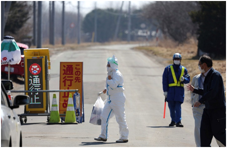

# 外媒：日本暴发“最严重禽流感”，扑杀超1700万只鸡致无地可埋

【环球网报道 见习记者
杜汝】据美国彭博社4月5日报道，日本暴发有史以来最严重的禽流感，全国大量扑杀鸡导致家禽数量大幅减少，鸡蛋价格飙升，现在甚至没有合适的土地用以填埋死禽。

彭博社称，在这波疫情中，日本全国扑杀超过1700万只鸡。为防止病毒传播或水源污染，必须妥善处理死禽尸体。据日本NHK电视台报道，日本多地政府和农民表示，目前缺少合适的土地填埋被扑杀的鸡。

_日本北海道一家禽养殖场外，地方政府工作人员正应对禽流感疫情 图自外媒_

彭博社称，虽然禽流感主要在欧洲、美国和亚洲暴发，但近几个月来，疫情已进一步蔓延至南美洲，阿根廷、乌拉圭和玻利维亚相继报告了首例病例。

此外，在通胀担忧日益加剧的当下，禽流感疫情暴发也在扰乱全球肉类和鸡蛋供应。日本暴发的禽流感疫情迫使麦当劳和7-
11等商家暂停销售鸡蛋相关产品或提高商品价格。

彭博社说，一般情况下，农民和有关部门通常会制定防范计划来处理禽流感暴发期间产生的废物，包括死禽、粪便和个人防护用具。但据日本NHK报道，由于要处理的死禽数量超出了他们的预期，一些有焚烧设施的地区将采用焚烧的方式处理死鸡。

