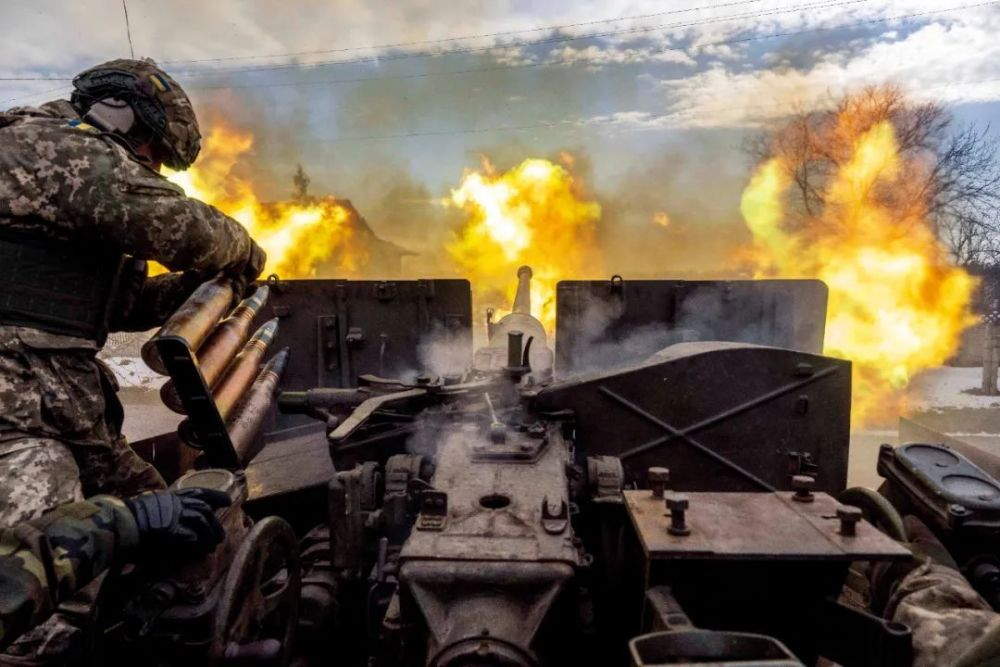
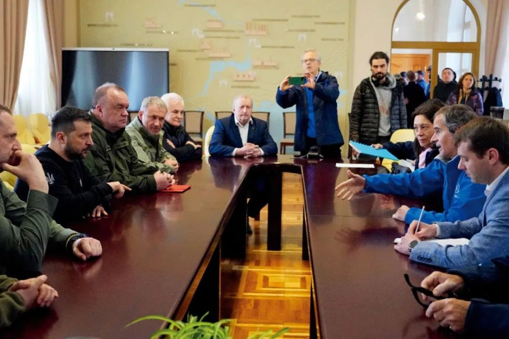

# 巴赫穆特战役接近尾声：和平依然遥远，但“冻结升级”可期

“现在是4月2日夜23时，我身后是阿尔乔莫夫斯克市政厅大楼。”夜视镜头中，俄罗斯瓦格纳雇佣军集团领导人普里戈津指着一面升上大楼的俄罗斯国旗说道。他口中的“阿尔乔莫夫斯克”，就是乌克兰顿涅茨克州东北重镇巴赫穆特。

2023年4月2日夜，俄罗斯方面消息称，俄军已基本占领巴赫穆特中心地区。乌克兰军方次日表示，这只是俄军“虚假宣传”的一部分，残酷的巷战仍在进行。西方智库认为，俄军目前控制的主要是巴赫穆特南部、东部街区。但显然，从去年7月开始、被称为“俄乌冲突中历时最长”的巴赫穆特战役，已接近尾声。

从军事角度看，巴赫穆特战役对俄乌双方而言，或许都不算是“有意义的一战”。最初，俄军希望通过占领交通要道巴赫穆特，向顿涅茨克州乌军控制区深入推进，以实现“特别军事行动”最基本的目标：占领顿巴斯地区全境。乌军则试图在巴赫穆特消耗俄军有生力量，为在北线向卢甘斯克俄占区反攻创造机会。但如今，多数分析认为，巴赫穆特漫长的拉锯之后，双方在短期内都丧失了再次发起大规模军事行动的能力。

不过，另一种行动正悄然展开。俄罗斯副外长加卢津2月底透露围绕扎波罗热核电站建立安全区的对话“正在进行中”之后，塔斯社4月初援引俄方人士的话说，扎波罗热核电站周围的冲突局势“有所稳定”“比较平静”。

3月28日，乌克兰外交部长库列巴在美国国务卿布林肯主持的会议上表示，乌克兰此前提出的10项和平条件，“可以同时执行，也可以一次执行一项”。这10项条件，就包括扎波罗热核电站的安全问题。三天后，俄罗斯总统普京签署俄罗斯最新外交政策构想文件，声明俄罗斯“不认为自己是西方的敌人，不与西方隔绝，对西方没有敌意”，被视为又一个积极信号。

这些动向是否意味着俄乌双方已就国际社会呼吁的“边打边谈”迈出了关键一步？美俄双方及第三方人士对《中国新闻周刊》表示，尚难判断官方谈判扩大的可能性，但多个方面的对话均有可能取得进展，各方应抓住契机，建立更稳固的战时对话平台。

_4月2日，巴赫穆特地区，俄乌冲突持续，乌克兰军人在前线附近发射炮弹。图/澎湃影像_

**“中立的价值”**

3月29日，俄乌冲突升级以来，国际原子能机构总干事格罗西第二次来到弹痕累累的扎波罗热核电站。自他去年9月首访扎波罗热以来，俄乌双方在国际原子能机构斡旋下，已就能否在扎波罗热核电站周围建立安全区进行了长达半年的磋商。

对话时断时续，乌克兰方面坚持俄军必须从扎波罗热核电站及周边地区撤军，将该设施的控制权完全交还给乌克兰。俄方则要求乌军立刻停止对核电站及周边地区的炮击及军事反击行动。在此期间，核电站于去年11月遭遇“最具威胁”的炮击。

如今，格罗西重返扎波罗热，意味着局势有所改观：因2月底冲突局势加剧而未能完成的国际原子能机构驻核电站专家轮换，在格罗西本次访问期间完成。事实上，2月底到3月初的短暂危机，是当地局势自去年11月以来唯一一次严重恶化。去年9月到11月，核电站五次完全失去外部电力。而11月至今，仅在3月9日发生一次完全断电。塔斯社称，到4月初，当地冲突各方已重回相对“平静”的态势。

这和不断调整的谈判方案有关。格罗西3月27日会见乌克兰总统泽连斯基后表示，谈判目标已从最初的“设立安全区”转变为“不再突出保护的地理边界”，以便俄乌双方先“达成一项基本原则”，即“在任何情况下都不能袭击核电站，而且也不能从核电站区域对外发动袭击”。这和俄罗斯副外长加卢津早些时候的表态相近。格罗西即将前往莫斯科和俄方讨论该方案。不过，加卢津表示，目前就说俄乌双方将达成该协议，为时尚早。

第三方斡旋或“在场”，以推动俄乌之间就双方都有意愿讨论的话题展开接触，乃至形成一定共识，是数月来俄乌走向“边打边谈”最显著的路径。对比乌克兰外长库列巴、俄罗斯副外长加卢津于3月28日、29日分别就双方和谈条件的最新阐述，有关乌克兰中立地位、是否加入北约及欧盟、领土边界如何划分等问题仍是“死结”。但在乌方表示可以“一次执行一项”的条件中，有三项都已经且正在取得进展。除扎波罗热核电站安全对话外，另两项有较多进展的接触，是交换战俘与遣返平民人口，以及黑海粮食通道对话。

红十字国际委员会（ICRC）是有关交换战俘等人道接触中最重要的第三方机构。ICRC主席中国特使、东亚代表处主任柯邱鸣对《中国新闻周刊》介绍，去年4月，当ICRC在马里乌波尔疏散平民时，就和俄乌双方军队进行了沟通。“当你试图撤离平民时，你需要双方暂时停战……有时俄乌双方军队会直接沟通，有时他们会要求ICRC提供支持。”

柯邱鸣指出，作为中立的参与者，ICRC的存在有助于这些对话展开。“我们的角色为接触的各方创造了信心，他们可以相信，当这些接触进行时，有一个中立的观察员在那里。”他说，“在我看来，这显示了中立的价值。有时候中立这个概念被误解了。人们会觉得：当你中立，意味着你漠不关心。但事实上，对ICRC来说，中立使我们能够更接近敏感问题，这是一种方法。”

2022年7月，在联合国牵头下，俄罗斯、乌克兰、土耳其和联合国共同签署黑海谷物倡议，俄罗斯与联合国签署谅解备忘录。随后，超过2500万吨的粮食和其他食品已经从乌克兰的黑海港口运出，其中55％的粮食出口到发展中国家。联合国秘书长古特雷斯将黑海谷物倡议称作乌克兰战争中“希望的灯塔”。今年3月18日，在黑海谷物倡议即将到期的最后一刻，协议顺利获得延期。

如何进一步发挥第三方作用，促进俄乌“边打边谈”？各方人士建议，一是要扩大第三方斡旋的话题范围，二是要扩大“中立第三方”的范围。近期，俄乌双方在土耳其进行了多轮有关交换战俘的直接谈判，双方专员在此期间亦多次和土耳其总统埃尔多安及高级官员会晤，讨论“更广泛的人道议题”。对此，俄罗斯国际事务委员会总干事科尔图诺夫对《中国新闻周刊》表示，双方可以更进一步，就不攻击民用目标、不攻击能源设施、促进平民撤离等具体战争规则问题达成协议。

“很多时候人们只把人道法规则视为适用于武装冲突的规则。但事实上，这些规则也在为各方摆脱冲突铺平道路。想一想：如果你尊重战俘，如果你保护对方平民的安全，你们之间是不是会更容易重启对话？更容易实现停战？”柯邱鸣说，“在冲突中遵守人道法规则，会为重建和平留下余地。”

斯洛文尼亚前总统、联合国前助理秘书长图尔克等欧洲政策界人士则建议，鉴于中国、巴西等国政府都已就和平解决乌克兰危机提出方案和呼吁，世界致力于和平解决乌克兰危机的国家可以组成“促进和平小组”，从而为俄乌在更多领域实现对话提供可靠的“第三方”保障。

**和平依然遥远，但“冻结升级”可期**

2022年2月24日俄军发起“特别军事行动”前，俄乌双方曾就顿巴斯问题进行了长达八年的谈判。冲突升级后，俄乌双方于去年3月3日到7日在白俄罗斯进行初步对话。一系列线下和在线接触后，俄罗斯外长拉夫罗夫与乌克兰外长库列巴去年3月10日在土耳其安卡拉会面。同月29日，双方代表团在土耳其伊斯坦布尔再次会晤，讨论俄军撤回2月24日前控制线、乌克兰永久中立、国际安全保障、双边元首会晤等一系列关键议程。这成为双方离暂时停火最近的时刻。

_3月27日，扎波罗热地区，乌克兰总统泽连斯基（左二）会见了国际原子能机构总干事格罗西（右二）。图/视觉中国_

然而，去年4月后，“布查事件”和马里乌波尔惨烈的围城战，及其背后反映出的双方强烈的“以战争取胜”的意愿，最终导致伊斯坦布尔会晤未能继续。

时间越久，受害者越多，双方就越难谅解，对话就会越难。但俄乌双方为何会在近期重新展现出“边打边谈”的积极迹象？第三方机构的长期斡旋，国际社会在冲突升级一周年之际加大对和平的呼吁，都是原因。但最关键的变化仍在战场上。

最近一周，乌军称俄军在巴赫穆特伤亡超过四千人，俄方则宣称杀伤了相近数目的乌军士兵。来自国际媒体的一线观察显示，这些数据可能并不是“宣传战”。在巴赫穆特以西20公里的一处乌军野战医院，医护人员对记者透露，这里每天都会送来三四十名伤员，很多时候“半数以上是重伤员”，他们得不到及时救治，有限的医疗资源只能先分配给医生认为最需要的伤者。

许多有经验的老兵倒下，包括瓦格纳集团的“网红”们，也包括在2014年顿巴斯战争期间就已成名的乌克兰民族主义武装指挥官。单兵装备最精良的“达芬奇狼营”指挥官科齐拜洛3月7日在巴赫穆特前线阵亡。他曾被泽连斯基授予最高荣誉金星勋章，被《基辅独立报》称为“传奇战士和乌克兰英雄”。

从哈尔科夫州与卢甘斯克州边境地区，到赫尔松州、扎波罗热州前线，类似巴赫穆特的“绞肉机”局面在整条战线持续上演。俄占顿涅茨克市西北方的小镇阿夫迪伊夫卡，如今是顿涅茨克南线战场的焦点。俄军三面包围数月，战斗至今依然焦灼在城郊的工厂区。交战双方均宣称每天能在此杀伤对方300多名官兵。

僵局消磨双方的战斗力，也消磨其他冲突支持者的信心。今年1月，美国总统拜登说：“普京预计我们对乌克兰的支持会随着时间的推移而瓦解。”他强调这种预期是错误的。但美联社民调显示，支持向乌克兰提供军事援助的美国民众比例，已从2022年5月时的60％下降到2023年2月时的48％。美国媒体观察到，五角大楼内，此前支持在近期向乌克兰提供先进战斗机、攻击型无人机的声音明显减弱。

哈佛大学贝尔福中心的报告指出，制裁虽然削弱俄罗斯经济，使其国内生产总值（GDP）下降2到4个百分点，但并未达到西方预期的“两位数衰退”，也就未能影响俄罗斯对冲突局势的经济支持能力。除非遭受更多主要国家卷入制裁等新的外部冲击，否则俄罗斯的战时经济至少还能坚持三年以上。相比之下，乌克兰的GDP下降超三分之一，国内基础设施受损四成以上。

“考虑到俄罗斯比乌克兰强大很多，从长远来看，战争不会有对乌克兰有利的结果。因此，对美方来说，推动尽快谈判是绝对必要的。”美军知名战略学者、大西洋理事会高级顾问乌尔曼对《中国新闻周刊》坦言。

不过，美国前驻北约大使斯特凡尼尼（Stefano
Stefanini）指出，目前双方对“边打边谈”的态度，仅仅是“由于军事和政治的综合原因，达到精疲力竭的临界点，被迫暂时放弃各自的目标”，并不意味着他们真的准备好通过谈判达成和解。

乌尔曼介绍，美方围绕俄乌冲突的一系列战略举措，最终目的是大大削弱俄罗斯的军事力量以及在欧亚大陆进行战略扩张的能力。他说，这种削弱行动“必须通过俄罗斯的周边地区来进行，因为对俄罗斯来说，这些地区的战略重要性非常高。美方要利用这种重要性，导向一种有利于西方的局势降级路径。”也正因此，乌克兰加入北约或单独和美方建立军事同盟、美国持续对乌军援，是华盛顿不可退让的底线。

另一边，在普京3月31日刚刚签署的俄罗斯新版外交政策构想中，俄罗斯也认为西方正在实施“旨在全面削弱俄罗斯的政策”。具体到乌克兰问题上，加卢津在最新表态中依然坚守：俄罗斯“不会容忍在其边界存在一个公开反俄国”。分析认为，美国、俄罗斯、乌克兰2024年都将迎来大选，急迫的国内政治议程将被美俄战略对抗绑架。在选举周期结束前，“边打边谈”都无望转入真正的停火和谈。

不过，这并不意味着当前的“边打边谈”没有价值。美俄外交、安全高层在美军无人机黑海“撞机”事件后的对话证明：保持沟通可以控制局势升级，降低北约和俄罗斯直接对抗的风险。今年1月，俄罗斯外交部司长波利丘克接受采访时，还强调俄乌谈判必须“没有西方调解人存在”。但近期俄罗斯副外长韦尔希宁和加卢津都提及，决定能否与俄罗斯会谈的不是乌克兰，而是西方主要国家，并暗示双方或能开始对话。3月31日普京签署的最新外交政策构想再次声明：俄罗斯不与西方隔绝，希望恢复平等互动。

值得注意的是，科尔图诺夫透露，俄罗斯和西方之间的直接二轨对话从未中断。3月16日，科尔图诺夫参加了一次“俄罗斯-
北约国际专家在线对话”，这是公开报道中双方最近一次二轨接触。参与者包括来自俄罗斯、美国及北约欧洲成员国的专家、前官员及军方人士，重点讨论了在俄罗斯暂停履行《新削减战略武器条约》后有何避免局势失控的替代方案，以及能否在战略对抗的大背景下找到共同、关键难题的“解法”。

发于2023.4.10总第1087期《中国新闻周刊》杂志

杂志标题：俄乌“边打边谈”路径初现？

记者：曹然

