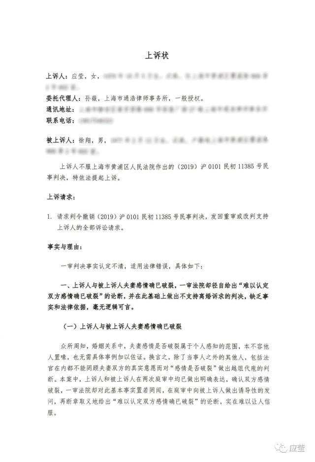
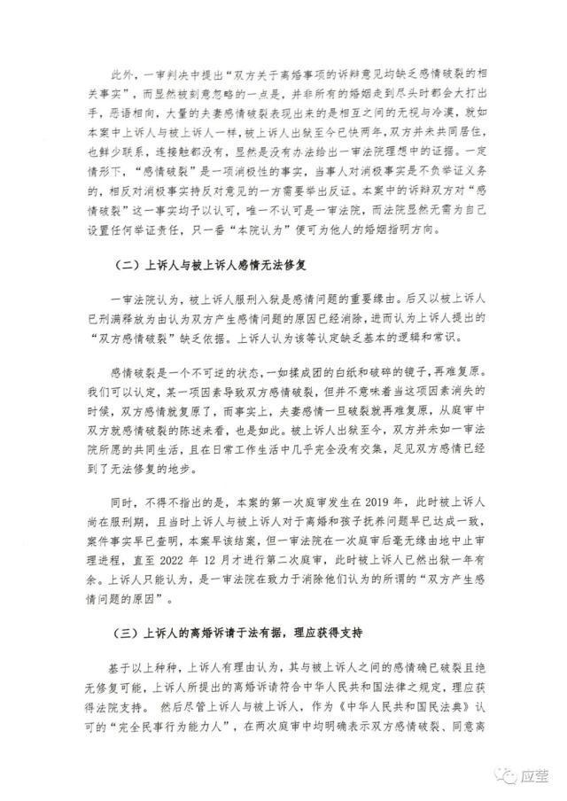
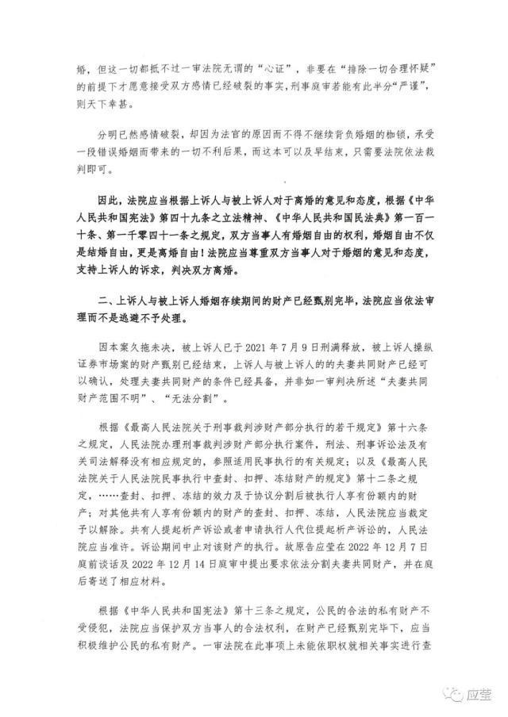
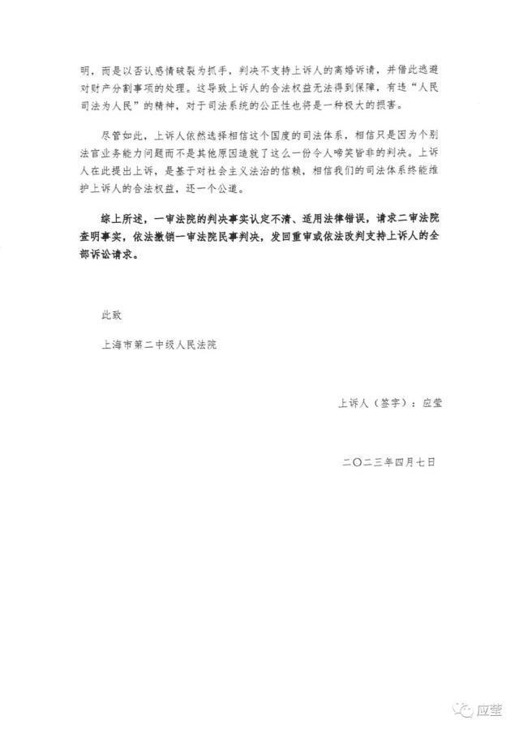
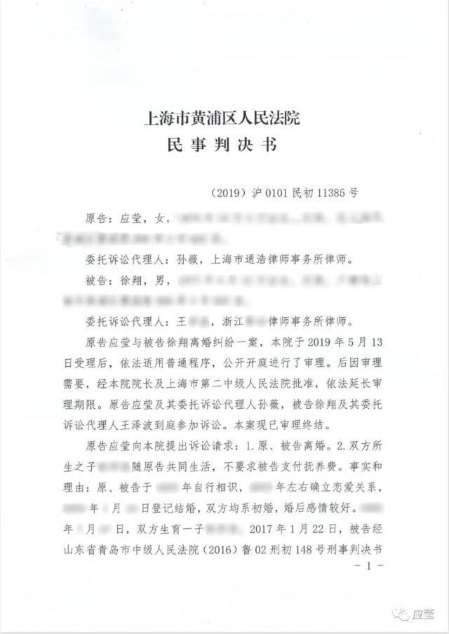
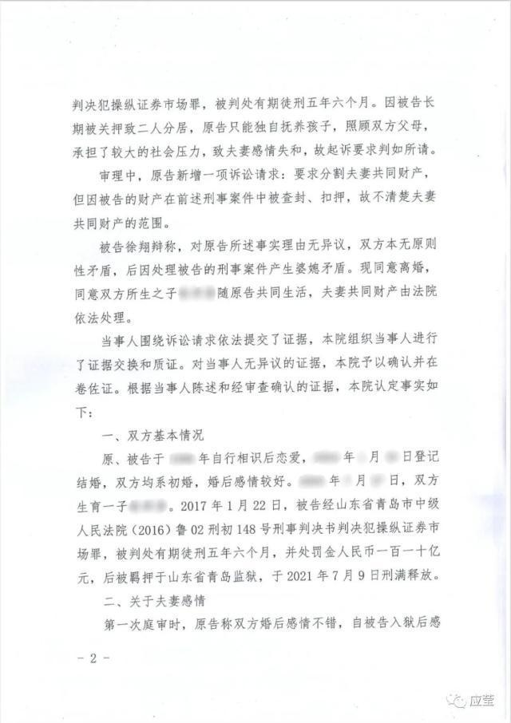
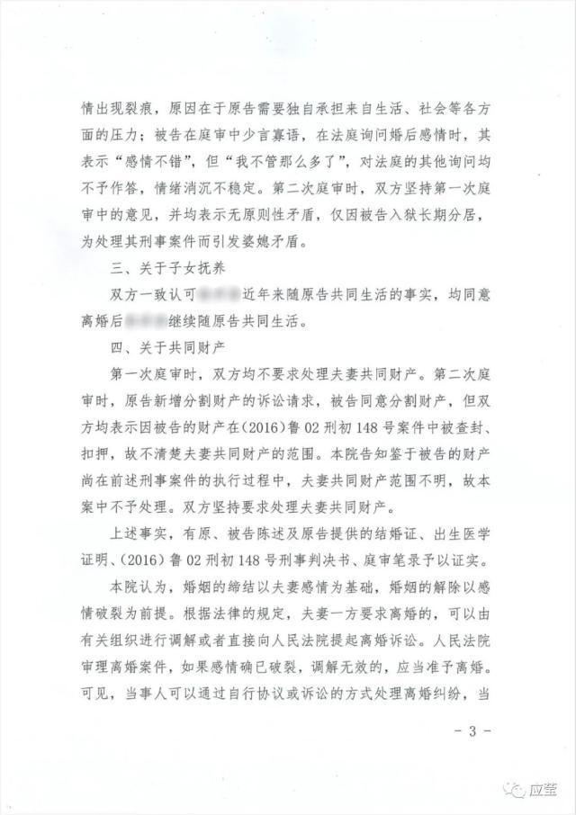
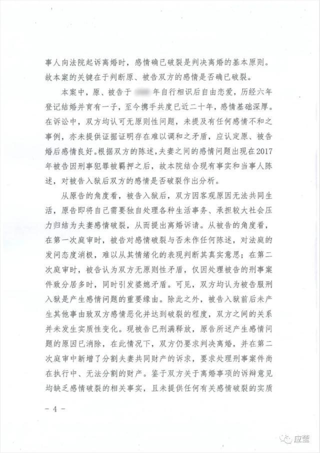
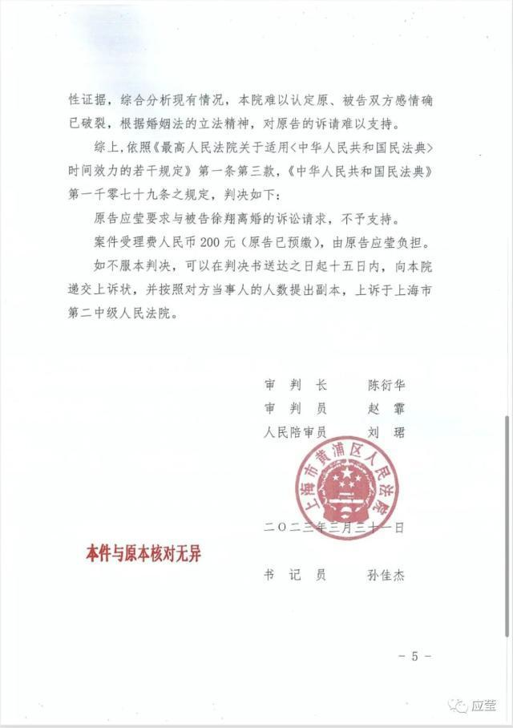

# 应莹：对离婚案将上诉，徐翔出狱后两人从未共同居住，感情无法修复

周四下午4点应莹在个人社交媒体发文称将对离婚案提起上诉，并表示自己与徐翔感情破裂无法修复，并举例称徐翔出狱后两人从未共同居住，“连接触都没有”，平日几乎没有交流。

据了解，徐翔是一名知名的私募基金经理，因涉嫌操纵证券市场罪被判处有期徒刑五年六个月，并处罚金110亿元，没收违法所得约93.37亿元。他的妻子应莹是一名律师，曾在2019年3月向法院提出离婚诉讼，要求分割夫妻共同财产。根据应莹的说法，她和徐翔的合法财产有100多亿，她要求依法分割一半。

然而，根据最新的消息，应莹和徐翔的离婚案已经判决，但法院不予支持应莹的诉讼请求。法院认为，双方感情问题的主要原因是徐翔入狱后无法共同生活，而现在徐翔已经刑满释放，原告所述产生感情问题的原因已消除。双方关于离婚事项的诉辩意见均缺乏感情破裂的相关事实和证据，本院难以认定原、被告双方感情确已破裂。

应莹对此表示愤怒和无奈，称她和徐翔曾两次表达了离婚的意愿，但法院却依然做出了夫妻感情没有破裂的判断。她表示将依法向上海市第二中级人民法院提起上诉。

