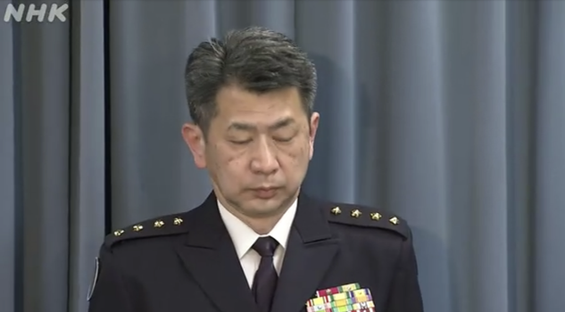
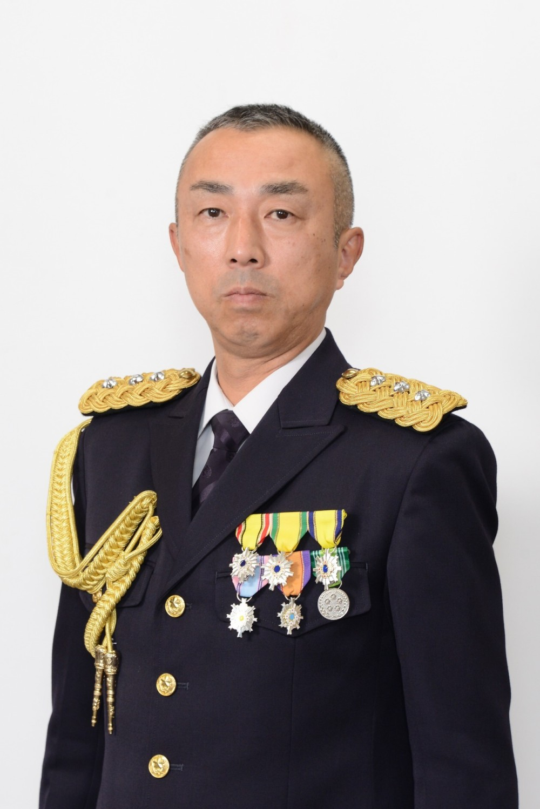

# 日本陆上自卫队幕僚长证实第8师团长所乘直升机失事 机上有10人

【环球网报道】据共同社最新消息，日本陆上自卫队幕僚长森下泰臣6日在发布会上表示，根据现场的迹象，自卫队判断此前在宫古岛附近海域上空失踪的直升机失事，机上乘有10人，包括陆上自卫队第8师团长坂本雄一。

_森下泰臣6日在发布会上通报直升机失事相关信息。_

_坂本雄一资料图，图自日本防卫省。_

据共同社早些时候报道，失踪的直升机型号为UH-60，救援人员目前在失踪海域发现了被认为是该失踪直升机的部件，海面上还有浮油。

NHK还称，日本首相岸田文雄早些时候就此事向记者表示，“目前防卫省正在确认状况，无论如何，今后的行动将以救助人命优先。目前了解到的只有这些”。

