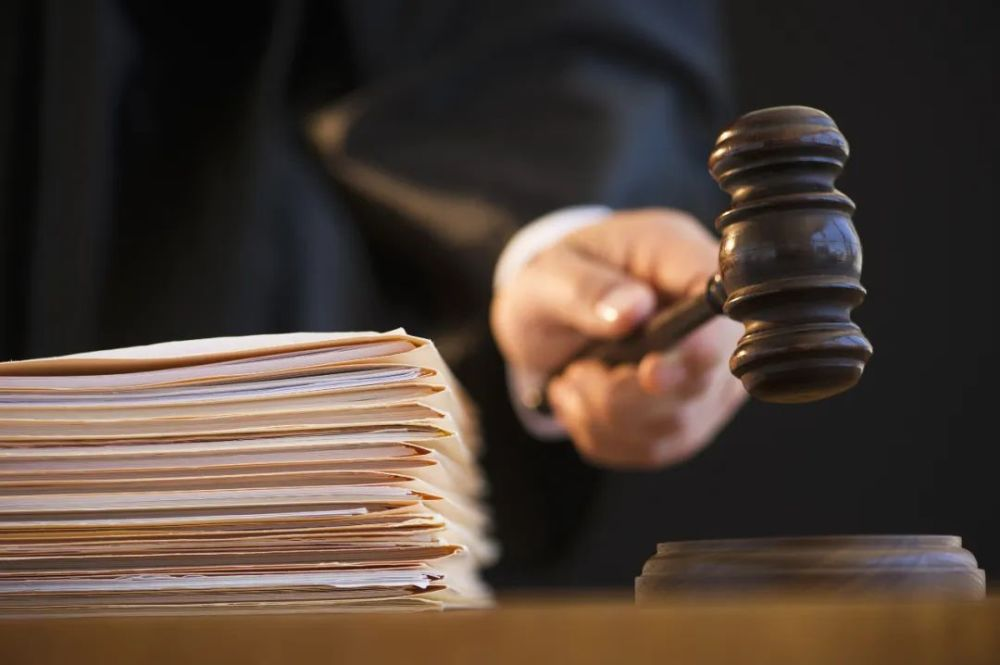
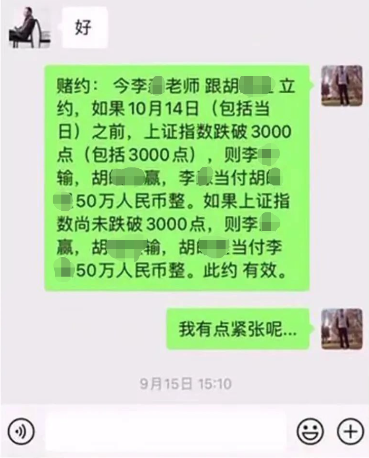

# 知名科学家50万赌股市跌不破3000点，输了后“赖账”被告上法庭

李某和胡某有一天在微信上讨论股市。李某对胡某说：“ **打赌吗，上证指数跌破3000点我输，不破你输** 。”

**双方约定，谁输了赔对方50万元** 。

谁知这样一场赌约，最后竟真的引发了一场官司。近日，记者拿到的一份民事起诉状显示，在双方打赌后一个月不到，上证指数跌破3000点。李某输了，但是并未按照赌约赔付50万元，胡某因此向法院提起诉讼，要求李某履行约定义务。

_图片来源：视觉中国_

**知名科学家50万赌股市跌不破3000点，引发一场官司**

记者了解到， **本案中的李某是一位知名学者，曾经任职于中山大学天文与空间科学研究院、南方科技大学物理系** 。李某擅长研究量子场论、超弦理论以及宇宙学，
**在超弦理论中的研究有一定的国际影响** ，特别是在两维刘维尔理论、D膜以及黑洞的量子物理等方面，后又研究超弦中的黑洞物理、超弦宇宙学以及暗能量。

据悉，原告胡某曾就职于上海英昊资产管理有限公司，与李某是通过大学讲座结识，两人曾就证券投资分析、股市等专业问题在微信上交流切磋。

这起纠纷要追溯到2022年9月15日，李某出于自身对股市的了解和自信，向 **原告胡某提出欲以“上证指数是否会跌破3000点”为条件打赌**
，一开始定下谁输了赔100万元。 **胡某根据自身经济条件将100万元调整为50万元** 。

双方通过微信确认：“今李某跟胡某立约，
**如果10月14日（包括当日）之前，上证指数跌破3000点（包括3000点），则李某输，胡某赢，李某当付胡某50万人民币整。如果上证指数尚未跌破3000点，则李某赢，胡某输，胡某当付李某50万人民币整**
。此约有效。”

**2022年10月10日，上证指数跌破3000点，当日最低跌至2968.28点**
，李某当日14:32向胡某发微信“你赢了”。2022年10月12日，上证指数进一步下探至2934.12点。

李某曾向胡某表示“和你打赌这些钱，我是能给你的”“我别的赚了给你钱，你放心”“等我赚钱还你吧？”，原告提出至少先象征性的付一点，
**李某并未履行约定义务，反而声称“再追我就赖账”“财迷”“小肚鸡肠”“掉钱眼里去了”** 。

原告胡某遂向法院上诉，请求判令被告立即向原告支付人民币50万元，并判令被告支付逾期返还上述钱款的利息损失。

**“打赌”协议是否有效**

对于“打赌”的法律效力，无论是法律实务界还是学界，都是有争议的。

第一种意见认为，“打赌”协议无效。理由是订立“打赌”协议是赌博行为，而赌博行为为我国法律所禁止，民法通则第五十八条第一款第（五）项已明确规定“违反法律或者社会公共利益的”行为，
**属无效民事行为，从行为开始起就没有法律约束力** 。

第二种意见认为，“打赌”协议是一种民事法律行为。根据民法通则第五十四条、五十五条之规定，民事法律行为是公民或者法人设立、变更、终止民事权利和民事义务的合法行为。民事法律行为应当具备下列条件：（一）行为人有相应的民事行为能力；（二）意思表示真实；（三）不违反法律或者社会公共利益。

针对本案，原告胡某认为， **“打赌”不能等同于赌博，赌博与打赌义近但有区别，打赌协议也并不一定不受法律保护，比如有打赌性质的“对赌协议”就受到法律保护**
。实务中有很多案例支持打赌协议合法有效，理论界对这一问题也未形成通说与定论。本案中，协议双方对自己的行为及后果有明确的认知，事后亦对各自权利义务均表示确认。打赌协议作为无名合同，通过双方意思自治设定了具体权利义务，应被认定为合法有效。

上海久诚律师事务所许峰律师表示，在本案中，打赌的金额巨大，并非亲朋之间简单的娱乐活动。此外，民法典规定，民事主体从事民事活动，应当遵循公平原则，合理确定各方的权利和义务。
**民事活动还应该遵守自愿公平、等价有偿原则，该赌约只可能最终一方获利一方损失，跟日常所见到的商业“对赌”行为具有对应的权利义务不同**
。双方如果在法院主持下达成和解或调解，未尝不是一个两全选择。但是最终还要等待法院的具体判决。

**编辑|** 段炼 杜波

**校对|** 王月龙

